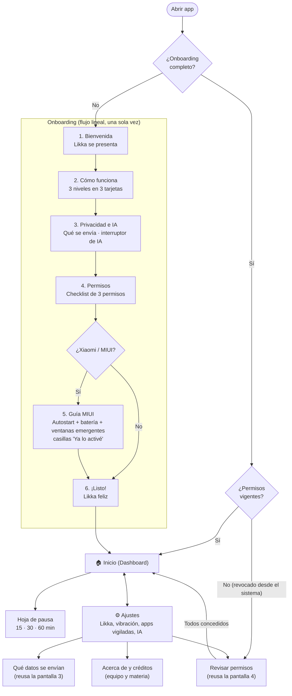
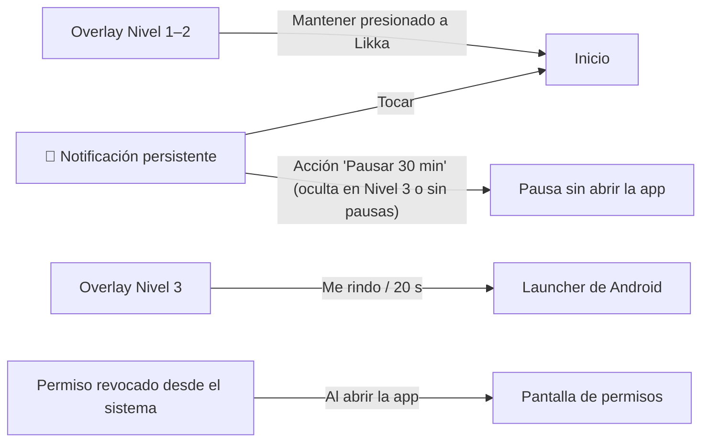

# 🎨 Likka-Pet — Design System (Interfaz UI/UX) · v3.4

> Documento **exclusivo de diseño de interfaz**. La lógica, arquitectura e IA viven en [`likkapet_documentacion.md`](likkapet_documentacion.md).  
> *Paleta: **Bosque** (frambuesa, ámbar, cacao, ocre, ciruela). Tema: **oscuro** (el MVP no incluye tema claro). Personaje: **Likka, un escarabajo ciervo nocturno** en pixel art (diseño original "Sirv").*

---

## Tabla de Contenidos

0. [Principios de Diseño](#0-principios-de-diseño)
1. [Design (Fundamentos Visuales)](#1-design-fundamentos-visuales)
   - [1.1 Color](#11-color)
   - [1.2 Tipografía](#12-tipografía)
   - [1.3 Espaciado y Retícula](#13-espaciado-y-retícula)
   - [1.4 Forma, Bordes y Elevación](#14-forma-bordes-y-elevación)
   - [1.5 Iconografía](#15-iconografía)
   - [1.6 Movimiento](#16-movimiento)
   - [1.7 Personaje: Likka, el Escarabajo Ciervo Nocturno (Sprites)](#17-personaje-likka-el-escarabajo-ciervo-nocturno-sprites)
   - [1.8 Componentes](#18-componentes)
   - [1.9 Voz y Microcopy](#19-voz-y-microcopy)
2. [Jerarquía](#2-jerarquía)
3. [Navegación](#3-navegación)
4. [Accesibilidad](#4-accesibilidad)
5. [Tokens en Compose](#5-tokens-en-compose)
6. [Registro de Cambios](#6-registro-de-cambios)

---

## 0. Principios de Diseño

| Principio | Qué significa en la práctica |
| :--- | :--- |
| **Likka es la interfaz** | El personaje comunica el estado antes que el texto. Si Likka está tranquilo, todo va bien; no hace falta leer nada. |
| **Molestar con cariño** | Los overlays estorban a propósito, pero nunca humillan ni atrapan: siempre hay una salida visible. |
| **Estorba con cariño y se mueve, pero nunca atrapa** | Desde el Nivel 1, Likka cambia de lugar; en el Nivel 2, camina y persigue. El movimiento es parte de la travesura, no un obstáculo real: nunca tapa la barra de estado/navegación, nunca bloquea los toques fuera de su silueta, y siempre se puede alejar de un arrastre o detener del todo con *Quitar animaciones* (`likkapet_documentacion.md` §9.6). |
| **Cero fricción fuera del overlay** | La app se abre poco. Cuando se abre, responde en 3 segundos: *¿estoy protegido? ¿cómo voy hoy?* |
| **Cálido y oscuro** | Fondo cacao para no deslumbrar (el usuario suele estar en redes de noche). El ámbar y la frambuesa son acentos, no fondos. |

---

## 1. Design (Fundamentos Visuales)

### 1.1 Color

#### Paleta Bosque (colores de marca)

Los cinco colores vienen de la paleta de referencia del equipo y **coinciden con los colores del diseño de Likka** (capucha ciruela y frambuesa, élitros y ojos ámbar, cuernos crema), así que **el personaje no necesita recolorearse**.

| Token | Hex | Nombre | Rol |
| :--- | :--- | :--- | :--- |
| `brand.amber` | `#FCA30B` | Ámbar | **Marca y acción.** Botón primario, estado "protegiendo", racha, Nivel 1. |
| `brand.ochre` | `#D17B0F` | Ocre | **Advertencia.** Nivel 2, avisos, barras de progreso. |
| `brand.raspberry` | `#A2315D` | Frambuesa | **Alerta.** Nivel 3, errores, botón "Me rindo". Solo como **relleno** (ver contraste). |
| `brand.plum` | `#4B1C33` | Ciruela | **Superficie** de tarjetas, hojas y burbujas. |
| `brand.cocoa` | `#3D1B1C` | Cacao | **Fondo** de todas las pantallas y del panel del Nivel 3. |

#### Colores de soporte (derivados)

La paleta no trae un color claro para texto ni un tono de frambuesa legible sobre fondos oscuros, así que se agregan estos:

| Token | Hex | Rol |
| :--- | :--- | :--- |
| `neutral.cream` | `#FFF4E6` | **Texto principal** y relleno del "escenario" de Likka. |
| `neutral.creamMuted` | `#E3C9C4` | Texto secundario, etiquetas, descripciones. |
| `bg.surfaceHigh` | `#5E2A45` | Tarjetas elevadas, estados *pressed*, campos. |
| `bg.switchTrackInactive` | `#8A6B78` | Pista de los interruptores en estado inactivo (ver nota de contraste abajo; `bg.surfaceHigh` no llegaba a 3:1). |
| `outline` | `#9C7488` | Bordes de 1dp para separar superficies (cacao y ciruela son muy parecidos) y límites de componente (WCAG 1.4.11). |
| `raspberry.light` | `#F07AA0` | **Texto, íconos y bordes** "frambuesa" sobre fondos oscuros. |

> **Corrección de contraste (v3):** en v2, `outline` (`#6B3552`) medía **1.64:1** sobre cacao y **1.49:1** sobre ciruela — WCAG 1.4.11 exige **3:1** para límites de componentes no decorativos (bordes de tarjetas, pista de interruptores inactiva), y ninguno de los dos llegaba. Se aclaró `outline` a `#9C7488`: contraste relativo a `#3D1B1C` (cacao) = **(0.208 + 0.05) / (0.032 + 0.05) = 3.15:1** ✅, y relativo a `#4B1C33` (ciruela) = **(0.208 + 0.05) / (0.028 + 0.05) = 3.31:1** ✅ (luminancias relativas WCAG: cacao 0.032, ciruela 0.028, `#9C7488` 0.208). La pista inactiva de los interruptores usa el mismo criterio con `bg.switchTrackInactive` (`#8A6B78`, ≈3.0:1 sobre ambos fondos) en vez de `bg.surfaceHigh` (que se queda como color de superficie elevada, sin ninguna obligación de contraste de "límite").

#### Contraste verificado (WCAG 2.1)

AA exige **4.5:1** para texto normal, y **3:1** para texto grande — la definición exacta de WCAG es **18pt regular o 14pt en negrita**, que en `sp` (a la densidad de referencia de la especificación) equivale a **≈24sp regular o ≈18.7sp en negrita/peso 700**, no "18sp / 14sp" como decía la v2.

| Combinación | Ratio | Uso permitido |
| :--- | :---: | :--- |
| Crema sobre Cacao | **14.1** | ✅ Cualquier texto |
| Crema sobre Ciruela | **12.8** | ✅ Cualquier texto |
| Crema sobre Superficie alta | **10.2** | ✅ Cualquier texto |
| Crema apagado sobre Cacao / Ciruela | **9.8 / 8.9** | ✅ Cualquier texto |
| Ámbar sobre Cacao / Ciruela | **7.6 / 6.9** | ✅ Cualquier texto |
| **Cacao sobre Ámbar** (botón primario) | **7.6** | ✅ Cualquier texto |
| Ocre sobre Cacao | **4.8** | ✅ Texto normal |
| Ocre sobre Ciruela | **4.3** | ⚠️ No llega a 4.5:1: **solo texto ≥24sp regular o ≥18.7sp en peso 700** (`display`, `headline`, o `title`/`label` si se usan en negrita a ese tamaño). No usar en `bodyMedium`, `label` (14sp) ni `caption` (12sp) sobre ciruela. |
| **Cacao sobre Ocre** (botón de advertencia) | **4.8** | ✅ Cualquier texto |
| **Crema sobre Frambuesa** (botón de peligro) | **6.2** | ✅ Cualquier texto |
| Frambuesa claro sobre Cacao / Ciruela | **5.8 / 5.3** | ✅ Cualquier texto |
| **Frambuesa sobre Cacao / Ciruela** | **2.3 / 2.1** | ❌ **Ni texto ni bordes**: usar `raspberry.light` |
| Cacao vs. Ciruela (entre superficies) | **1.1** | ⚠️ No se distinguen solas: usar borde `outline` |
| `outline` sobre Cacao / Ciruela (límite de componente) | **3.15 / 3.31** | ✅ Cumple WCAG 1.4.11 (≥3:1); corregido en v3, ver nota debajo de la paleta |

#### Reglas de uso

1. **60 / 30 / 10**: 60% cacao, 30% ciruela, 10% acentos (ámbar, ocre, frambuesa).
2. **Un color = un significado.** Ámbar significa "Likka te habla / acción", ocre significa "cuidado" y frambuesa significa "alerta". La frambuesa nunca es decoración.
3. **El color nunca va solo**: todo estado se refuerza con un ícono, texto o la pose de Likka (daltonismo: ámbar y ocre se parecen para algunas personas).
4. **Frambuesa sobre oscuro = `raspberry.light`.** La frambuesa pura solo se usa como relleno con texto crema encima.
5. Degradados permitidos únicamente en el aura del Nivel 3 (`brand.raspberry → raspberry.light`).

#### Colores por nivel de escalamiento

Como el sprite conserva sus colores originales, **el nivel se comunica con el borde del escenario y el aura**, no recoloreando al personaje.

| Nivel | Borde del escenario (3dp) | Borde de la burbuja | Sensación |
| :--- | :--- | :--- | :--- |
| Reposo / Feliz | `neutral.cream` | — | Calma |
| 1 — Susurro | `brand.amber` | `brand.amber` | Aviso amable |
| 2 — Molesto | `brand.ochre` | `brand.ochre` | Cuidado |
| 3 — Furia | `raspberry.light` + aura pulsante | `raspberry.light` | Alerta |

La progresión **claro → oscuro → rojo** (ámbar → ocre → frambuesa) comunica el escalamiento sin leer texto.

---

### 1.2 Tipografía

Dos familias de **Google Fonts (licencia OFL, gratuitas y con soporte completo de español)**, redondeadas para suavizar el pixel art:

- **Baloo 2**: títulos, números grandes y texto de Likka (tiene personalidad).
- **Nunito**: cuerpo, botones y etiquetas (muy legible en tamaños chicos).

| Estilo | Familia | Tamaño / Interlínea | Peso | Uso |
| :--- | :--- | :--- | :--- | :--- |
| `display` | Baloo 2 | 40 / 48sp | ExtraBold 800 | Número héroe del dashboard (minutos hoy) |
| `headline` | Baloo 2 | 28 / 36sp | Bold 700 | Título de pantalla |
| `title` | Baloo 2 | 20 / 28sp | SemiBold 600 | Título de tarjeta, texto del roast en Nivel 3 |
| `bodyLarge` | Nunito | 16 / 24sp | Regular 400 | Texto principal, roast en Nivel 1–2 |
| `bodyMedium` | Nunito | 14 / 20sp | Regular 400 | Descripciones |
| `label` | Nunito | 14 / 20sp | Bold 700 | Botones, chips |
| `caption` | Nunito | 12 / 16sp | SemiBold 600 | Metadatos, unidades ("min", "°") |

Reglas:
- Máximo **4 tamaños por pantalla** (el dashboard, la pantalla más densa, ya usa `display` + `headline`/`title` + `bodyMedium` + `caption`: ver §2.4). En el resto de las pantallas, 3 alcanza.
- Nunca texto en mayúsculas sostenidas: se lee como un grito. Dos excepciones, ambas cortas a propósito: el Nivel 3 (intencional, refuerza la alerta) y los **encabezados de grupo de Ajustes** (`caption`, 1–2 palabras, §2.5) — un uso tipográfico convencional para separar secciones, no para gritar.
- Siempre `sp`, para respetar el tamaño de fuente del sistema.

---

### 1.3 Espaciado y Retícula

Retícula base de **4dp**. Escala permitida:

| Token | Valor | Uso típico |
| :--- | :---: | :--- |
| `space.xs` | 4dp | Separación ícono–texto |
| `space.s` | 8dp | Entre elementos relacionados |
| `space.m` | 16dp | Padding interno de tarjetas, **margen lateral de pantalla** |
| `space.l` | 24dp | Entre secciones |
| `space.xl` | 32dp | Separación de bloques mayores |
| `space.xxl` | 48dp | Aire alrededor de Likka en pantallas héroe |

- Área táctil mínima: **48 × 48dp** (incluso si el ícono mide 24dp).
- Ancho de diseño de referencia: **360dp** (el Redmi 9 reporta ~393dp de ancho).

---

### 1.4 Forma, Bordes y Elevación

La UI es redondeada; solo Likka es pixelado. Ese contraste entre personaje pixel art y UI suave es intencional.

| Token | Radio | Uso |
| :--- | :---: | :--- |
| `shape.s` | 12dp | Chips, campos |
| `shape.m` | 20dp | Tarjetas, burbujas de diálogo |
| `shape.l` | 28dp | Hojas inferiores, overlay Nivel 3 |
| `shape.full` | 50% | Botones tipo píldora, escenario de Likka |

**Elevación:** cacao y ciruela casi no se distinguen (1.1:1), así que la profundidad se expresa con un **borde `outline` de 1dp** y, en los niveles altos, con `bg.surfaceHigh`. Solo el overlay usa sombra real, porque el fondo es una app ajena.

---

### 1.5 Iconografía

- **Material Icons Extended** (`androidx.compose.material:material-icons-extended`), estilo **Rounded**. Compose no incluye *Material Symbols* como fuente/paquete propio — eso es lo que trae la librería, y es la referencia correcta para "íconos redondeados de Material" en este proyecto. Si más adelante se necesita un ícono que solo exista en el catálogo de *Material Symbols* (symbols.google.com) y no en `material-icons-extended`, se importa como **vector SVG propio** (`ImageVector`/`res/drawable`), no como fuente de íconos.
- Tamaños: 24dp estándar, 20dp dentro de chips y 32dp en la checklist de permisos.
- Grosor 400, con relleno solo en estado activo o seleccionado (los íconos `Rounded` de `material-icons-extended` ya cubren ambas variantes, outlined y filled).
- Los íconos nunca reemplazan a Likka para comunicar emoción.

---

### 1.6 Movimiento

| Token | Duración | Curva | Uso |
| :--- | :---: | :--- | :--- |
| `motion.fast` | 150ms | `FastOutSlowIn` | Pressed, toggles |
| `motion.standard` | 300ms | `FastOutSlowIn` | Cambio de pantalla, expandir tarjeta |
| `motion.enter` | 400ms | `spring(dampingRatio = 0.6)` | Likka aparece (rebote) |
| `motion.fury` | 600ms | `spring(dampingRatio = 0.4)` | Crecimiento al Nivel 3 |
| `motion.hop` | — (instantáneo, sin interpolación) | — | Nivel 1: Likka se esconde y reaparece en otra posición (§1.8) |
| `motion.walk` | continuo, paso a paso | 8–10 pasos/s | Nivel 2: desplazamiento al caminar/perseguir (§1.8) |

Animaciones del personaje:

- **Frames del sprite**: 8–10 fps, tal como vienen en el paquete.
- **Nivel 1**: Likka entra deslizándose desde el borde con `motion.enter` y queda **medio asomado**; cada cierto tiempo se esconde y reaparece en otra posición con `motion.hop` (§1.8, detalle de tiempos en `likkapet_documentacion.md` §6 Módulo 3).
- **Nivel 2**: sacudida horizontal de **1 píxel del sprite** al aparecer (sincronizada con la vibración de 250 ms) — no un valor fijo en dp, para que se mantenga alineada a la cuadrícula del pixel art sin importar la escala del nivel (§1.7: un dp fijo no coincide con el tamaño de píxel real en todas las escalas). Además, camina por la pantalla con `motion.walk` en ciclos de caminar/detenerse (§1.8), usando la animación de caminar del personaje (genérica: la fila y los cuadros exactos los define la hoja de sprites vigente, §1.7).
- **Nivel 3**: el aura (dibujada en Compose, degradado frambuesa → frambuesa claro) pulsa cada 1 s, con la cuenta regresiva visible. Sin movimiento de posición.
- Los movimientos del contenedor (deslizar, sacudir, crecer, caminar, cambiar de lugar) avanzan en **pasos de 1 píxel del sprite**, para no romper la estética pixel art. El movimiento de posición (`motion.hop`, `motion.walk`) va a **8–10 actualizaciones por segundo** (la cadencia de la animación), no a 60 fps: más barato en batería.

> Respetar *Quitar animaciones* del sistema (`Settings.Global.ANIMATOR_DURATION_SCALE == 0`): se muestra solo el primer frame de cada pose, sin loops ni sacudidas, **y Likka deja de moverse de posición** (Nivel 1 no cambia de lugar, Nivel 2 no camina).

---

### 1.7 Personaje: Likka, el Escarabajo Ciervo Nocturno (Sprites)

#### Concepto

Likka es un **escarabajo ciervo nocturno**: un pequeño compañero del bosque con cuernos de ciervo, capucha, bufanda frambuesa, alas de élitro ámbar y patas de sátiro. Bajo la capucha solo se ven sus **dos ojos ámbar**. Sale de noche, que es justo cuando la gente se queda pegada al teléfono, y cuida tu cuello a su manera: burlándose de ti con cariño. *"Un pequeño compañero, gran personalidad."*

#### Origen y derechos

| Campo | Valor |
| :--- | :--- |
| Diseño | **Sirv**, creación original del equipo |
| Derechos | **Propios**: uso libre, sin atribución externa |
| Nombre en la app | **Likka** ("Sirv" es solo el nombre interno del diseño anterior) |
| Referencia de diseño | `sprites/sirv.png` — **no** se usa en la app; solo guía de colores, capucha, cuernos y bufanda mientras se dibuja `likka.png` a mano |
| Hoja de sprites final | `sprites/likka.png`, dibujada a mano en Aseprite, exportada junto con `sprites/likka.json` |
| Mapa de poses | `sprites/likka_poses.json`, escrito y editado a mano |

> **Dibujo a mano, sin generador:** los sprites anteriores (generados por agentes/scripts) no sirvieron para el juego. Likka se dibuja **desde cero en Aseprite**, cuadro por cuadro, usando `sirv.png` solo como referencia de diseño — nunca se recorta ni se reescala ese archivo. Mientras se dibuja, la app y la maqueta funcionan con **sprites provisionales** (ver "Regla de provisionales" más abajo): el reemplazo final es soltar `likka.png`, `likka.json` y `likka_poses.json` en `sprites/`, **sin tocar código**.

#### Formato del arte

| Propiedad | Valor |
| :--- | :--- |
| Lienzo por cuadro | **64 × 64 px** |
| Altura de Likka | **44–48 px** (el resto es aire transparente, para dejar espacio a patas/cuernos en las poses más extremas) |
| Línea de pies | fija en **y = 60** en todos los cuadros, de todas las animaciones |
| Fondo | transparente, **alfa binario** (0 o 255, sin semitransparencias) |
| Paleta | fija, **12–16 colores**, basada en `sirv.png` y alineada con la paleta Bosque (§1.1) |
| Contorno | **1 px** oscuro alrededor de la silueta |

La línea de pies fija es lo que permite que todas las animaciones se vean paradas en el mismo sitio al cambiar de cuadro o de tag, sin saltos verticales.

#### Animaciones (tags de Aseprite)

Cada fila es un **tag** de Aseprite; el nombre del tag es el identificador que usa el código (`likka_poses.json` los referencia). Los nombres de tag y las claves de `likka_poses.json` van en inglés, como cualquier identificador de código (`CLAUDE.md`, reglas de idioma).

| Prioridad | Tag | Cuadros | fps | Uso (nivel / pantalla / evento) | Pose del §1.7 (v3.3) que reemplaza |
| :---: | :--- | :---: | :---: | :--- | :--- |
| P1 | `idle` | 4 | 8 | Reposo de frente; dashboard, onboarding, estado "Protegiendo" | `idle` |
| P1 | `blink` | 2 | 8 | Variante corta insertada al azar en el loop de `idle` (ojos cerrados) | el "cuadro 6 parpadea" de la antigua fila `idle` |
| P1 | `walk_right` | 4–6 | 10 | Overlay Nivel 2 caminando/persiguiendo hacia la derecha; despedida (`goodbye`, RF-O04) | `walk_right` |
| P1 | *(`walk_left`, espejo de `walk_right`)* | — | 10 | Overlay Nivel 2 caminando hacia la izquierda | `walk_left` |
| P1 | `walk_down` | 4 | 10 | Movimiento del overlay (N1/N2) hacia abajo en pantalla | *(nueva; no existía dirección vertical)* |
| P1 | `walk_up` | 4 | 10 | Movimiento del overlay hacia arriba; también cubre ambas diagonales hacia arriba (§9.6) | *(nueva)* |
| P1 | `peek` | 4 | 8 | Overlay Nivel 1, medio asomado por el borde | `whisper` (antes `idle` asomado) |
| P1 | `annoyed` | 4 | 8 | Overlay Nivel 2, parado (detenido, no caminando) | `annoyed` (antes `idle` + sacudida en Compose) |
| P1 | `fury` | 6 | 8 | Overlay Nivel 3 (el aura pulsante sigue siendo un extra de Compose, ver más abajo) | `fury` (antes `idle` + aura en Compose) |
| P1 | `happy` | 6 | 8 | Perdonado, racha, onboarding completo | `happy`/`joy` |
| P2 | `walk_diag_down_right` | 4–6 | 10 | Movimiento diagonal abajo-derecha del overlay | *(nueva)* |
| P2 | *(`walk_diag_down_left`, espejo de `walk_diag_down_right`)* | — | 10 | Movimiento diagonal abajo-izquierda del overlay | *(nueva)* |
| P2 | `talk` | 4 | 8 | Gesto sutil mientras el globo del roast está visible (Niveles 1–3) | *(nueva; antes el personaje quedaba estático mientras "hablaba")* |
| P2 | `dragged` | 4 | 8 | Mientras el usuario arrastra a Likka (reacción local, §1.9) | *(nueva; antes no había pose visual para arrastrar)* |
| P2 | `worried` | 2–4 | 6 | Falta un permiso, error | `worried` (antes `idle` + gota de sudor en Compose) |
| P2 | `sleep` | 2–4 | 4 | Pausa, Likka desactivado | `sleep` |
| P3 | `look_around` | 4 | 6 | Variante ambiental de `idle` en esperas largas (dashboard, Nivel 1 asomado) | *(nueva; detalle opcional, no bloquea el MVP)* |
| P3 | `hop` | 4–6 | 10 | Overlay Nivel 1 al esconderse y reaparecer en otro borde | `hop`/`jump` |
| P3 | `wave` | 4 | 8 | Saludo; candidato para el paso de bienvenida del onboarding | *(nueva)* |

`walk_left` y `walk_diag_down_left` **no se dibujan aparte**: el código los obtiene reflejando en X el frame de `walk_right`/`walk_diag_down_right` (igual que antes en v3.3, que ya espejaba `walk_left` a partir de `walk_right`... en realidad al revés; lo importante es que solo uno de cada par se dibuja).

No hay tag de `attack`/`hurt` ni pose de muerte, por la misma razón que en v3.3: es una app de bienestar, no un juego de combate.

#### Seis direcciones de movimiento

El movimiento del overlay usa **seis** tags de dirección: `walk_down`, `walk_up`, `walk_right`, `walk_left` (espejo), `walk_diag_down_right` y `walk_diag_down_left` (espejo). Las diagonales **hacia arriba** no tienen tag propio: usan `walk_up`. El código (`OverlayMotionPlanner`, `domain`) calcula la dirección a partir del vector de movimiento y elige la animación por sectores angulares — el detalle de los sectores y la prueba unitaria correspondiente están en `likkapet_documentacion.md` §9.6 y §12.1.

#### Extras dibujados en Compose, nunca en la hoja

Las "z" de dormir, la gota de sudor de `worried`, el aura pulsante de `fury`, los destellos de `happy` y la sombra del escenario **no se dibujan dentro de `likka.png`**: son overlays de Compose sobre la animación base, listados en `likka_poses.json` como `extras`. Esto es un cambio respecto a v3.3, donde la "z" y los destellos venían horneados en los cuadros de `sleep`/`joy`: mantener la hoja limpia de estos detalles hace más fácil re-dibujar o ajustar una animación sin tener que repetir el extra en cada cuadro.

#### Regla de provisionales

Mientras una animación de la tabla no exista todavía, `likka_poses.json` apunta esa pose a `idle` (o a la más cercana ya disponible) en vez de fallar. La app y la maqueta funcionan igual, solo que con un movimiento menos expresivo; en cuanto se agrega el tag real en Aseprite, basta con actualizar `likka_poses.json` — sin tocar código ni la app.

#### Guía corta para quien dibuja

1. Empezar por **un cuadro de `idle`**: define la silueta, la paleta y el contorno de referencia para todo lo demás.
2. Derivar el resto de las poses **copiando ese primer cuadro** y modificando solo lo necesario (piernas, brazos, cuernos), en vez de dibujar cada animación desde cero.
3. Usar ***onion skin*** de Aseprite al animar, para no perder la línea de pies ni el tamaño entre cuadros.
4. **Misma línea de pies (y = 60) y misma paleta en todos los cuadros**, de todas las animaciones — es lo que evita saltos y parpadeos de color al cambiar de tag.
5. **Un tag por animación**, con el nombre exacto de la tabla de arriba (en inglés, minúsculas, con guion bajo).
6. Para exportar: *File → Export Sprite Sheet* → formato **JSON (Array)**, casilla **Tags** activada, sin recorte (*Trim* desactivado, para que los 64×64 se mantengan iguales en todos los cuadros) → guardar como `sprites/likka.png` + `sprites/likka.json`.

#### Formato de `likka.json` (exportado por Aseprite) y `likka_poses.json` (a mano)

`likka.json` es el JSON estándar que exporta Aseprite (*Array* + *Tags*): cada frame trae su `frame` (x, y, w, h) y `duration` en ms, y cada tag trae su rango de frames (`from`/`to`). El código lo lee tal cual, sin reprocesarlo: los **tags son las animaciones** y la **duración por cuadro sale de `duration`**, no de un `fps` fijo.

`likka_poses.json` es el archivo pequeño, escrito a mano, que traduce cada **pose** (lo que pide el resto del código: `idle`, `annoyed`, `fury`...) a un tag de `likka.json`, con su modo de reproducción y, si aplica, sus extras de Compose:

```json
{
  "idle": { "tag": "idle", "mode": "loop" },
  "peek": { "tag": "peek", "mode": "loop" },
  "annoyed": { "tag": "annoyed", "mode": "loop" },
  "fury": { "tag": "fury", "mode": "loop", "extras": ["aura"] },
  "worried": { "tag": "worried", "mode": "loop", "extras": ["sweat_drop"] },
  "sleeping": { "tag": "sleep", "mode": "loop", "extras": ["z"] },
  "happy": { "tag": "happy", "mode": "once_then_idle", "extras": ["sparkles"] },
  "hop": { "tag": "hop", "mode": "once" },
  "goodbye": { "tag": "walk_right", "mode": "loop" },
  "walk_left": { "tag": "walk_right", "mode": "loop", "mirror": true },
  "walk_diag_down_left": { "tag": "walk_diag_down_right", "mode": "loop", "mirror": true }
}
```
- `mode` puede ser `loop`, `once`, `once_then_idle` o `hold`, igual que en v3.3.
- `mirror: true` le dice al código que refleje en X los cuadros del `tag` indicado, en vez de buscar un tag propio.
- Mientras falta un tag real, su entrada apunta a `"tag": "idle"` (regla de provisionales, arriba).

Se elimina `sirv_frames.json`: ya no hace falta describir filas/columnas/`cellSize` a mano porque `likka.json` (de Aseprite) ya trae la posición exacta de cada cuadro.

#### Prueba unitaria

Una prueba JVM (§12.1 de `likkapet_documentacion.md`) valida:
- `likka.json` tiene **todos los tags P1** de la tabla de arriba.
- Cada pose de `likka_poses.json` apunta a un `tag` que existe en `likka.json`.
- Todos los cuadros de `likka.json` miden **64 × 64 px**.

#### Reglas de renderizado del pixel art

- **Escalado solo entero**: el tamaño en pantalla se calcula en **píxeles físicos** a partir de la altura real de Likka dentro del lienzo (≈48 px de referencia, no los 64 px del lienzo completo): `scale = floor(targetPx / 48)`. Las escalas fraccionarias deforman los píxeles.
- **Sin suavizado**: dibujar con `FilterQuality.None`.
- **Escenario**: detrás del sprite va un **círculo crema** (`neutral.cream`) con un borde de 3dp del color del nivel. Likka es oscuro (capa ciruela, cuerpo cacao), y el crema garantiza que se vea sobre cualquier app, incluso sobre fondos negros. La sombra del escenario es un extra de Compose (ver arriba), no parte de la hoja.
- **Retrato**: no existe un archivo de retrato aparte. La bienvenida del onboarding usa el **cuadro 0 de `idle`** a escala entera, igual que cualquier otro uso del sprite.
- **Accesibilidad**: `contentDescription` con el estado (*"Likka molesto, nivel 2"*).
- El código lee la posición de cada cuadro solo de `likka.json` y el mapeo pose→tag solo de `likka_poses.json`; ningún offset va hardcodeado.

#### Tabla de escalas (densidad de referencia: Redmi 9, ≈2.75; personaje de 48 px)

`scale = round(targetPx / 48)`; tamaño real mostrado = `48 × scale / 2.75` dp.

| Uso | Escala | Tamaño real mostrado |
| :--- | :---: | :---: |
| Overlay Nivel 1 (asomado) | 3× | ≈52dp |
| Overlay Nivel 2 (caminando) | 8× | ≈140dp |
| Overlay Nivel 3 | 11× | ≈192dp |
| Dashboard | 9× | ≈157dp |
| Onboarding | 6× | ≈105dp |

> **Se cierra la decisión pendiente de v3.3 sobre el escenario de 88dp para el Nivel 1:** con el personaje dibujado a 48 px de alto (en vez de calcularse sobre el `contentBox` de la hoja generada, de 120 px), la escala 3× ya da ≈52dp reales — un tamaño razonable para un elemento que además se mueve de borde en borde. Ya no hace falta subir el escenario del Nivel 1 a 88dp.

---

### 1.8 Componentes

#### Botones

| Variante | Relleno | Texto | Uso |
| :--- | :--- | :--- | :--- |
| **Primario** | `brand.amber` | Cacao, `label` | Una acción principal por pantalla ("Comenzar a cuidar mi cuello", "Conceder permiso") |
| **Advertencia** | `brand.ochre` | Cacao, `label` | Acciones con consecuencia leve ("Pausar a Likka") |
| **Peligro** | `brand.raspberry` | Crema, `label` | "Me rindo (ir al inicio)" en el Nivel 3, "Desactivar a Likka" |
| **Secundario** | Transparente, borde 1.5dp `brand.amber` | `brand.amber` | Acciones alternativas ("Ahora no") |
| **Texto** | Ninguno | `brand.amber` | Enlaces ("¿Por qué pedimos esto?") |

Alto de 52dp, forma de píldora y ancho completo en el onboarding. En estado deshabilitado: 38% de opacidad **más** un texto explicativo debajo (nunca un botón gris sin explicación).

#### Tarjeta de permiso (onboarding)

```
┌─────────────────────────────────────────────┐
│ [ícono 32dp]  Mostrar sobre otras apps   [✓] │
│               Para que Likka aparezca       │
│               encima de TikTok.             │
└─────────────────────────────────────────────┘
```
Estados:
- **Pendiente**: borde ámbar y botón "Conceder".
- **Concedido**: check ámbar y texto secundario.
- **Denegado**: borde `raspberry.light`, botón "Reintentar" y Likka `worried`.

#### Tarjeta de estadística (dashboard)

Número en `display` o `headline`, etiqueta en `caption` debajo e ícono opcional arriba. Superficie ciruela con borde `outline`, radio `shape.m` y padding `space.m`. El número héroe va en **ámbar**; el resto, en crema.

#### Burbuja de diálogo (roast)

Superficie ciruela con borde de 2dp del color del nivel, radio `shape.m` y un **pico** apuntando a Likka. Máximo **25 palabras** (el prompt ya lo limita). Texto en `bodyLarge` en los Niveles 1–2 y en `title` en el Nivel 3.

#### Overlay por nivel

| Nivel | Contenedor | Posición | ¿Se mueve? | Interacción |
| :--- | :--- | :--- | :--- | :--- |
| 1 | Escenario de 64dp + globo colapsado | Asomado por un borde; cambia de borde/altura cada rato (`motion.hop`, §1.6) | Sí — cambia de lugar periódicamente, elegido al azar entre posiciones permitidas fuera de los *insets* del sistema | Tocar a Likka despliega el roast durante 5 s. El resto de la pantalla sigue funcionando. Mantener presionado abre la app. Arrastrarlo dispara una reacción local (§1.9) sin cambiar su ciclo de cambio de lugar. |
| 2 | Escenario de 140dp + globo siempre visible | Camina por la pantalla llevando el globo, orientado hacia donde va; se detiene sobre la zona central del contenido (`motion.walk`, §1.6) | Sí — ciclo continuo de caminar/detenerse; si se lo arrastra lejos, vuelve caminando tras una breve espera | El roast queda siempre visible (no hay que tocar para desplegarlo, a diferencia del Nivel 1). Igual que el Nivel 1, no se puede cerrar sin resolver el motivo. Arrastrarlo o tocarlo repetidamente dispara una reacción local (§1.9). |
| 3 | Panel del 80% de alto, radio `shape.l` en las esquinas superiores, cacao al 96% | Anclado al fondo de la pantalla (dejando visible el 20% superior, igual que §2.3) | No — sin movimiento de posición, solo el pulso del aura | Likka `fury`, roast, **cuenta regresiva de 20 s** y botón **Peligro** "Me rindo". |

En Nivel 1 y 2, la ventana del overlay está recortada al tamaño de Likka y su globo (no cubre la pantalla completa), así que los toques fuera de su silueta siempre llegan a la app de fondo — incluso mientras camina. Con *Quitar animaciones* del sistema activado, ambos niveles quedan fijos en su última posición (§1.6).

#### Notificación persistente (servicio en primer plano)

Ícono monocromo con la silueta de los cuernos de Likka. Título "Likka está cuidando tu cuello". Acciones: **Pausar 30 min** · **Abrir**.

---

### 1.9 Voz y Microcopy

Likka es un **escarabajo ciervo nocturno sarcástico, bromista y un poco dramático**. Habla en **primera persona**, tutea, y molesta con cariño, como un amigo pesado que en el fondo te quiere. Se burla del **hábito** (encorvarte, quedarte pegado a la pantalla), **nunca** del cuerpo, la identidad ni la salud mental de la persona. Sin groserías ni culpa real: la idea es sacarte una sonrisa incómoda, no hacerte sentir mal.

#### Rasgos de personalidad

| Rasgo | Qué significa | Ejemplo |
| :--- | :--- | :--- |
| **Ironía** | Dice lo contrario de lo que quiere decir, o exagera el elogio a algo que no lo merece | "27 minutos en TikTok. Qué dedicación." |
| **Exageración dramática** | Convierte un hábito pequeño en una tragedia de proporciones absurdas, sobre todo en Nivel 3 | "Se acabó la función. Te mando al inicio antes de que el algoritmo te adopte." |
| **Autorreferencia de escarabajo** | Se compara con su propio cuerpo (cuernos, élitros), su bosque o la noche | "Yo cargo cuernos y aun así camino derecho." |
| **Comparaciones absurdas** | Compara el hábito con algo cotidiano y ridículo, nunca con el cuerpo de la persona | "Tu cuello carga lo mismo que un garrafón de agua." |
| **Remates cortos** | Cierra con una frase corta y seca, no con una explicación | "Suelta eso." / "Qué valiente." |

#### Tabla de sí / no

| Sí | No |
| :--- | :--- |
| "27 minutos en TikTok. Qué dedicación. Ojalá tu tarea tuviera tanta suerte." (se burla del hábito, con ironía) | "Llevas 27 minutos en TikTok, deberías parar." (informativo, sin voz) |
| "Tu cuello carga 27 kilos. Yo cargo cuernos y aun así camino derecho." (se compara consigo mismo) | "Tu postura es mala, podrías lastimarte la espalda." (suena a regaño médico) |
| "Oye, que no soy un sticker." (remate corto ante el gesto) | "Por favor no me arrastres, prefiero quedarme quieto." (educado pero sin personalidad) |
| "Sin internet. Tranquilo, mis frases de siempre también muerden." (le resta dramatismo al error con humor) | "Error de red: no se pudo conectar al servidor." (mensaje técnico crudo) |
| "Conceder permiso" (permisos: claro, sin sarcasmo) | "Dame permiso o no puedo hacer mi trabajo, humano." (sarcasmo donde no debe haber) |

#### Escala de tono por nivel

| Nivel | Tono | Descripción |
| :--- | :--- | :--- |
| **N1** | Comentario pícaro | Un guiño ligero, casi cómplice; Likka insinúa más de lo que dice. |
| **N2** | Sarcasmo directo | Sin rodeos: la ironía es evidente y un poco filosa, pero sigue siendo cariñosa. |
| **N3** | Drama teatral con ultimátum | Exageración máxima, tono de "esto se acaba ya", cierra con una consecuencia clara (el aviso de expulsión). |

#### Dónde aplica cada tono

| Con la voz de Likka (irónica, bromista) | Claro y sin sarcasmo |
| :--- | :--- |
| Roasts (Niveles 1–3) | Permisos |
| Reacciones locales (arrastrar, tocar) | Privacidad |
| Estados globales del dashboard (§3.5) | Ajustes |
| Onboarding | Errores técnicos |

En permisos, privacidad, ajustes y errores técnicos el usuario necesita **entender**, no reírse: ahí Likka habla claro, sin ironía ni comparaciones.

#### Muestras de referencia

| Contexto | Frase |
| :--- | :--- |
| N1, `POSTURE` | "Psst… tu cuello acaba de pedir asilo en mi bosque." |
| N2, `USAGE_TIME` | "27 minutos en TikTok. Qué dedicación. Ojalá tu tarea tuviera tanta suerte." |
| N3, `POSTURE` | "Tu cuello carga 27 kilos. Yo cargo cuernos y aun así camino derecho. Suelta eso." |
| N3, `USAGE_TIME` | "Se acabó la función. Te mando al inicio antes de que el algoritmo te adopte." |
| Reacción: arrastrar | "Oye, que no soy un sticker." |
| Reacción: tocar mucho | "Si me tocas tanto, empiezo a cobrar por hora." |
| Estado: protegiendo | "Te vigilo desde mi tronco. Sin presión. Bueno, un poco." |
| Estado: en pausa | "Me voy a dormir hasta las 18:40. No hagas nada que yo haría." |
| Estado: sin internet | "Sin internet. Tranquilo, mis frases de siempre también muerden." |

Reglas generales:
- Botones con **verbo + objeto**: "Conceder permiso", no "OK".
- Errores con solución, sin tecnicismos: aun en tono claro, se explica qué pasa y qué falta, nunca solo el código o el nombre del error.

#### Reacciones locales

Al arrastrarlo o tocarlo repetido (`likkapet_documentacion.md` RF-O12, `assets/reactions.json`): frases cortas (≤ 12 palabras), sin IA, mismo tono que los roasts — se burla del hábito o del gesto de interactuar con él, nunca del cuerpo ni de la persona. Ejemplos: *"Oye, que no soy un sticker."* (arrastrar), *"Puedes moverme, pero no a tu cuello."* (arrastrar), *"Si me tocas tanto, empiezo a cobrar por hora."* (tocar repetido).

---

## 2. Jerarquía

### 2.1 Jerarquía visual (qué se ve primero)

En cada pantalla, el ojo debe recorrer este orden:

1. **Likka**: su pose dice el estado general.
2. **Dato o mensaje principal**: un solo número o frase en `display`/`headline`, en ámbar.
3. **Acción principal**: un único botón primario.
4. **Información de apoyo**: tarjetas secundarias y texto en `bodyMedium`/`caption`.

Herramientas para construirla, en orden de preferencia: **tamaño → posición → color → peso**. Si todo es ámbar, nada destaca: el acento se gana.

### 2.2 Jerarquía de la información (qué es más importante)

| Prioridad | Información | Dónde vive |
| :---: | :--- | :--- |
| 1 | ¿Likka me está protegiendo? (servicio activo / en pausa / falta permiso) | Parte superior del dashboard, con la pose de Likka |
| 2 | ¿Cómo voy hoy? (minutos de ocio, intervenciones) | Tarjeta héroe del dashboard |
| 3 | Racha de días | Tarjeta secundaria |
| 4 | Configuración (apps vigiladas, IA, pausa) | Pantalla de Ajustes |
| 5 | Explicaciones (biomecánica, privacidad, créditos) | Detrás de enlaces "¿Por qué?" |

### 2.3 Jerarquía de interrupción (overlay)

El overlay sigue la regla de **mínima interrupción necesaria**: cada nivel ocupa más espacio y exige más atención que el anterior.

| Nivel | % de pantalla | Canales de atención | ¿Bloquea la app? | ¿Se mueve? |
| :--- | :---: | :--- | :--- | :--- |
| 1 | ~3% | Visual | No | Sí, cambia de lugar cada rato (§1.8) |
| 2 | ~10% | Visual + vibración | No | Sí, camina y persigue en ciclo (§1.8) |
| 3 | 80% | Visual + vibración + (opcional) voz | Casi: deja visible la parte superior | No |

### 2.4 Plantilla del dashboard

```
┌───────────────────────────────┐
│ Likka-Pet                 ⚙️  │  ← barra superior (título + Ajustes)
│                               │
│        [ Likka idle ]         │  ← 1. Personaje (160dp, escenario crema)
│   ● Protegiendo tu cuello     │  ← estado (chip ámbar / frambuesa claro)
│                               │
│  ┌─────────────────────────┐  │
│  │        23 min           │  │  ← 2. Dato héroe (display, ámbar)
│  │   de redes hoy          │  │
│  └─────────────────────────┘  │
│  ┌──────────┐ ┌──────────┐    │
│  │ 4        │ │ 🔥 6     │    │  ← 4. Apoyo: intervenciones · racha
│  │ avisos   │ │ días     │    │
│  └──────────┘ └──────────┘    │
│                               │
│  [        Pausar          ]   │  ← 3. Acción (abre la hoja de pausa)
│     Te quedan 3 pausas hoy    │
└───────────────────────────────┘
```

#### Hoja de pausa (bottom sheet)

```
┌───────────────────────────────┐
│  ¿Cuánto descanso, humano?    │  ← title
│  [15 min] [30 min] [60 min]   │  ← chips; 30 min preseleccionado
│  Te quedan 3 pausas hoy       │  ← caption; mismo conteo que el dashboard (baja a 2 recién al confirmar)
│  [       Pausar a Likka     ] │  ← botón de advertencia (ocre)
└───────────────────────────────┘
```

Si ya no quedan pausas o Likka está en el Nivel 3, el botón "Pausar" del dashboard se deshabilita con el texto *"Sin pausas por hoy"* o *"No puedes pausarme mientras estoy furioso"*.

### 2.5 Plantilla de Ajustes

```
┌───────────────────────────────┐
│ ←  Ajustes                    │
│                               │
│ LIKKA                         │  ← caption, texto secundario
│ Likka activado          [●━]  │
│ Vibración               [●━]  │
│                               │
│ APPS VIGILADAS                │
│ TikTok                  [●━]  │
│ Instagram               [●━]  │
│ YouTube                 [●━]  │
│ Facebook                [●━]  │
│                               │
│ INTELIGENCIA ARTIFICIAL       │
│ Mensajes con IA         [●━]  │
│ ¿Qué datos se envían?  →      │  ← enlace de texto
│                               │
│ Revisar permisos       →      │
│ Acerca de y créditos   →      │  ← créditos del equipo
└───────────────────────────────┘
```

Reglas de la pantalla:
- Los grupos llevan un encabezado `caption` en mayúsculas cortas.
- Cada fila mide 56dp de alto.
- Interruptores: pista ámbar cuando están activos y `bg.switchTrackInactive` cuando están inactivos (contraste ≥ 3:1, ver §1.1).
- No se puede apagar la última app vigilada.

---

## 3. Navegación

### 3.1 Mapa de la app



### 3.2 Patrón de navegación

- **Sin barra de navegación inferior.** La app tiene solo 2 destinos principales (Inicio y Ajustes), así que una barra inferior sería peso muerto. Ajustes se abre desde el ícono ⚙️ de la barra superior.
- **Onboarding lineal**, con indicador de pasos (puntos) y botón "Atrás". No se puede saltar la pantalla de permisos.
- La pausa se elige en una **hoja inferior** (no es una pantalla nueva), para no sacar al usuario del dashboard.
- Implementación: **Navigation Compose** con 2 grafos (`onboarding` y `main`). Al terminar el onboarding se hace `popUpTo(onboarding) { inclusive = true }`, para que "Atrás" no regrese a él.

### 3.3 Comportamiento del botón "Atrás"

| Dónde | Qué hace "Atrás" |
| :--- | :--- |
| Onboarding, paso 1 | Sale de la app |
| Onboarding, pasos 2–6 | Paso anterior |
| Inicio | Sale de la app (el servicio sigue corriendo) |
| Ajustes y subpantallas | Regresa un nivel |
| Overlay Nivel 1–2 | No lo intercepta (`FLAG_NOT_FOCUSABLE`): funciona en la app de fondo. El movimiento de Likka (§1.8) no cambia esto: la ventana sigue recortada a su silueta, nunca captura el botón "Atrás". |
| Overlay Nivel 3 | No lo intercepta. Las salidas son "Me rindo", el botón/gesto **Inicio** del sistema (misma expulsión que "Me rindo": ver RF-O03) o esperar la cuenta regresiva. **Enderezar el cuello solo sirve si el motivo activo es `POSTURE`**; si es `USAGE_TIME`, ninguna postura resuelve el Nivel 3 (§3.3 de `likkapet_documentacion.md`, regla A). |

### 3.4 Puntos de entrada externos



### 3.5 Estados globales

Cada pantalla contempla estos estados, y cada uno tiene su pose de Likka:

| Estado | Pose | Mensaje | Acción |
| :--- | :--- | :--- | :--- |
| Protegiendo | `idle` | "Te vigilo desde mi tronco. Sin presión. Bueno, un poco." | Pausar |
| En pausa | `sleeping` | "Me voy a dormir hasta las 18:40. No hagas nada que yo haría." | Reanudar ahora |
| Desactivado | `sleeping` | "Estoy apagado. Sin mí, tu cuello queda por su cuenta." | Activar a Likka |
| Falta permiso | `worried` | "Sin este permiso no puedo aparecer." | Conceder permiso |
| Sin internet o sin saldo de IA | `idle` | "Sin internet. Tranquilo, mis frases de siempre también muerden." | — (informativo) |
| IA desactivada | `idle` | — (no se muestra aviso: es una elección del usuario) | — |

Nota de tono (§1.9): "Protegiendo", "En pausa" y "Desactivado" usan la voz de Likka porque son estados del personaje, no del sistema. "Falta permiso" se mantiene claro y directo aun con la pose `worried`, porque es un mensaje de permisos. "Sin internet" usa la voz de Likka a propósito: le resta dramatismo a un error técnico sin dejar de explicar qué pasa.

---

## 4. Accesibilidad

- Contraste AA verificado (ver [1.1](#11-color)). **Nunca se usa frambuesa pura para texto o bordes sobre fondos oscuros.**
- Ámbar y ocre pueden confundirse con algunos tipos de daltonismo, así que el nivel siempre se refuerza con el tamaño, la pose y la vibración.
- Todas las imágenes de Likka llevan un `contentDescription` con su estado: *"Likka molesto, nivel 2"*.
- TalkBack anuncia el texto del roast al aparecer (`liveRegion = Polite` en los Niveles 1–2 y `Assertive` en el Nivel 3).
- Soporte de fuente grande hasta 200%: las tarjetas crecen en alto y nunca cortan texto.
- La vibración y el color nunca son el único aviso.

---

## 5. Tokens en Compose

```kotlin
// presentation/theme/Color.kt
package com.likkapet.presentation.theme

import androidx.compose.ui.graphics.Color

object LikkaColors {
    // Forest palette (brand)
    val Amber = Color(0xFFFCA30B)
    val Ochre = Color(0xFFD17B0F)
    val Raspberry = Color(0xFFA2315D)
    val Plum = Color(0xFF4B1C33)
    val Cocoa = Color(0xFF3D1B1C)

    // Support colors
    val Cream = Color(0xFFFFF4E6)
    val CreamMuted = Color(0xFFE3C9C4)
    val SurfaceHigh = Color(0xFF5E2A45)
    val SwitchTrackInactive = Color(0xFF8A6B78)
    val Outline = Color(0xFF9C7488)          // v3: was #6B3552 (1.64:1); now ≥3:1 (WCAG 1.4.11)
    val RaspberryLight = Color(0xFFF07AA0)

    // Extra surface/error roles so Material 3 doesn't fall back to its own purples
    // for tokens the v2 scheme left unset (surfaceContainer*, inverseSurface, scrim...).
    val SurfaceDim = Color(0xFF2E1416)
    val SurfaceBright = Color(0xFF6B3552)
    val SurfaceContainerLowest = Color(0xFF260F11)
    val SurfaceContainerLow = Color(0xFF351719)
    val SurfaceContainer = Color(0xFF3D1B1C)
    val SurfaceContainerHigh = Color(0xFF48222A)
    val SurfaceContainerHighest = Color(0xFF5E2A45)
    val InverseSurface = Color(0xFFE3C9C4)
    val InverseOnSurface = Color(0xFF3D1B1C)
    val Scrim = Color(0xFF000000)
}

/** Stage border and bubble color for an escalation level (0 = calm). */
fun levelColor(level: Int): Color = when (level) {
    1 -> LikkaColors.Amber
    2 -> LikkaColors.Ochre
    3 -> LikkaColors.RaspberryLight
    else -> LikkaColors.Cream
}
```

```kotlin
// presentation/theme/Theme.kt — Material 3 scheme (dark only)
val LikkaDarkColorScheme = darkColorScheme(
    primary = LikkaColors.Amber, onPrimary = LikkaColors.Cocoa,
    primaryContainer = LikkaColors.Ochre, onPrimaryContainer = LikkaColors.Cocoa,
    secondary = LikkaColors.Ochre, onSecondary = LikkaColors.Cocoa,
    tertiary = LikkaColors.RaspberryLight, onTertiary = LikkaColors.Cocoa,
    // RaspberryLight (not the pure Raspberry fill) so text/icons on the container stay AA (§1.1).
    error = LikkaColors.RaspberryLight, onError = LikkaColors.Cocoa,
    errorContainer = LikkaColors.Raspberry, onErrorContainer = LikkaColors.Cream,
    background = LikkaColors.Cocoa, onBackground = LikkaColors.Cream,
    surface = LikkaColors.Plum, onSurface = LikkaColors.Cream,
    surfaceVariant = LikkaColors.SurfaceHigh, onSurfaceVariant = LikkaColors.CreamMuted,
    surfaceDim = LikkaColors.SurfaceDim, surfaceBright = LikkaColors.SurfaceBright,
    surfaceContainerLowest = LikkaColors.SurfaceContainerLowest,
    surfaceContainerLow = LikkaColors.SurfaceContainerLow,
    surfaceContainer = LikkaColors.SurfaceContainer,
    surfaceContainerHigh = LikkaColors.SurfaceContainerHigh,
    surfaceContainerHighest = LikkaColors.SurfaceContainerHighest,
    inverseSurface = LikkaColors.InverseSurface, inverseOnSurface = LikkaColors.InverseOnSurface,
    outline = LikkaColors.Outline, outlineVariant = LikkaColors.SurfaceHigh,
    scrim = LikkaColors.Scrim
)
```

```kotlin
// presentation/theme/Spacing.kt — §1.3
package com.likkapet.presentation.theme

import androidx.compose.ui.unit.dp

object LikkaSpacing {
    val xs = 4.dp
    val s = 8.dp
    val m = 16.dp
    val l = 24.dp
    val xl = 32.dp
    val xxl = 48.dp
}
```

```kotlin
// presentation/theme/Shape.kt — §1.4
package com.likkapet.presentation.theme

import androidx.compose.foundation.shape.RoundedCornerShape
import androidx.compose.material3.Shapes
import androidx.compose.ui.unit.dp

object LikkaShapes {
    val s = RoundedCornerShape(12.dp)
    val m = RoundedCornerShape(20.dp)
    val l = RoundedCornerShape(28.dp)
    val full = RoundedCornerShape(50)
}

val LikkaMaterialShapes = Shapes(small = LikkaShapes.s, medium = LikkaShapes.m, large = LikkaShapes.l)
```

```kotlin
// presentation/theme/Type.kt — §1.2
package com.likkapet.presentation.theme

import androidx.compose.material3.Typography
import androidx.compose.ui.text.TextStyle
import androidx.compose.ui.text.font.FontWeight
import androidx.compose.ui.unit.sp

object LikkaTypography {
    val display = TextStyle(fontSize = 40.sp, lineHeight = 48.sp, fontWeight = FontWeight.ExtraBold, fontFamily = Baloo2)
    val headline = TextStyle(fontSize = 28.sp, lineHeight = 36.sp, fontWeight = FontWeight.Bold, fontFamily = Baloo2)
    val title = TextStyle(fontSize = 20.sp, lineHeight = 28.sp, fontWeight = FontWeight.SemiBold, fontFamily = Baloo2)
    val bodyLarge = TextStyle(fontSize = 16.sp, lineHeight = 24.sp, fontWeight = FontWeight.Normal, fontFamily = Nunito)
    val bodyMedium = TextStyle(fontSize = 14.sp, lineHeight = 20.sp, fontWeight = FontWeight.Normal, fontFamily = Nunito)
    val label = TextStyle(fontSize = 14.sp, lineHeight = 20.sp, fontWeight = FontWeight.Bold, fontFamily = Nunito)
    val caption = TextStyle(fontSize = 12.sp, lineHeight = 16.sp, fontWeight = FontWeight.SemiBold, fontFamily = Nunito)
}

// Maps to Material 3's Typography so default components (Text, Button...) pick up the right style.
val LikkaMaterialTypography = Typography(
    displayLarge = LikkaTypography.display, headlineLarge = LikkaTypography.headline,
    titleLarge = LikkaTypography.title, bodyLarge = LikkaTypography.bodyLarge,
    bodyMedium = LikkaTypography.bodyMedium, labelLarge = LikkaTypography.label,
    labelSmall = LikkaTypography.caption
)
```

```kotlin
// presentation/theme/Motion.kt — §1.6
package com.likkapet.presentation.theme

import androidx.compose.animation.core.FastOutSlowInEasing
import androidx.compose.animation.core.spring

object LikkaMotion {
    const val FAST_MS = 150
    const val STANDARD_MS = 300
    // Movement cadence and timings (hop, walk) are NOT redefined here: they live only in
    // EscalationConfig.MOVEMENT_STEP_FPS / LEVEL_1_HOP_INTERVAL_SEC / LEVEL_2_WALK_SEC /
    // LEVEL_2_STOP_SEC / LEVEL_2_RETURN_DELAY_SEC, per CLAUDE.md's "no magic numbers" rule.
    val easing = FastOutSlowInEasing
    val enter = spring<Float>(dampingRatio = 0.6f)
    val fury = spring<Float>(dampingRatio = 0.4f)
}
```

---

## 6. Registro de Cambios

| Versión | Cambio | Motivo |
| :--- | :--- | :--- |
| v1 | Paleta Fairy (violeta, periwinkle, cian, crema) + ajolote vectorial por capas | Propuesta inicial |
| v1.1 | Ajolote en pixel art de itch.io (Lil Axolotl) | Decisión del equipo de usar sprites de itch.io |
| **v2** | **Paleta Bosque** (frambuesa, ámbar, cacao, ocre, ciruela) + neutros derivados | Nueva paleta del equipo, que coincide con los colores del sprite |
| **v2** | **Likka pasa a ser un sátiro bromista** (Satyr de LuckyLoops) | Personaje elegido (Cain); el sátiro bromista justifica el sarcasmo |
| **v2** | El nivel se comunica con el **borde del escenario y el aura**, sin recolorear el sprite | Los colores del sprite ya pertenecen a la paleta |
| **v2** | Frambuesa pura prohibida como texto o borde sobre fondos oscuros; se agrega `raspberry.light` | Contraste 2.3:1 (no cumple AA) |
| **v2** | Bordes `outline` para separar superficies | Cacao y ciruela tienen un contraste de 1.1:1 |
| **v2** | Sección de licencia CC BY 4.0 y atribución | Proyecto académico privado (decisión del equipo) |
| **v3** | **Likka pasa a ser un escarabajo ciervo nocturno** (diseño original del equipo, "Sirv") | Personaje propio: sin licencias de terceros |
| **v3** | Hoja de sprites generada con `tools/sprites/build_sirv_sheet.py`: celdas de 80 px, 9 animaciones, paleta de 24 colores | La hoja de concepto no era utilizable directamente |
| **v3** | Se eliminan la sección de licencia CC BY y la atribución | Ya no se usa el sprite *Satyr* |
| **v3** | Se elimina la pose `thinking` | Contradecía la regla de que la UI nunca espera a la red (Módulo 4 de `likkapet_documentacion.md`) |
| **v3** | Mapa de navegación (§3.1): un permiso revocado va a la pantalla de permisos, no al paso 1 del onboarding | El flujo anterior no distinguía "onboarding incompleto" de "permiso revocado" (RF-A06) |
| **v3** | Máximo de tamaños tipográficos por pantalla: 3 → 4 | El propio mockup del dashboard (§2.4) ya usaba 4 |
| **v3** | Nivel 3 del overlay: unificado a "anclado al fondo, deja visible la parte superior" | §1.8 decía "centrado" y §2.3 decía "deja visible la parte superior" |
| **v3** | Vibración del Nivel 3 especificada (dos pulsos de 300 ms) | §2.3 la daba por hecha pero no existía en `likkapet_documentacion.md` RF-O02 |
| **v3** | Sacudida del Nivel 2: 4dp fijos → 1 píxel del sprite | 4dp no coincidía con el tamaño real de un píxel del sprite en las escalas usadas |
| **v3** | "Te quedan N pausas" unificado a 3 en ambos mockups del §2.4 | Los mockups mostraban 3 y 2 sin explicar la diferencia |
| **v3** | Excepción de mayúsculas sostenidas para los encabezados de grupo de Ajustes | §2.5 ya los mostraba en mayúsculas; la regla de §1.2 solo permitía la excepción del Nivel 3 |
| **v3** | `outline` corregido de `#6B3552` a `#9C7488` (≥3:1 en vez de 1.64:1/1.49:1); nuevo `bg.switchTrackInactive` | WCAG 1.4.11 exige 3:1 para límites de componente; no se cumplía |
| **v3** | Definición de "texto grande" corregida: 18pt/14pt negrita ≈ 24sp/18.7sp, no 18sp/14sp | Los sp no son puntos; la v2 los igualaba sin convertir |
| **v3** | `ColorScheme` ampliado: `errorContainer`, `onErrorContainer`, `primaryContainer`, `surfaceContainer*`, `surfaceBright`, `surfaceDim`, `outlineVariant`, `inverseSurface`, `scrim` | Sin ellos, Material 3 usa sus morados por defecto para esos roles |
| **v3** | §1.5 corregido: Compose trae *Material Icons Extended* (estilo Rounded), no una fuente "Material Symbols" | Nombre incorrecto de la librería |
| **v3** | Tokens `LikkaSpacing`, `LikkaShapes`, `LikkaTypography`, `LikkaMotion` agregados al §5 | `CLAUDE.md` y la skill `likka-ui` ya los daban por existentes |
| **v3.1** | Principio "estorba con cariño y se mueve, pero nunca atrapa" (§0); Likka se mueve por nivel: cambia de lugar en N1, camina y persigue en N2 (§1.6, §1.8, §2.3) | Decisión del usuario: Likka solo crecía por nivel, nunca se movía |
| **v3.1** | Tokens `motion.hop`/`motion.walk` en §1.6; `LikkaMotion` documenta que la cadencia y los tiempos viven en `EscalationConfig`, no se redefinen aquí | Coherencia con la regla de "sin números mágicos" |
| **v3.1** | Microcopy de reacciones locales (arrastrar/tocar repetido) en §1.9 | Nueva función sin IA (RF-O12 de `likkapet_documentacion.md`) |
| **v3.1** | Columna "¿Se mueve?" agregada a las tablas de §1.8 y §2.3 | El movimiento por nivel no tenía dónde documentarse en la jerarquía de interrupción |
| **v3.1** | §3.3: aclarado que el movimiento no cambia el comportamiento del botón "Atrás" | Evitar la duda de si una ventana que se mueve podría interceptarlo |
| **v3.2** | §1.7 reescrita: `sprites/sirv.png` **es** la hoja final (768×896 px, 6×7 celdas de 128×128 px, 22 colores, sin generador); animaciones renombradas a `idle`, `walk_left`, `walk_right`, `sleep`, `joy`, `sway`, `jump`; `annoyed`/`fury`/`worried` reutilizan `idle` con extras de Compose | La hoja anterior (`art/sirv/sirv_sheet.png` de 80 px, "9 animaciones" con `attack`/`hurt`) no correspondía a lo que hay realmente en `sirv.png`; se verificó la imagen directamente. |
| **v3.2** | Retrato aparte eliminado: la bienvenida usa el cuadro 0 de `idle` | No existe un archivo de retrato independiente; mantenerlo como requisito documental era falso. |
| **v3.2** | Tabla de escalas recalculada sobre la altura real del `contentBox` (≈120 px) en vez del `cellSize` completo; Nivel 1 baja a ≈44dp reales a escala 1× (decisión pendiente: subir a 88dp) | La v3.1 escalaba sobre el tamaño de celda completo, que incluye aire transparente alrededor del personaje. |
| **v3.3** | §1.9 reescrita: rasgos de personalidad (ironía, exageración dramática, autorreferencia de escarabajo, comparaciones absurdas, remates cortos), tabla de sí/no, escala de tono por nivel (N1 pícaro, N2 sarcasmo directo, N3 drama teatral) y tabla de dónde aplica cada tono | El usuario sintió que los diálogos no transmitían la personalidad de Likka; faltaba una guía concreta de voz más allá de "se burla con cariño". |
| **v3.3** | Mensajes de §3.5 (estados globales) y ejemplos de reacciones reescritos con la nueva voz | Coherencia con la §1.9 reescrita. |
| **v3.3** | `Facebook` agregado a la plantilla de Ajustes (§2.5) | Nueva app vigilada por defecto (Messenger queda fuera; ver `likkapet_documentacion.md` §3.4, §7.2). |
| **v3.4** | §1.7 reescrita por completo: Likka se dibuja **a mano en Aseprite** (`sprites/likka.png` + `likka.json` exportado, lienzo de 64×64 px, paleta de 12–16 colores); `sirv.png` pasa a ser solo referencia de diseño; se elimina `sirv_frames.json` y se agrega `likka_poses.json` (mapeo pose→tag, escrito a mano) | Los sprites generados por agentes no servían; el equipo dibuja a Likka desde cero, y la maqueta/app deben poder avanzar mientras tanto con sprites provisionales. |
| **v3.4** | Tabla de animaciones ampliada de 7 a 18 tags (P1/P2/P3), con seis direcciones de movimiento (`walk_down`/`walk_up`/`walk_right`/`walk_left`/`walk_diag_down_right`/`walk_diag_down_left`); las diagonales hacia arriba usan `walk_up` | El sprite anterior solo tenía dos direcciones horizontales; el movimiento del overlay (§9.6 de `likkapet_documentacion.md`) necesita cubrir las seis direcciones de pantalla. |
| **v3.4** | Extras (`z`, gota de sudor, aura, destellos, sombra) pasan a dibujarse siempre en Compose, nunca horneados en la hoja | Mantener la hoja de sprites limpia facilita redibujar una animación sin repetir el extra en cada cuadro. |
| **v3.4** | Tabla de escalas recalculada sobre un personaje de 48 px (en vez del `contentBox` de 120 px de la hoja generada); Nivel 1 sube de ≈44dp a ≈52dp reales | Cierra la decisión pendiente de v3.3 sobre subir el escenario del Nivel 1 a 88dp: con el nuevo dibujo a mano ya no hace falta. |
| **v3.4** | Nueva subsección "Guía corta para quien dibuja" en §1.7 | El equipo dibuja los sprites por primera vez a mano; necesitaban una guía mínima de proceso (onion skin, línea de pies, un tag por animación, exportación). |
