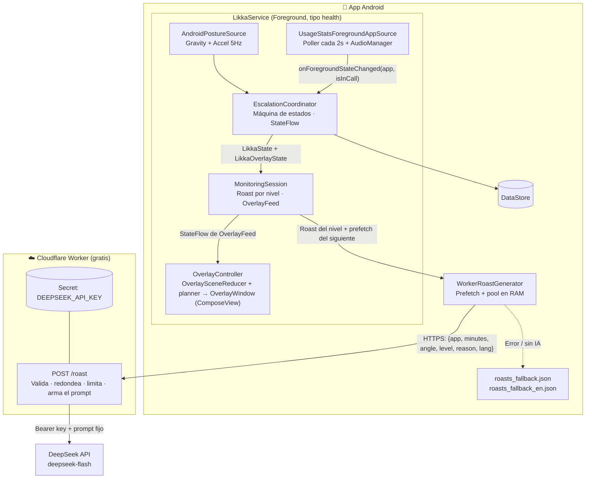
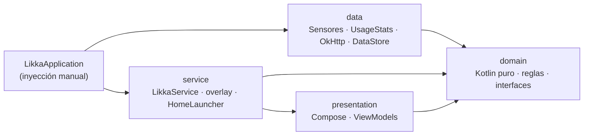
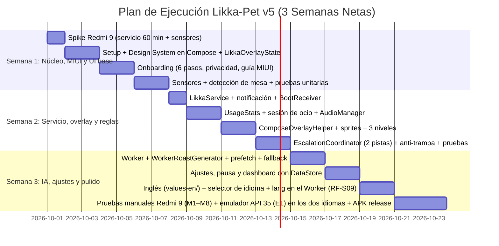

# 📖 Likka-Pet — Documentación Técnica Definitiva (MVP) · v5.18

> **Mascota virtual anti-procrastinación y guardián físico contra el dolor cervical.**  
> *El trinomio core: Postura Física + Overlay Flotante + IA Sarcástica (DeepSeek vía backend propio).*  
> *Estado: Aprobado para desarrollo (MVP de 3 semanas netas).*  
> *Diseño de interfaz: ver [`likkapet_design_system.md`](likkapet_design_system.md).*

---

## Tabla de Contenidos

1. [Ficha Técnica del Proyecto](#1-ficha-técnica-del-proyecto)
2. [Concepto Visual: Likka (Escarabajo Ciervo Nocturno)](#2-concepto-visual-likka-escarabajo-ciervo-nocturno)
3. [Mecánica Central: Escalamiento en 3 Niveles](#3-mecánica-central-escalamiento-en-3-niveles)
4. [Fundamento Biomecánico y Manejo de Casos Borde](#4-fundamento-biomecánico-y-manejo-de-casos-borde)
5. [Arquitectura: App + Backend Proxy](#5-arquitectura-app--backend-proxy)
6. [Requisitos del Sistema (Clasificación MoSCoW)](#6-requisitos-del-sistema-clasificación-moscow)
   - [Módulo 0: Máquina de Estados y Reglas Anti-trampa](#módulo-0-máquina-de-estados-y-reglas-anti-trampa)
   - [Módulo 1: Detección de Postura (Sensores 5Hz)](#módulo-1-detección-de-postura-sensores-5hz)
   - [Módulo 2: Monitoreo de Apps y Onboarding de Permisos](#módulo-2-monitoreo-de-apps-y-onboarding-de-permisos)
   - [Módulo 3: Overlay Flotante con Compose en WindowManager](#módulo-3-overlay-flotante-con-compose-en-windowmanager)
   - [Módulo 4: Motor de IA Contextual (DeepSeek)](#módulo-4-motor-de-ia-contextual-deepseek)
   - [Módulo 5: Persistencia Local Ligera (DataStore)](#módulo-5-persistencia-local-ligera-datastore)
   - [Módulo 6: Ajustes y Modo Pausa](#módulo-6-ajustes-y-modo-pausa)
   - [6.7 Requisitos No Funcionales Transversales](#67-requisitos-no-funcionales-transversales)
   - [6.8 Matriz de Trazabilidad](#68-matriz-de-trazabilidad-requisito--prueba)
7. [Backend Proxy: Decisión y Diseño](#7-backend-proxy-decisión-y-diseño)
8. [Privacidad y Minimización de Datos](#8-privacidad-y-minimización-de-datos)
9. [Soluciones de Ingeniería Android & Buenas Prácticas](#9-soluciones-de-ingeniería-android--buenas-prácticas)
10. [Arquitectura de Capas y Estructura de Carpetas](#10-arquitectura-de-capas-y-estructura-de-carpetas)
11. [Permisos y AndroidManifest.xml Unificado](#11-permisos-y-androidmanifestxml-unificado)
12. [Estrategia de Pruebas](#12-estrategia-de-pruebas)
13. [Entrega Final: APK Firmado](#13-entrega-final-apk-firmado)
14. [Cronograma de Ejecución (3 Semanas Netas)](#14-cronograma-de-ejecución-3-semanas-netas)
15. [Matriz de Riesgos y Mitigaciones](#15-matriz-de-riesgos-y-mitigaciones)
16. [Mejoras Opcionales de Bajo Esfuerzo (TTS y Sonidos)](#16-mejoras-opcionales-de-bajo-esfuerzo-tts-y-sonidos)
17. [Flujo de Desarrollo Asistido por IA (Skills y Agentes)](#17-flujo-de-desarrollo-asistido-por-ia-skills-y-agentes)
18. [Registro de Cambios](#18-registro-de-cambios)

---

## 1. Ficha Técnica del Proyecto

| Parámetro | Definición |
| :--- | :--- |
| **Nombre del Proyecto** | **Likka-Pet** |
| **Nombre del Personaje** | **Likka**, un escarabajo ciervo nocturno (diseño original de la autora, "Sirv") |
| **Plataforma Objetivo** | Android nativo (Kotlin, Jetpack Compose, Coroutines/Flow) |
| **Versión de Android** | Mínima: Android 10 (API 29) \| Objetivo: Android 15 (API 35) |
| **Dispositivo de Prueba Real** | **Xiaomi Redmi 9 M2004J19C («lancelot», versión global), Android 12 (API 31), MIUI 13 (V13.0.2.0.SJCMIXM)** — datos verificados por `adb` el 2026-09-30. Requiere validación temprana de restricciones de batería/autostart. Tiene `TYPE_GRAVITY` **de hardware** (MTK), que el servicio usa (RF-P01); el fallback de acelerómetro con EMA queda de reserva para otros equipos. Al ser Android 12, le aplican las restricciones para arrancar servicios en primer plano desde segundo plano (§9.3). |
| **Emulador de Prueba** | **API 35 (Android 15), imagen `google_apis` x86_64 (no AOSP)** — cubre lo que el Redmi 9 no tiene: `POST_NOTIFICATIONS` (API 33), `FOREGROUND_SERVICE_TYPE_HEALTH` (API 34) y la restricción de actividades en segundo plano de Android 15 (RF-O03). Ver §12.3. |
| **Distribución** | **Sideload (APK directo)** — sin revisión de Google Play |
| **Idioma** | **Español (por defecto) e inglés**, a elección del usuario (RF-S09, MUST): interfaz, onboarding, notificación, overlay, frases locales de reserva y mensajes de la IA, sin mezclar. *Pendiente de código (RF-S09):* hoy la app solo tiene el español en `strings.xml` |
| **Cerebro de IA** | **DeepSeek API** (`deepseek-flash`, formato OpenAI), llamada **solo desde el backend** |
| **Backend** | **Cloudflare Worker** (plan gratuito: 100,000 peticiones/día) que guarda la API key y arma el prompt |
| **Caché en Cliente** | Prefetch + pool en RAM (3 roasts por clave) + `roasts_fallback.json` (español) / `roasts_fallback_en.json` (inglés) |
| **Persistencia** | `Jetpack DataStore Preferences` |
| **Servicio Núcleo** | **`LikkaService` único** (Foreground Service: `health`) |
| **Costo Operativo** | Worker: **\$0**. DeepSeek: **~\$0.0002 USD por roast** → el saldo prepago de \$2 USD alcanza para ~10,000 roasts |

---

## 2. Concepto Visual: Likka (Escarabajo Ciervo Nocturno)

Likka es un **escarabajo ciervo nocturno** en **pixel art**: cuernos de ciervo, capucha y bufanda, élitros ámbar, patas de sátiro y dos ojos ámbar bajo la capucha. Es un **diseño original de la autora** (nombre interno del diseño: *Sirv*), así que no depende de licencias de terceros. Sus colores ya pertenecen a la paleta *Bosque*: el sprite no se recolorea, y el nivel se comunica con el **halo** de Likka (overlay de los Niveles 1–2), el **borde del escenario** (dashboard, onboarding y Nivel 3) y el **aura**.

| Estado | Animación (tag de Aseprite) | Halo de Likka (N1–N2) / borde del escenario | Tamaño en overlay |
| :--- | :--- | :--- | :--- |
| Reposo / Feliz | `idle` / `happy` (tag `idle` + destellos de Compose) | Crema `#FFF4E6` | Oculto (solo dentro de la app) |
| Nivel 1 — Susurro | `peek` en los bordes laterales, `perch` (tag `sit`) en el borde inferior; el cambio de lugar lo hace Compose (`motion.hop`), sin animación de sprite | Ámbar `#FCA30B` | Sin escenario: halo del color del nivel (2 píxeles del sprite); ventana = cuadro de 96 px × escala + halo en cada lado + globo (≈73dp sin globo); cambia de posición (§9.6) |
| Nivel 2 — Molesto | `annoyed` detenido; al caminar, los tags `walk_diag_down_right` (derecha, izquierda con espejo y diagonales hacia abajo), `walk_down` y `walk_up` | Ocre `#D17B0F` | Sin escenario: halo del color del nivel (2 píxeles del sprite); ventana = cuadro de 96 px × escala + halo en cada lado + globo (≈145dp sin globo); camina y vuelve al centro (§9.6) |
| Nivel 3 — Furia | `fury` (tag `fury`) en loop + aura pulsante (extra de Compose) | Frambuesa claro `#F07AA0` | Overlay 80%, sin movimiento de posición |

> **Assets:** todo el arte de Likka se generó con herramientas de IA a partir del diseño propio "Sirv"; la hoja final la construye el script `likka_sprites/tools/build.py` a partir de `sprites/drafts/2d-sprites-sheets/` (reducción por factor entero con vecino más cercano, paleta común de 16 colores, alfa binaria, contorno de 1 px, pies en y = 92) y se regenera con `python likka_sprites/tools/build.py` desde la raíz. `sprites/likka.png` (cuadros de 96×96 px) es la hoja final, `sprites/likka.json` tiene el formato del JSON que exporta Aseprite (Array + `frameTags`, se puede abrir en Aseprite, pero lo genera el script) y `sprites/likka_poses.json` es el mapeo pose→tag, también generado por `build.py` (tabla `POSES`). Los tres archivos y `likka_sprites/` se versionan en git; `sprites/drafts/`, `sprites/sirv.png` y los `*.aseprite`/`*.ase` no (§10.2). `sprites/sirv.png` queda solo como **referencia de diseño** (colores, capucha, cuernos, bufanda) y no se copia a la app. El conjunto de animaciones es **definitivo**: 10 tags (`idle`, `walk_down`, `walk_up`, `walk_diag_down_right`, `annoyed`, `fury`, `peek`, `sit`, `sleep`, `look_around`) hechos con las hojas de `sprites/drafts/2d-sprites-sheets/`; el resto de poses (`happy`, `talk`, `worried`, `perch`, `dragged`, `walk_right`...) reutilizan uno de ellos, y no habrá más animaciones. No hay retrato aparte (la bienvenida usa el cuadro 0 de `idle`, en vista 3/4). Al crear el proyecto Android, los tres archivos de `likka.*` se copian sin cambios a `app/src/main/assets/sprites/`. El detalle está en [`likkapet_design_system.md` §1.7](likkapet_design_system.md#17-personaje-likka-el-escarabajo-ciervo-nocturno-sprites).

---

## 3. Mecánica Central: Escalamiento en 3 Niveles

### 3.1 Motivos de disparo

Likka solo actúa **mientras una app vigilada está en primer plano**. Hay dos motivos de disparo independientes, y **cada uno tiene su propia forma de resolverse**:

| Motivo | Se dispara cuando… | Se resuelve cuando… |
| :--- | :--- | :--- |
| **`POSTURE`** | $\theta < 45^\circ$ durante **10 s continuos** | $\theta > 55^\circ$ durante **15 s continuos** |
| **`USAGE_TIME`** | La **sesión de ocio** acumula **15 min** | El usuario pasa **5 min seguidos fuera de todas** las apps vigiladas (fin de sesión) |

- **Sesión de ocio**: tiempo acumulado en **todas** las apps vigiladas juntas, incluidas las que el usuario añadió (RF-S06). Saltar de TikTok a Instagram **no** reinicia el contador. Salir por menos de 5 min **pausa** el contador, pero no lo reinicia.
- **Cada motivo lleva su propio nivel y su propio temporizador de escalamiento** (§3.3): `POSTURE` y `USAGE_TIME` avanzan de forma independiente entre Nivel 0 y Nivel 3. El overlay siempre muestra **el nivel más alto de los dos**.
- Enderezar el cuello **solo** resuelve el motivo `POSTURE`. Si `USAGE_TIME` sigue activo, el overlay se queda en el nivel de `USAGE_TIME` (no baja a Gracia ni a Reposo): ver regla A.

### 3.2 Reglas anti-trampa

| Regla | Qué evita | Comportamiento |
| :--- | :--- | :--- |
| **A. Resolución por motivo** | Enderezar el cuello un momento para seguir 2 horas en TikTok | El motivo `USAGE_TIME` **ignora la postura**; solo se resuelve saliendo de las apps vigiladas 5 min seguidos (fin de sesión). Resolver `POSTURE` con `USAGE_TIME` todavía activo **no** manda a Gracia: el overlay se queda en el nivel de `USAGE_TIME`. |
| **B. Gracia tras perdonar** | Un reaparecer inmediato de Likka | Tras resolver `POSTURE` **y** con `USAGE_TIME` inactivo, hay **60 s de gracia** sin detección de postura (Likka celebra y se va). Resolver `USAGE_TIME` no tiene Gracia: pasa directo a Inactivo (fin de sesión). |
| **C. Reincidencia** | El ciclo "me enderezo → me encorvo → vuelvo al Nivel 1 amable" | Aplica **solo al motivo `POSTURE`** (es el único con Gracia). Si `POSTURE` se vuelve a disparar **dentro de 10 min** tras haber resuelto, se **retoma el nivel de postura alcanzado la vez anterior** (mínimo Nivel 1), no el Nivel 1. |
| **D. Regreso rápido** | Mandarte al inicio en el Nivel 3 y volver a abrir TikTok de inmediato | Si se vuelve a abrir una app vigilada **dentro de los 5 min** posteriores a una expulsión, cada motivo que **seguía activo** al expulsar retoma **directo en Nivel 2** (no en Nivel 3). Un motivo ya resuelto no se reactiva. |
| **E. Pausa limitada** | Pausar a Likka indefinidamente | Máximo **3 pausas al día**; se permite desde Nivel 0 a Nivel 2, **nunca durante el Nivel 3** (ver Módulo 6). |

### 3.3 Máquina de estados

La máquina tiene dos partes: un **estado global** (`LikkaState`, lo que puede bloquear o congelar todo el servicio) y, mientras el estado global es `WATCHING`, **dos pistas de escalamiento independientes** — una por motivo (`POSTURE`, `USAGE_TIME`) — que avanzan en paralelo. El overlay siempre muestra `max(nivelPostura, nivelUso)`.

```mermaid
stateDiagram-v2
    state "Inactivo" as IDLE
    state "Vigilando" as WATCHING {
        state "Pista POSTURE" as POSTURE_TRACK {
            state "Sin aviso" as P0
            state "Nivel 1" as P1
            state "Nivel 2" as P2
            state "Nivel 3" as P3
            state "Gracia (regla B)" as PGRACE
            state "En mesa (congelada)" as PTABLE
            [*] --> P0
            P0 --> P1: 10 s continuos θ < 45°
            P1 --> P2: motivo sigue activo 2 min
            P2 --> P3: motivo sigue activo 3 min
            P1 --> PGRACE: θ > 55° 15 s continuos
            P2 --> PGRACE: θ > 55° 15 s continuos
            P3 --> PGRACE: θ > 55° 15 s continuos (fuera de la expulsión del Nivel 3 global)
            PGRACE --> P0: 60 s (regla B) o retoma nivel previo si hay reincidencia < 10 min (regla C)
            P1 --> PTABLE: teléfono clasificado ON_TABLE (§4)
            P2 --> PTABLE: teléfono clasificado ON_TABLE (§4)
            P3 --> PTABLE: teléfono clasificado ON_TABLE (§4)
            PTABLE --> P1: deja la mesa, retoma el nivel y el tiempo restante
        }
        state "Pista USAGE_TIME" as USAGE_TRACK {
            state "Sin aviso" as U0
            state "Nivel 1" as U1
            state "Nivel 2" as U2
            state "Nivel 3" as U3
            [*] --> U0
            U0 --> U1: sesión de ocio acumula 15 min
            U1 --> U2: motivo sigue activo 2 min
            U2 --> U3: motivo sigue activo 3 min
        }
    }
    state "Expulsado" as EJECTED
    state "Suspendido" as SUSPENDED
    state "Pausa" as PAUSED

    [*] --> IDLE
    IDLE --> WATCHING: Abre app vigilada
    WATCHING --> IDLE: USAGE_TRACK resuelto (5 min fuera de todas las apps vigiladas = fin de sesión)
    WATCHING --> EJECTED: max(nivelPostura, nivelUso) llega a Nivel 3 y el usuario pulsa "Me rindo" o pasan 20 s
    EJECTED --> WATCHING: Reabre una app vigilada antes de 5 min: cada pista que seguía activa retoma en Nivel 2 (regla D)
    EJECTED --> IDLE: 5 min fuera (fin de sesión; ambas pistas vuelven a 0)
    WATCHING --> SUSPENDED: Llamada o pantalla apagada
    SUSPENDED --> WATCHING: Termina la causa; cada pista retoma su propio nivel y tiempo restante
    IDLE --> PAUSED: Pausa manual (sin sesión activa)
    WATCHING --> PAUSED: Pausa manual (Nivel 0–2 de ambas pistas; nunca en Nivel 3)
    PAUSED --> WATCHING: Vence `paused_until` con la sesión de USAGE_TIME todavía viva, o el usuario reanuda antes
    PAUSED --> IDLE: Vence `paused_until` y la sesión ya terminó (5 min fuera durante la pausa)
```



- Los identificadores en mayúsculas son los valores de los enums `LikkaState` (global) y `ReasonLevel` (por pista) en el código.
- **Un nivel por motivo.** `POSTURE` y `USAGE_TIME` tienen cada uno su propio nivel (0–3) y su propio temporizador Nivel 1→2→3. El overlay muestra el máximo; el roast que se pide y se muestra corresponde al motivo con el nivel más alto (empate → se prioriza el que lleva más tiempo activo).
- **Gracia (regla B) solo existe en la pista `POSTURE`.** Resolver `USAGE_TIME` termina la sesión de ocio y, si `POSTURE` también está en 0, el estado global vuelve a `IDLE` directamente (sin Gracia).
- **Salir de la app vigilada en Nivel 1–2 sin llegar a expulsión** (botón Inicio, cambiar a una app no vigilada, minimizar): el overlay se oculta y **los temporizadores de escalamiento y de resolución de ambas pistas se congelan** en el estado global `WATCHING` (no hay una transición de estado nueva; es una bandera `isForeground` que la UI usa para decidir si dibuja el overlay). Si pasan 5 min fuera de todas las apps vigiladas, la sesión termina (`WATCHING → IDLE`, igual que el fin de sesión de `USAGE_TIME`) y ambas pistas se reinician a 0. Si el usuario vuelve antes, se retoma cada pista con su nivel y tiempo restante — no aplica la regla D (esa es solo para expulsiones forzadas del Nivel 3). Cualquier salida con el nivel global en Nivel 3 **no** es este caso: cuenta como expulsión (`EJECTED`), igual que "Me rindo" (RF-O03, RF-O07, decisión 44 del registro de cambios).
- **Tres conceptos separados que en v4 estaban mezclados en `SUSPENDED`:**
  - **Suspendido** (`SUSPENDED`): llamada (`AudioManager.getMode()`, §4.2) o pantalla apagada. Congela **todo** (ambas pistas, incluida la cuenta regresiva de 20 s del Nivel 3) y oculta el overlay. Al volver, cada pista retoma su nivel y su tiempo restante.
  - **En mesa** (`PTABLE`, dentro de `POSTURE_TRACK`): **Opción B (§4.1, decisión de la dueña 2026-10-05).** La mesa solo oculta la pista `POSTURE` si esa pista **no está activa** (`!track.isActive`). Si `POSTURE` ya alcanzó un nivel activo (N1–N3), la mesa no la oculta ni congela la cuenta del Nivel 3; únicamente impide que un ángulo nuevo dispare un nivel desde cero. `USAGE_TIME` sigue corriendo normalmente y su overlay sigue visible. La cuenta regresiva de 20 s del Nivel 3 **corre siempre**, sin importar si el teléfono está en la mesa. No es un estado global. `MonitoringSession` registra `onTable=true/false` en logcat cada vez que cambia.
  - **Pausa** (`PAUSED`): acción manual del usuario. No dispara ni escala ningún nivel mientras dura, pero los minutos **sí** cuentan para las estadísticas de uso del día. Se permite desde Nivel 0–2 (de cualquier pista); **nunca** si alguna pista está en Nivel 3.
- **Al volver de `SUSPENDED`** se retoma el mismo nivel en cada pista (no hay una transición genérica `SUSPENDED → WATCHING` que reinicie nada): el coordinador guarda el nivel y el tiempo restante de cada pista al entrar en `SUSPENDED` y los restaura al salir.
- **Regla C (reincidencia)** vive dentro de `PGRACE → P0`: si `POSTURE` se vuelve a disparar dentro de `RELAPSE_WINDOW_MIN` (10 min) desde que se entró a Gracia, en vez de reiniciar en `P0` se reingresa directo al nivel de postura que tenía antes de resolverse (mínimo Nivel 1).
- **Pantalla apagada cuenta como "tiempo fuera" para terminar la sesión de `USAGE_TIME`**: al apagarse la pantalla el estado pasa a `SUSPENDED` (no se congela el reloj de la sesión, solo la detección), así que si pasan los 5 min de `SESSION_END_AWAY_MIN` con la pantalla apagada, la sesión también termina al reactivarse. Ver también la nota sobre `PTABLE` — el teléfono en mesa **no** apaga la pantalla ni suspende `USAGE_TIME`.
- **Una llamada congela absolutamente todo, sin excepción**, incluida la ventana de 5 min tras una expulsión (`EJECTED`) y el plazo `EJECTION_EXIT_TIMEOUT_SEC` de la regla D: mientras `AudioManager` reporta una llamada, ninguno de esos conteos avanza, sin importar el estado global. La pantalla apagada, en cambio, **no** congela esas dos ventanas: cuenta como tiempo fuera, igual que cualquier otro momento sin la app vigilada en primer plano.
- **Margen tras colgar (`CALL_END_GRACE_SEC` = 5 s, v5.17, decisión de la dueña).** Al terminar una llamada, la pantalla de llamada o la app de VoIP (WhatsApp) pueden seguir delante unos cuantos sondeos. Durante esos 5 s, estar fuera de la app vigilada **sigue contando como parte de la llamada**: se congela todo igual que en la llamada (ambas pistas, la cuenta de 20 s del Nivel 3, la ventana de 5 min de una expulsión y el plazo `EJECTION_EXIT_TIMEOUT_SEC` de la regla D), y el Nivel 3 no lo cuenta como salida. Si la app vigilada vuelve dentro del margen, se retoma el mismo nivel y tiempo restante; si el margen vence fuera, es una salida normal (en Nivel 3, expulsión). El margen se cancela al volver la app vigilada o al empezar otra llamada, y vence en un `onTick()` aunque no llegue ningún sondeo. Si una sola actualización tardía cruza el fin de una pausa y el fin del margen, ambos se procesan en orden cronológico, para que el tiempo entre uno y otro cuente con las reglas correctas.

**Reglas de detalle (interpretaciones aprobadas por la dueña del proyecto, sin cambiar el resto de §3.2/§3.3):**

- La regla C (reincidencia) también aplica sin que haya habido Gracia (regla B): la ventana de `RELAPSE_WINDOW_MIN` (10 min) cuenta siempre desde el instante en que `POSTURE` se resuelve, haya o no Gracia.
- Una reincidencia (regla C) que retoma desde Nivel 3 vuelve a Nivel 3 con los 20 s de `LEVEL_3_AUTO_HOME_SEC` contados de nuevo, no con el tiempo que ya llevaba antes de resolverse.
- Al retomar un nivel por la regla C o por la regla D, el temporizador de escalamiento de ese nivel (2 min / 3 min) empieza de cero, no continúa donde iba antes de resolverse o de la expulsión.
- Regla D: una pista que solo llegó a Nivel 1 al momento de la expulsión también vuelve en Nivel 2 al regresar dentro de la ventana (no solo las que llegaron a Nivel 2–3). La regla exige una salida real de la app vigilada, **o** que la app siga reportándose en primer plano por más de `EJECTION_EXIT_TIMEOUT_SEC` tras la expulsión (más de dos ciclos del poller de 2 s, para no contar un poll rezagado): eso también cuenta como "regreso" a efectos de la regla D. La ventana de `QUICK_RETURN_WINDOW_MIN` (5 min) corre desde el instante de la expulsión, no desde que el usuario finalmente sale.
- Los 15 s de buena postura que resuelven `POSTURE` cuentan igual estando en Nivel 3: si se cumplen y `USAGE_TIME` no está también en Nivel 3, la cuenta regresiva de `LEVEL_3_AUTO_HOME_SEC` se cancela (vuelve a 0) en vez de seguir corriendo o expulsar.
- La Gracia (regla B) y la ventana de la regla C corren con reloj real (no se congelan si el teléfono queda suspendido o en pausa mientras tanto). En cambio, los contadores de postura continua (`POSTURE_TRIGGER_SEC` = 10 s, `POSTURE_RESET_SEC` = 15 s) se reinician cada vez que la detección se interrumpe: al salir de la app, al suspenderse (llamada o pantalla apagada), al entrar en pausa y al clasificarse el teléfono como en mesa.
- La suspensión (llamada o pantalla apagada) solo congela mientras el estado global es `WATCHING`; la única excepción es la llamada, que congela también la ventana de 5 min de una expulsión y el plazo de la regla D (ver arriba) — la pantalla apagada no.
- En la mesa, **Opción B**: `PostureTrack.shownLevel` devuelve `NONE` solo si la pista NO está activa (`!track.isActive`). Si `POSTURE` ya llegó a un nivel activo, la mesa no lo oculta; únicamente impide que `POSTURE` se dispare desde cero mientras el teléfono está plano y quieto. La cuenta regresiva de 20 s del Nivel 3 corre siempre, sin congelas por mesa. Salir de la app vigilada con un Nivel 3 de `POSTURE` (aunque la mesa no lo oculte) sigue contando como expulsión. Si, en ese mismo momento, `USAGE_TIME` alcanza también Nivel 3, hereda la cuenta regresiva ya congelada de `POSTURE` en vez de arrancar una nueva (caso raro, aceptado por diseño).
- Pausa: se permite desde `IDLE` o desde `WATCHING` (ver el diagrama actualizado, que agrega `IDLE → PAUSED`), nunca desde `EJECTED` ni con alguna pista en Nivel 3. Al vencer `paused_until`, se vuelve a `WATCHING` si la sesión de `USAGE_TIME` sigue viva, o a `IDLE` si ya terminó (por ejemplo, si los 5 min de `SESSION_END_AWAY_MIN` se cumplieron mientras se estaba en pausa). La pausa congela ambas pistas y el contador de la sesión de `USAGE_TIME`, pero 5 min fuera de las apps vigiladas durante la pausa igual terminan la sesión. La pausa también se oculta durante una llamada o con la pantalla apagada (mismo `HIDDEN_SUSPENDED` que cualquier otro estado, §5).
- En un empate de nivel entre las dos pistas, manda el motivo que lleva más tiempo activo (`activeSinceMs` más antiguo); la regla D conserva ese instante al retomar en Nivel 2, así que un empate resuelto antes de una expulsión se mantiene resuelto igual después de volver.
- Entre 45° y 55° (zona neutra), `POSTURE` no dispara ni se resuelve, pero si la pista ya está activa, su temporizador de escalamiento sigue corriendo con normalidad — la zona neutra no congela el escalamiento, solo impide que la histéresis dispare o perdone.
- Un evento reportado con el mismo valor que el anterior (misma app en primer plano, mismo ángulo/zona de postura) no tiene efecto adicional: las fuentes pueden reportar en cada ciclo de sondeo sin que eso reinicie o duplique nada.
- Contrato con el servicio: el coordinador es síncrono y no programa nada por sí mismo; el servicio debe llamar a `onTick()` aproximadamente una vez por segundo para que los temporizadores avancen sin otros eventos. El servicio nunca debe reportar la pantalla apagada ni la pantalla de bloqueo como "salir de la app vigilada": eso se reporta solo a través de `onScreenStateChanged`, nunca como una app en primer plano nula. La fuente de primer plano informa **cada consulta** con `onForegroundStateChanged(app, isInCall)`, que aplica los dos campos juntos y reconcilia una sola vez (v5.17): una pantalla de llamada encima de la app vigilada en Nivel 3 llega como "sin app vigilada" + "en llamada" (y colgar, como lo contrario); aplicados uno por uno, cualquiera de los dos órdenes dejaría un instante en Nivel 3 fuera de la app y sin suspender, que contaría como expulsión. Los métodos de un solo campo (`onForegroundAppChanged`, `onCallStateChanged`) quedan `internal`, solo para las pruebas.

### 3.4 Calibración centralizada (`EscalationConfig.kt`)

Única fuente de verdad para tiempos y umbrales. Ningún otro archivo define estos números.

```kotlin
package com.likkapet.domain

import com.likkapet.domain.model.TargetApp

/** Single source of truth for every threshold and timing (documentación §3.4). */
object EscalationConfig {
    // Posture
    const val POSTURE_DANGER_ANGLE = 45.0 // θ < 45° = text neck
    const val POSTURE_RESET_ANGLE = 55.0 // θ > 55° to forgive (10° hysteresis)
    const val POSTURE_TRIGGER_SEC = 10 // Continuous bad posture before triggering
    const val POSTURE_RESET_SEC = 15 // Continuous good posture before forgiving

    // Owner decision (2026-10-05): straightening the phone does not make an active Likka leave; the
    // POSTURE track ends only with the session or an ejection, so a landscape game or video keeps
    // being interrupted. POSTURE_RESET_ANGLE/SEC (and rules B and C) apply only when this is true.
    const val POSTURE_FORGIVES_GOOD_POSTURE = false

    // Usage time
    const val USAGE_THRESHOLD_MIN = 15 // Session minutes before Level 1
    const val SESSION_END_AWAY_MIN = 5 // Minutes away from watched apps that end a session

    // Escalation (per-reason track, §3.3). Minutes, like the other multi-minute
    // timers below; only LEVEL_3_AUTO_HOME_SEC needs second-level granularity.
    const val LEVEL_1_TO_2_MIN = 2
    const val LEVEL_2_TO_3_MIN = 3
    const val LEVEL_3_AUTO_HOME_SEC = 20

    // Anti-cheat rules (§3.2)
    const val GRACE_AFTER_RESET_SEC = 60 // Rule B
    const val RELAPSE_WINDOW_MIN = 10 // Rule C
    const val QUICK_RETURN_WINDOW_MIN = 5 // Rule D
    const val MAX_PAUSES_PER_DAY = 3 // Rule E

    // The farewell animation length that bounds `LikkaOverlayState.isFarewell` (RF-O04), and the
    // pause lengths offered by the dashboard and the notification action (RF-S01, RF-O08).
    const val FAREWELL_SEC = 1
    val PAUSE_OPTIONS_MIN = listOf(15, 30, 60)
    const val NOTIFICATION_PAUSE_MIN = 30

    // After an ejection, a watched app still reported in the foreground for longer than this
    // (more than two 2 s poller cycles, so not just a stale poll) means the user never left
    // (HomeLauncher blocked, e.g. by MIUI, or reopened from recents): it counts as a return
    // and rule D applies (§3.3 "Reglas de detalle").
    const val EJECTION_EXIT_TIMEOUT_SEC = 5

    // Phase 4a (owner-approved): after a call ends, the call screen or the VoIP app (WhatsApp)
    // may stay in front for a few polls. For this long, being away from the watched app is still
    // part of the call: nothing runs and Level 3 does not count it as an exit; if the watched app
    // comes back, everything resumes where it was; if the time runs out away, it is a normal exit.
    const val CALL_END_GRACE_SEC = 5

    // How often the usage time kept in memory is written to DataStore (RF-D02), and how often
    // the dashboard re-checks whether paused_until has passed (RF-S01).
    const val USAGE_FLUSH_SEC = 60
    const val PAUSE_EXPIRY_CHECK_SEC = 15

    // Service cadences: the coordinator is ticked once per second (its documented contract, §3.3);
    // the service looks for a day change at least this often, so a clock or zone change is noticed
    // too; the notification re-reads the permissions this often (RF-A06).
    const val COORDINATOR_TICK_SEC = 1
    const val DAY_CHANGE_CHECK_SEC = 60
    const val PERMISSION_CHECK_SEC = 30

    // Diagnostic heartbeat of the service: readings rate after decimation and CPU-sleep gaps,
    // kept for the on-device checks (Data 2 rates, M1 screen-off survival).
    const val HEARTBEAT_SEC = 60

    // Sensor and poller cadences of Data 2.
    // Posture sensors (RF-P01): the period asked from Android is only a hint, so the source
    // decimates by sample timestamp to this period; an event up to the jitter early still counts.
    const val POSTURE_SAMPLE_PERIOD_MS = 200 // 5 Hz
    const val POSTURE_SAMPLE_JITTER_MS = 20
    const val ACCELEROMETER_EMA_ALPHA = 0.15 // Fallback orientation filter without TYPE_GRAVITY (RF-P01)
    // Foreground app poller (RF-A01, RF-A03): the first query also looks back this far to know the
    // app that is already open when the service starts.
    const val FOREGROUND_POLL_SEC = 2
    const val FOREGROUND_INITIAL_LOOKBACK_MIN = 10
    // AI roasts (RF-I03, RF-I05, RF-I06): pool size per key and the Worker's answers' back-offs.
    const val ROAST_POOL_SIZE = 3
    const val ROAST_MAX_WORDS = 25
    const val RATE_LIMIT_BACKOFF_MIN = 10 // After a 429 the app makes no request for this long
    const val ROAST_REQUEST_TIMEOUT_SEC = 8 // The Worker gives DeepSeek 6 s; this covers the extra hop

    // Table detection (§4)
    const val TABLE_MIN_Z = 9.0 // m/s²
    const val TABLE_MAX_ABS_Y = 2.0 // m/s²
    const val TABLE_MAX_STDDEV = 0.05 // m/s², std-dev of |a| over 2 s
    const val TABLE_WINDOW_SAMPLES = 10 // 2 s at 5 Hz

    // Overlay movement (§9.6, RF-O09–RF-O12)
    const val LEVEL_1_HOP_INTERVAL_SEC = 40 // Level 1: seconds between hops to a new edge position
    const val LEVEL_2_WALK_MIN_SEC = 3 // Level 2: minimum seconds per walking segment when space allows (decisión de la dueña 2026-10-05)
    const val LEVEL_2_STOP_SEC = 5 // Level 2: seconds stopped between walking segments (decisión de la dueña 2026-10-05)
    const val LEVEL_2_RETURN_DELAY_SEC = 5 // Level 2: seconds after a drag before walking back
    const val MOVEMENT_STEP_FPS = 10 // Movement updates per second (sprite-frame cadence, not 60fps)
    const val POKE_REACTION_TAPS = 3 // Taps within the window below that trigger a "poke" reaction
    const val POKE_REACTION_WINDOW_SEC = 5 // Window to count taps for the "poke" reaction

    // The Level 2 walking step in sprite pixels, kept here so scenario M8 can tune Likka's
    // speed without touching code. LEVEL_2_CENTER_ZONE_FRACTION exists in the code but is no
    // longer used by the normal walk cycle (the new cycle covers the whole safe area).
    const val LEVEL_2_CENTER_ZONE_FRACTION = 0.5
    const val LEVEL_2_WALK_STEP_SPRITE_PX = 1

    // Overlay feedback (phase 4a, RF-O02): how long a tap keeps the Level 1 roast unfolded,
    // and the vibration of Level 2 (one pulse) and Level 3 (two pulses with a gap).
    const val LEVEL_1_ROAST_EXPANDED_SEC = 5
    const val LEVEL_2_VIBRATION_MS = 250L
    const val LEVEL_3_VIBRATION_PULSE_MS = 300L
    const val LEVEL_3_VIBRATION_GAP_MS = 150L

    // Phase 4b (RF-O12): how long a local reaction stays in the bubble; a drag one counts from the drop.
    const val LOCAL_REACTION_SEC = 4

    // Default watched apps (user can disable them in Settings). Any package the user adds
    // (RF-S06) is not in this map and is treated as TargetApp.OTHER.
    val DEFAULT_TARGET_PACKAGES =
        mapOf(
            "com.zhiliaoapp.musically" to TargetApp.TIKTOK, // TikTok Global
            "com.ss.android.ugc.trill" to TargetApp.TIKTOK, // TikTok Regional
            "com.instagram.android" to TargetApp.INSTAGRAM,
            "com.google.android.youtube" to TargetApp.YOUTUBE,
            "com.facebook.katana" to TargetApp.FACEBOOK,
            "com.facebook.lite" to TargetApp.FACEBOOK,
        )
}
```

> **`POSTURE_FORGIVES_GOOD_POSTURE = false` (decisión de la dueña, 2026-10-05):** Con este valor, una vez que la pista `POSTURE` está activa, enderezar el teléfono **no** la resuelve; la pista termina solo con el fin de sesión o una expulsión. Las reglas B (Gracia) y C (reincidencia) y las constantes `POSTURE_RESET_ANGLE`/`POSTURE_RESET_SEC` aplican únicamente si esta constante fuera `true`.

> **`LEVEL_2_CENTER_ZONE_FRACTION`** sigue existiendo en el código pero el nuevo ciclo de movimiento del Nivel 2 (fase 4b, decisión de la dueña 2026-10-05) recorre toda el área segura, no solo la zona central. La constante se conserva para no romper código que la referencia, pero el planner ya no la usa en el ciclo normal.

```kotlin
// TargetApp and TriggerReason live in domain/model/ (§10.2), not in this file;
// they're shown together here only for readability. OTHER ("otra app") stands for every app
// the user adds (RF-S06): the coordinator treats it like any other (§3.1), and it is the only
// value the app ever sends to the Worker for those apps, never their name or package (§8).
enum class TargetApp(val displayName: String) {
    TIKTOK("TikTok"), INSTAGRAM("Instagram"), YOUTUBE("YouTube"), FACEBOOK("Facebook"), OTHER("Otra app")
}
enum class TriggerReason { POSTURE, USAGE_TIME }
```

---

## 4. Fundamento Biomecánico y Manejo de Casos Borde

### Biomecánica Cervical (Hansraj, 2014)
$$\theta = \arccos\left(\frac{Z}{\sqrt{X^2 + Y^2 + Z^2}}\right)$$

$\theta \approx 90^\circ$ con el teléfono vertical frente a la cara y $\theta \approx 0^\circ$ con el teléfono horizontal boca arriba.

| Inclinación de Pantalla ($\theta$) | Flexión Cervical estimada | Carga en la columna cervical | Equivalencia usada por la IA |
| :---: | :---: | :---: | :--- |
| **$\ge 65^\circ$** | $0^\circ - 15^\circ$ | **~5 – 12 kg** | Peso natural de la cabeza. Postura saludable. |
| **$45^\circ - 64^\circ$** | $15^\circ - 30^\circ$ | **~12 – 18 kg** | Como un garrafón de agua colgado del cuello. |
| **$< 45^\circ$** | **$30^\circ - 60^\circ$** | **~18 – 27 kg** | **Hasta 27 kg de carga**. Vértebras bajo estrés extremo. |

> **Supuesto de diseño:** la inclinación del teléfono es una **aproximación** de la flexión del cuello (se asume que el usuario mira la pantalla de frente). Es suficiente para un recordatorio de hábito, no es una medición clínica; así se debe presentar en la app y en la exposición.

> **Ángulo redondeado en el Worker (v5.14):** la app envía el ángulo sin redondear y el Worker lo redondea a múltiplos de 5 antes de armar el prompt (§8). Un ángulo real de 43–44° (ya en la banda de 27 kg) llega entonces como 45, que con el texto anterior «menor a 45» caía en la banda de 15 kg. Por eso el *system prompt* dice «ángulo de **45 o menos**» → hasta 27 kg; «entre 50 y 60» → unos 15 kg; «desde 65» → postura sana (§7.2, RF-I11).

### Casos Borde Críticos y sus Mitigaciones

#### 4.1 Teléfono sobre una mesa (falso positivo)
Plano sobre una superficie, $Z \approx 9.81\text{ m/s}^2$ y $\theta \approx 0^\circ$. El problema es que alguien viendo el teléfono **casi horizontal en sus piernas** produce valores parecidos, y es justo la peor postura.  
*Mitigación:* se clasifica como `ON_TABLE` solo si se cumplen **las tres** condiciones:
- $Z > 9.0\text{ m/s}^2$ y $|Y| < 2.0\text{ m/s}^2$ (horizontal), **y**
- la **desviación estándar de la magnitud de la aceleración** en los últimos 2 s (10 muestras de `TYPE_ACCELEROMETER` crudo) es **< 0.05 m/s²**.  
Un teléfono en la mano siempre tiene microtemblor (típicamente > 0.1 m/s²); uno sobre una mesa está quieto. La varianza se calcula con el acelerómetro **crudo**, porque `TYPE_GRAVITY` ya viene filtrado y ocultaría el temblor.

**Opción B — comportamiento de la mesa (decisión de la dueña, 2026-10-05).** `PostureTrack.shownLevel` devuelve `NONE` solo si la pista `POSTURE` **no está activa** (`!track.isActive`). Esto significa que:
- Si la pista no está activa (Nivel 0), la mesa impide que `POSTURE` se dispare: el overlay de `POSTURE` no aparece mientras el teléfono está plano y quieto.
- Si la pista **ya está activa** (Nivel 1–3), la mesa **no la oculta ni congela su cuenta**: el overlay sigue visible y la cuenta regresiva de 20 s del Nivel 3 corre sin detenerse.
- La cuenta del Nivel 3 corre siempre, independientemente de si el teléfono está en la mesa.
- `MonitoringSession` registra `onTable=true/false` en logcat al cambiar.

#### 4.2 Llamadas (entrantes, salientes y VoIP)
El overlay podría tapar los botones para contestar.  
*Mitigación:* consultar `AudioManager.getMode()` en cada ciclo de 2 s. Si es `MODE_RINGTONE`, `MODE_IN_CALL` o `MODE_IN_COMMUNICATION` (esta última cubre llamadas de WhatsApp/Meet), se pasa a **Suspendido**. No requiere permisos. El poller sigue leyendo el estado de llamada con la pantalla apagada (no consulta `UsageStats` en ese estado, pero sí `AudioManager`): una llamada con la pantalla apagada también congela todo (§3.3). Como respaldo, también se suspende si la app en primer plano es un marcador conocido (`com.android.incallui`, `com.google.android.dialer`, `com.android.dialer`). *(Revisar solo el nombre del paquete no es confiable: la pantalla de llamada no siempre genera un evento de uso.)*  
*Contrato con el coordinador (v5.17):* cada consulta del poller se informa con un solo `onForegroundStateChanged(app, isInCall)`, que aplica la app y la llamada juntas: así una pantalla de llamada que aparece encima de la app vigilada en Nivel 3 **suspende** en vez de expulsar (aplicadas por separado, quedaría un instante en Nivel 3 fuera de la app y sin suspender). Al colgar, los `CALL_END_GRACE_SEC` (5 s) siguientes fuera de la app vigilada cuentan todavía como llamada, porque la pantalla de llamada o WhatsApp pueden seguir delante unos sondeos; si la app vigilada vuelve, se retoma el mismo nivel y tiempo; si el margen vence fuera, es una salida normal (§3.3).

#### 4.3 Pantalla apagada (ahorro de batería)
Desregistro de sensores con un `BroadcastReceiver` dinámico para `ACTION_SCREEN_OFF`; se reactivan con `ACTION_SCREEN_ON`. Mientras la pantalla está apagada, el estado es **Suspendido** (y, si pasan 5 min así, también termina la sesión de `USAGE_TIME`: §3.3).

#### 4.4 Usuario acostado boca arriba
Con el teléfono sobre la cara, $Z < 0$ y $\theta > 90^\circ$: no se considera mala postura (el cuello no está flexionado). Limitación conocida y aceptada.

---

## 5. Arquitectura: App + Backend Proxy



**Contrato central:** `LikkaOverlayState` es la única salida del coordinador hacia la UI. Se define **primero**, para que la maquetación del overlay y la lógica del servicio avancen en paralelo con estados falsos.

> **Nombre:** en v4 este modelo se llamaba `LikkaUiState`, pero el sufijo `UiState` está reservado por la convención del §10.4 para el estado de una pantalla concreta (`DashboardUiState`, `SettingsUiState`). Como este modelo sale de `domain` y lo consume el overlay (que no es una `Screen`/`ViewModel` como las demás), se renombra a `LikkaOverlayState`.

```kotlin
data class LikkaOverlayState(
    val visibility: OverlayVisibility,     // SHOWN, HIDDEN_WHILE_AWAY, HIDDEN_SUSPENDED
    val level: Int,                        // max(postureLevel, usageLevel); 0 = nothing to show
    val reason: TriggerReason?,            // the reason driving `level`; null at level 0
    val app: TargetApp?,
    val roast: String?,
    val level3SecondsLeft: Int?,           // Level 3 only
    val isPaused: Boolean,                 // true → render the `sit` pose, no escalation
    val isFarewell: Boolean,               // true → play the goodbye animation (RF-O04) before hiding
    val isWatchedAppInForeground: Boolean  // a watched app is the one on screen; on an ejection, only then is the user sent home (RF-O03)
)

enum class OverlayVisibility { SHOWN, HIDDEN_WHILE_AWAY, HIDDEN_SUSPENDED }
```

- `HIDDEN_WHILE_AWAY` covers leaving a watched app in Level 1–2 without ejection (§3.3): the overlay disappears but the state (and its timers) is preserved for the UI to resume once `visibility` goes back to `SHOWN`. Leaving with the global level at 3 is always an ejection instead (`EJECTED`), never `HIDDEN_WHILE_AWAY`.
- `HIDDEN_SUSPENDED` covers `SUSPENDED` (call, screen off): same idea, different cause, kept separate so the service/notification text can tell them apart.
- `isPaused` and `isFarewell` are mutually exclusive with a nonzero `level`: `isPaused` is only true while `LikkaState == PAUSED`, and `isFarewell` is only true for the ~1 s farewell animation right after a reason resolves.
- `isWatchedAppInForeground` (v5.17) es `true` mientras una app vigilada es la que está en pantalla. En una expulsión decide si se abre Inicio (RF-O03): solo cuando el usuario sigue en la app vigilada.
- `roast` **no** lo rellena el coordinador (lo deja en `null`). Lo rellena `MonitoringSession`: un roast por nivel, motivo y app (el mismo texto se mantiene mientras esos tres no cambien, también durante `SUSPENDED` o fuera de la app; cualquier cambio toma uno nuevo y el Nivel 0 lo olvida), y al tomar uno pide el prefetch del nivel siguiente (§6 Módulo 4). `nextRoast` nunca espera a la red (pool o frase local), así que un nivel nunca se muestra con el globo vacío.

**Del coordinador a la ventana (v5.17, fase 4a).** El flujo sigue siendo unidireccional:

1. `MonitoringSession` publica un `StateFlow<OverlayFeed>`: el estado global (`LikkaState`) y el `LikkaOverlayState` con su roast, tomados **de la misma publicación** del coordinador, para que el overlay nunca combine una expulsión con un nivel viejo ni al revés.
2. `OverlayController` (en `service/`, hilo principal) recibe cada `OverlayFeed`, informa el estado al `OverlayMotionPlanner` y le pide a `OverlaySceneReducer` (en `domain/`, Kotlin puro) la `OverlayScene` que toca: `Withdrawn` (sin ventana), `Hidden` (ventana conservada, invisible e intocable: `SUSPENDED` o salida en Nivel 1–2), `Ejected(sendsHome)` (RF-O03), `Companion` (Nivel 1–2 con su roast y su posición), `Fury` (panel del Nivel 3 con roast y segundos restantes) y `Resting` (despedida `GOODBYE` o pausa `SIT`, del tamaño del último nivel mostrado).
3. `OverlayWindow` aplica la escena a la única ventana (§9.1); `OverlayAlerts` vibra al mostrarse un nivel nuevo (RF-O02); `OverlayContent` (en `presentation/overlay/`) dibuja la escena y solo devuelve eventos ("Me rindo", pulsación larga, tamaño medido).

---

## 6. Requisitos del Sistema (Clasificación MoSCoW)

### Módulo 0: Máquina de Estados y Reglas Anti-trampa

| ID | Requisito | Prioridad | Criterio de aceptación | Verificación |
| :--- | :--- | :---: | :--- | :--- |
| RF-E01 | Dos pistas de escalamiento independientes (`POSTURE`, `USAGE_TIME`), cada una 0→3 con sus propios temporizadores; el overlay muestra `max(nivelPostura, nivelUso)` (§3.3). | MUST | Con `POSTURE` en N2 y `USAGE_TIME` en N1, el overlay muestra N2. | §12.1 "Pistas independientes". |
| RF-E02 | Regla A (resolución por motivo): `USAGE_TIME` ignora la postura; solo se resuelve con 5 min fuera de las apps vigiladas. | MUST | Enderezar el cuello con `USAGE_TIME` activo no baja el nivel mostrado. | §12.1 regla A. |
| RF-E03 | Regla B (gracia): 60 s de gracia tras resolver `POSTURE`, solo si `USAGE_TIME` está inactivo. | MUST | Resolver `POSTURE` sin `USAGE_TIME` activo entra en `PGRACE` 60 s antes de volver a N0. | §12.1 regla B. |
| RF-E04 | Regla C (reincidencia): `POSTURE` disparado de nuevo dentro de `RELAPSE_WINDOW_MIN` (10 min) desde la gracia retoma el nivel de postura previo, no N1. | MUST | Reincidencia a los 5 min retoma N2 si se había resuelto desde N2. Reincidencia a los 11 min empieza en N1. | §12.1 regla C. |
| RF-E05 | Regla D (regreso rápido): reabrir una app vigilada dentro de `QUICK_RETURN_WINDOW_MIN` (5 min) tras una expulsión del Nivel 3 retoma en N2 cada pista que seguía activa al expulsar. | MUST | Expulsado con ambas pistas en N3, vuelve a los 3 min: ambas retoman en N2. Si solo `POSTURE` seguía activa, solo esa retoma en N2. | §12.1 regla D. |
| RF-E06 | Regla E (pausa limitada): máximo `MAX_PAUSES_PER_DAY` (3) pausas al día; ninguna pausa si alguna pista está en N3. | MUST | Ver RF-S01. | §12.1 regla E. |
| RF-E07 | Estados globales `SUSPENDED` (llamada/pantalla apagada, congela todo), "en mesa" (congela solo `POSTURE`) y `PAUSED` (no escala, sí cuenta minutos) son conceptos separados (§3.3). | MUST | En mesa con `USAGE_TIME` activo, su temporizador sigue corriendo y su overlay no se oculta. | §12.1 "Suspendido / en mesa / pausa". |
| RF-E08 | Al salir de `SUSPENDED`, cada pista retoma su nivel y tiempo restante (no hay reinicio genérico). | MUST | Ver RF-O06. | §12.1. |

---

### Módulo 1: Detección de Postura (Sensores 5Hz)

| ID | Requisito | Prioridad | Criterio de aceptación | Verificación |
| :--- | :--- | :---: | :--- | :--- |
| RF-P01 | Registrar `Sensor.TYPE_GRAVITY` (o `TYPE_ACCELEROMETER` con filtro EMA, $\alpha$ = `ACCELEROMETER_EMA_ALPHA` = 0.15, si no existe) pidiendo un período de `POSTURE_SAMPLE_PERIOD_MS` = 200 ms (5 Hz); ese período es solo una **sugerencia** para Android, no una garantía (el spike del emulador entregó 20 Hz con esa misma petición; el del Redmi 9 entregó ~48 Hz, porque el HAL declara un `minRate` de 50 Hz y `samplingPeriod` queda en 20 000 µs), así que `AndroidPostureSource` debe **diezmar por timestamp de la muestra** antes de usarla, en vez de asumir que cada evento ya llega cada 200 ms (una muestra hasta `POSTURE_SAMPLE_JITTER_MS` = 20 ms antes de tiempo aún cuenta como puntual, para que un sensor que de verdad entrega 5 Hz con algo de *jitter* no pierda una de cada dos). `TABLE_WINDOW_SAMPLES` (§3.4) asume que las muestras que llegan a `BiomechanicsCalculator` ya están a 5 Hz. | MUST | Dado un equipo sin `TYPE_GRAVITY`, cuando arranca `AndroidPostureSource`, entonces usa `TYPE_ACCELEROMETER` filtrado y sigue emitiendo lecturas a ~200 ms, sin importar la tasa real de entrega del sensor. | Spike Día 1 (§14): el Redmi 9 sí tiene `TYPE_GRAVITY` de hardware (MTK) y el servicio lo usa; el fallback con EMA se prueba con un fake en §12.1 y queda de reserva para otros equipos. |
| RF-P02 | Calcular $\theta$ en grados aplicando `.coerceIn(-1.0, 1.0)` antes del arcocoseno. | MUST | Dado un vector cuyos componentes harían que el argumento de `acos` supere 1 o sea menor que -1, cuando se calcula $\theta$, entonces el resultado es un número válido, nunca `NaN`. | §12.1, `BiomechanicsCalculator`. |
| RF-P03 | Detectar "Teléfono en Mesa" con la triple condición del §4.1 ($Z > 9.0$, $\lvert Y\rvert < 2.0$, desviación estándar < `TABLE_MAX_STDDEV` en `TABLE_WINDOW_SAMPLES` muestras de `TYPE_ACCELEROMETER` crudo). | MUST | Dado el teléfono plano y quieto, se clasifica `ON_TABLE`. Dado el teléfono plano pero con temblor (σ ≥ `TABLE_MAX_STDDEV`, ej. "en las piernas"), no se clasifica `ON_TABLE`. | §12.1 "Detección de mesa"; §12.3 escenario M3. |
| RF-P04 | Histéresis de disparo/resolución de `POSTURE` con los umbrales de `EscalationConfig` (`POSTURE_DANGER_ANGLE`, `POSTURE_TRIGGER_SEC`, `POSTURE_RESET_ANGLE`, `POSTURE_RESET_SEC`). | MUST | Dado $\theta$ < `POSTURE_DANGER_ANGLE` sostenido `POSTURE_TRIGGER_SEC`, se dispara `POSTURE`; a `POSTURE_TRIGGER_SEC - 1` no se dispara. Dado $\theta$ > `POSTURE_RESET_ANGLE` sostenido `POSTURE_RESET_SEC`, se resuelve. Dado $\theta$ entre ambos umbrales, ni dispara ni resuelve. | §12.1, `EscalationCoordinator`. |
| RF-P05 | Pausar el registro de sensores en `ACTION_SCREEN_OFF` y reactivarlo en `ACTION_SCREEN_ON`. | MUST | Dado que la pantalla se apaga, los listeners de sensores se desregistran en menos de 1 ciclo (200 ms); al encenderse, se reregistran. | §12.3 escenario M1 (batería con pantalla apagada). |
| RNF-P01 | Consumo de CPU del hilo de sensores. | MUST | < 1% de CPU con el teléfono en reposo, medido con `adb shell top`. | `redmi-check`, §12.3. |
| RNF-P02 | Impacto de batería con pantalla encendida. | MUST | < 2.5%/h medido en Configuración → Batería tras 30 min de uso continuo de una app vigilada. El sensor sigue entregando ~48 Hz al HAL del Redmi 9 aunque `AndroidPostureSource` diezme a 5 Hz, así que la medición se hace a esa tasa real de entrega, no a la de 5 Hz. | §12.3 escenario M8. |

---

### Módulo 2: Monitoreo de Apps y Onboarding de Permisos

| ID | Requisito | Prioridad | Criterio de aceptación | Verificación |
| :--- | :--- | :---: | :--- | :--- |
| RF-A01 | Poller cada `FOREGROUND_POLL_SEC` (2 s) con `UsageStatsManager.queryEvents`, procesando `ACTIVITY_RESUMED` (único evento relevante desde API 29, el minSdk del proyecto) y conservando la última app conocida entre consultas. Al iniciar el servicio, consulta los últimos `FOREGROUND_INITIAL_LOOKBACK_MIN` (10) min para conocer la app actual. | MUST | Dada una ventana de 2 s sin eventos nuevos, la app en primer plano reportada no cambia. Dado el arranque del servicio con TikTok ya abierto, detecta TikTok sin esperar el siguiente cambio de app. | §12.1 (fake `ForegroundAppSource`). |
| RF-A02 | Apps vigiladas por defecto: TikTok, Instagram, YouTube y Facebook (`com.facebook.katana`, `com.facebook.lite`; Messenger queda fuera) (`DEFAULT_TARGET_PACKAGES`), activables/desactivables en Ajustes; el usuario puede añadir otras (RF-S06). | MUST | Instalación limpia → las 4 apps quedan vigiladas por defecto. | §12.3 manual. |
| RF-A03 | Suspender por llamada con `AudioManager.getMode()` (§4.2), con respaldo por nombre de paquete de marcador conocido. | MUST | Dado `AudioManager.getMode()` en `MODE_IN_CALL`/`MODE_RINGTONE`/`MODE_IN_COMMUNICATION`, el estado global pasa a `SUSPENDED` en ≤ 2 s (siguiente ciclo del poller). | §12.3 escenario M4. |
| RF-A04 | Onboarding de 6 pasos (design system §3) con checklist de permisos **solo los que apliquen a la versión de Android** del equipo (`POST_NOTIFICATIONS` únicamente en API 33+). | MUST | Dado API < 33, el checklist muestra 2 permisos y el botón final se habilita con esos 2. Dado API 33+, muestra 3 y exige los 3. | §12.3 escenario E1 (emulador API 35, 3 permisos) y onboarding en el Redmi 9 antes de M1 (API 31, 2 permisos). |
| RF-A05 | Guía MIUI (Xiaomi/Redmi/POCO o ROM MIUI/HyperOS) con accesos directos a Autostart, Batería sin restricciones y ventanas emergentes en segundo plano, cada uno con casilla "Ya lo activé" (`miui_*_confirmed`, RF-D01). | MUST | Dado un equipo MIUI, el onboarding muestra el paso 5, titulado «Ajustes de tu teléfono», con las 3 casillas; en un equipo no-MIUI, el paso se salta. | §12.3 manual en el Redmi 9. |
| RF-A06 | Si se revoca un permiso desde el sistema, al abrir la app se redirige a la pantalla de permisos (reutiliza el paso 4) y la notificación del servicio muestra "Necesito un permiso" (v5.16: título «Necesito un permiso» y texto «Toca para revisar los permisos.»; el servicio relee los permisos cada `PERMISSION_CHECK_SEC` y no ofrece «Pausar» mientras falte alguno). | MUST | Dado un permiso revocado desde Ajustes del sistema, cuando se reabre la app, entonces se muestra la pantalla de permisos (no el paso 1 del onboarding) y la notificación cambia de texto. | §12.3 manual. |
| RF-A07 | `BootReceiver` reinicia `LikkaService` tras `ACTION_BOOT_COMPLETED` si el onboarding está completo, `likka_enabled = true` y todos los permisos están concedidos (`shouldStartMonitoring`, §9.3). | MUST | Tras reiniciar el teléfono con Likka activado, el servicio vuelve a correr sin abrir la app. En MIUI, requiere *Autostart* concedido (RF-A05). | §12.3 escenario M2 (en el Redmi 9, que corre Android 12). |
| RNF-A01 | Compatibilidad del checklist de permisos con API 29–35. | MUST | Pasa en el Redmi 9 (API 31 vía `unsafeCheckOpNoThrow`, RF-A04 nota de §9) y en el emulador API 35. | §12.3 escenarios M1–M8 y E1. |

**Detalle de implementación de RF-A04** (los 6 pasos del onboarding y qué verifica cada permiso): 1) Bienvenida. 2) Cómo funciona (3 niveles). 3) Privacidad e IA (§8, interruptor de IA). 4) Permisos — `POST_NOTIFICATIONS` vía `ContextCompat.checkSelfPermission` (solo API 33+), `SYSTEM_ALERT_WINDOW` vía `Settings.canDrawOverlays()`, `PACKAGE_USAGE_STATS` vía `AppOpsManager.unsafeCheckOpNoThrow` (único camino: minSdk = 29). 5) «Ajustes de tu teléfono» (la guía MIUI de RF-A05, solo Xiaomi). 6) Listo.

**Detalle de implementación de RF-A05**: los Intents a pantallas de MIUI van envueltos en `try/catch` con respaldo a la pantalla de detalles de la app (`ACTION_APPLICATION_DETAILS_SETTINGS`), porque esas pantallas no son API pública y varían entre versiones de MIUI. **Observado en el Redmi 9 (MIUI 13) el 2026-10-01** (no es una garantía del código: son pantallas privadas de MIUI que pueden cambiar entre versiones): los tres accesos directos abren la pantalla correcta: Autostart → `AutoStartManagementActivity` (`com.miui.securitycenter`), Batería sin restricciones → `HiddenAppsConfigActivity` (`com.miui.powerkeeper`) y ventanas emergentes → `PermissionsEditorActivity` (`com.miui.securitycenter`), que aterriza en «Otros permisos». En esa misma prueba, el acceso al permiso de **uso** (`ACTION_USAGE_ACCESS_SETTINGS`) abrió la lista general de apps con acceso de uso, no la página de Likka-Pet: el usuario debe buscarla y activarla.

---

### Módulo 3: Overlay Flotante con Compose en WindowManager

| ID | Requisito | Prioridad | Criterio de aceptación | Verificación |
| :--- | :--- | :---: | :--- | :--- |
| RF-O01 | `WindowManager.addView()` con `TYPE_APPLICATION_OVERLAY` y flags `FLAG_NOT_FOCUSABLE \| FLAG_NOT_TOUCH_MODAL \| FLAG_LAYOUT_IN_SCREEN`. La ventana del overlay está **recortada al tamaño de Likka y su globo** (no es una ventana transparente de pantalla completa), para que los toques fuera de esa silueta sigan llegando a la app de fondo (§9.6). | MUST | Con el overlay visible, el teclado y el botón "Atrás" siguen funcionando en la app de fondo, y tocar fuera de la silueta de Likka llega a la app de fondo (no al overlay). | §12.3 manual; revisión de código (`android-reviewer`). |
| RF-O02 | Tamaño y contenido por nivel (en N1 y N2 no hay círculo de escenario: Likka lleva un halo del color del nivel, de 2 píxeles del sprite de grosor, y la ventana mide el cuadro de 96 px × escala más el halo en cada lado y el globo): N1 con globo colapsado (tocar despliega el roast 5 s, mantener presionado abre la app); N2 con roast siempre visible y vibración de un pulso de 250 ms; N3 panel 80% con Likka `fury` sobre su escenario, roast, cuenta regresiva de 20 s, botón «Me rindo» y vibración de dos pulsos de 300 ms separados 150 ms. Cada vibración suena una sola vez, cuando el nivel aparece por primera vez; volver de oculto al mismo nivel no vibra de nuevo (`OverlayAlerts`, v5.17). La posición de N1 y N2 no es fija: ver RF-O09/RF-O10. | MUST | Cada nivel muestra el tamaño, contenido y vibración de su fila; medido con `VibrationEffect` capturado en logs de depuración. | §12.3 escenarios M3–M5. |
| RF-O03 | Al pulsar "Me rindo" o terminar la cuenta regresiva del Nivel 3: primero se lanza `ACTION_MAIN + CATEGORY_HOME`, después se retira el overlay. Inicio se lanza **solo si la app vigilada sigue en primer plano y el panel del Nivel 3 está visible** (`OverlayScene.Ejected(sendsHome = true)` después de una escena `Fury`). Salir del Nivel 3 hacia otra app (botón Inicio, recientes, otra app) cuenta como la **misma expulsión** que "Me rindo" (`EJECTED`, mismas reglas D y de fin de sesión, §3.2), para que no sea una forma de escapar sin consecuencias, pero en ese caso solo se retira el overlay, sin abrir Inicio encima de la app a la que el usuario se fue (v5.17, decisión de la dueña). | MUST | En Android 15 (API 35), el Intent de Inicio se lanza con éxito porque el overlay sigue visible en ese instante (la app tiene `SYSTEM_ALERT_WINDOW`). Salir con Inicio desde el Nivel 3 deja el mismo rastro de expulsión (`EJECTED`) que "Me rindo" y no abre Inicio otra vez: una reapertura antes de 5 min entra directo a Nivel 2 (regla D). | §12.3 escenario M5 (Redmi) y E1 (emulador API 35); §12.1 regla D y `OverlaySceneTest`. |
| RF-O04 | Al resolverse el motivo que causó el nivel actual, Likka reproduce la animación de despedida (~1 s) y el overlay se retira. La despedida (pose `goodbye`) y la pausa (pose `sit`) se muestran en el modo `RESTING` del planner (§9.6): Likka queda quieto donde estaba, sin moverse ni poder arrastrarse. | MUST | Dado `POSTURE` resuelto con `USAGE_TIME` inactivo, se reproduce la despedida antes de ocultar. Dado `POSTURE` resuelto con `USAGE_TIME` activo, no se reproduce (el overlay sigue mostrando el nivel de `USAGE_TIME`, §3.3). | §12.1 (estado `isFarewell` de `LikkaOverlayState`; `OverlaySceneTest` y `OverlayMotionRestingTest`). |
| RF-O05 | Sin fugas de memoria: **una sola ventana mientras haya algo que mostrar** (`OverlayWindow`, `ComposeOverlayHelper`, §9.1). Entre niveles, al ocultarse y durante el movimiento solo cambia de tamaño y posición con `updateViewLayout()`, sin destruirse ni recrearse. Se retira cuando no hay escena (`Withdrawn`) y tras una expulsión (`Ejected`), y se crea de nuevo en la siguiente aparición (v5.17). | MUST | Crear y retirar el overlay 50 veces no deja instancias retenidas en LeakCanary (build debug). | §12.3 escenario M6. |
| RF-O06 | La cuenta regresiva del Nivel 3 se congela en `SUSPENDED` (llamada, pantalla apagada) y se retoma con el tiempo restante al volver. | MUST | Dada una llamada entrante en el segundo 12 de 20, al colgar la cuenta regresiva continúa en el segundo 12, no se reinicia en 20. | §12.1 "Suspendido"; §12.3 escenario M4. |
| RF-O07 | Salir de la app vigilada en Nivel 1–2 sin llegar a la expulsión del Nivel 3 (botón Inicio, cambiar a una app no vigilada, minimizar) oculta el overlay (`HIDDEN_WHILE_AWAY`), congela ambas pistas de escalamiento **y detiene el movimiento** (RF-O09/RF-O10); volver antes de 5 min retoma el mismo nivel y posición, y 5 min fuera terminan la sesión. | MUST | Dado Nivel 2 de `POSTURE` y el usuario abre una app no vigilada, el overlay desaparece y el nivel no avanza a N3 aunque pasen los 3 min de `LEVEL_2_TO_3_MIN`. Al volver a los 2 min, sigue en N2 y retoma su ciclo de movimiento donde iba. | §12.1 "Sesión de ocio y salir de la app". |
| RF-O08 | Notificación persistente del servicio en primer plano, con acciones **Pausar 30 min** (oculta en Nivel 3 o sin pausas restantes) y **Abrir**. Desde v5.16 tiene tres modos: **Protegiendo** (título «Likka está cuidando tu cuello», sin texto), **En pausa** («Likka está en pausa» / «Vuelve cuando termine la pausa.») y **Necesito un permiso** («Necesito un permiso» / «Toca para revisar los permisos.»; RF-A06). «Pausar 30 min» (`notification_action_pause` con `NOTIFICATION_PAUSE_MIN`) aparece solo si `PauseRules` lo permite y no falta ningún permiso, o sea que se oculta en Nivel 3, con una expulsión o una pausa en curso, y sin pausas restantes; «Abrir» (`notification_action_open`) trae al frente la instancia existente de `MainActivity` (`singleTask`). | MUST | Dada la notificación visible y `pauses_today < MAX_PAUSES_PER_DAY` con el nivel global < 3, la acción "Pausar 30 min" está presente y, al tocarla, inicia una pausa sin abrir la app. | §12.1 (`DataStoreStatsStore` + acción de notificación); §12.3 manual. |
| RF-O09 | **Movimiento en Nivel 1 ("se asoma y cambia de lugar")**: cada `LEVEL_1_HOP_INTERVAL_SEC` (40 s), Likka se esconde y reaparece asomado por otro borde o a otra altura, elegido al azar entre las posiciones permitidas (fuera de los *insets* del sistema, RF-O13). | MUST | En una sesión de Nivel 1 de más de 40 s, con `Clock` falso, se observa al menos un cambio de posición hacia un borde/altura distinto del anterior. | §12.1 (lógica de posiciones con `Clock` falso). |
| RF-O10 | **Movimiento en Nivel 2 ("te persigue", decisión de la dueña 2026-10-05)**: Likka camina por toda el área segura con la animación de caminar, orientado hacia donde va y llevando el globo del roast. Solo 4 direcciones cardinales: arriba (`walk_up`), abajo (`walk_down`), izquierda (`walk_left`) y derecha (`walk_right`). Cada tramo elige una dirección distinta de la anterior que tenga al menos `LEVEL_2_WALK_MIN_SEC` (3 s) de espacio; si ninguna cabe, la de más espacio. Camina en línea recta hasta completar el tramo o tocar el borde; nunca cambia de destino ni de pose a mitad de tramo. Si no hay espacio para avanzar ni un paso, se queda quieto sin cambiar de pose. Luego se detiene en `annoyed` durante `LEVEL_2_STOP_SEC` (5 s) y repite. No se puede cerrar. | MUST | Con `Clock` falso, la pose no cambia durante un tramo; cada tramo dura ≥ 3 s si hay espacio; la pausa dura 5 s; la dirección siguiente es distinta; sin espacio no hay cambios de pose; nunca sale del área segura. | §12.1; §12.3 escenario M8 (Nivel 2 caminando). |
| RF-O11 | **Regreso tras arrastrar (Nivel 2)**: si el usuario arrastra a Likka lejos de su posición, a los `LEVEL_2_RETURN_DELAY_SEC` (5 s) vuelve caminando hacia la zona central en tramos rectos cardinales, sin el tope de `LEVEL_2_WALK_MIN_SEC` que sí aplica al ciclo normal (desde una esquina puede tardar más); al llegar, el ciclo termina detenido. | MUST | Con `Clock` falso, tras soltar un arrastre, el temporizador de regreso dispara a los 5 s y el modo de movimiento pasa a "caminando" hacia el centro en tramos rectos. | §12.1; §12.3 escenario M8 (arrastre y regreso). |
| RF-O12 | **Reacciones locales sin IA**: al arrastrar a Likka, o al alcanzar `POKE_REACTION_TAPS` (3) toques (el tercer toque, no el cuarto) dentro de `POKE_REACTION_WINDOW_SEC` (5 s), se muestra una frase corta del archivo `assets/reactions.json` (español) o `assets/reactions_en.json` (inglés), elegido por el idioma resuelto de `app_language` (RF-S09). Claves `drag`/`poke`, ≥ 7 frases cada una, ≤ 12 palabras, mismo tono que los roasts: se burla del hábito, nunca del cuerpo ni de la persona. La frase reemplaza al roast en el globo durante `LOCAL_REACTION_SEC` (4 s); el toque cuenta en N1 y N2; el poke muestra `annoyed` mientras dura, salvo bajo el dedo. Implementado en `domain/LocalReactionDisplay.kt`, `domain/model/ShownReaction.kt`, `domain/port/ReactionPhrases.kt` y `data/reaction/LocalReactionPhrases.kt`. No usa la IA ni el Worker. | MUST | Arrastrar a Likka muestra una frase de la clave `drag`. Tocarlo exactamente 3 veces en 5 s ya dispara una frase de la clave `poke` (no hace falta un cuarto toque); tocarlo 2 veces no dispara nada. Ninguna de las dos hace una petición de red. | §12.1 (estructura y longitud de `reactions.json`, como `roasts_fallback.json`). |
| RF-O13 | El movimiento (N1 y N2) nunca coloca a Likka sobre la barra de estado ni la barra de navegación: usa los *insets* del sistema (`WindowInsets`) como zona prohibida. | MUST | Ninguna posición generada por la lógica de movimiento cae dentro de los *insets* de sistema, para un rango de tamaños de pantalla probados. | §12.1 ("nunca dentro de los insets"). |
| RF-O14 | Con *Quitar animaciones* del sistema activado (`ANIMATOR_DURATION_SCALE == 0`), leído en vivo con un `ContentObserver` (`presentation/components/SystemAnimations.kt`), Likka no camina ni cambia de lugar: queda fijo en su última posición. | MUST | Con la escala de animación en 0, tras varios ciclos de `LEVEL_1_HOP_INTERVAL_SEC`/`LEVEL_2_WALK_MIN_SEC`, la posición no cambia. | §12.1 ("detenido con Quitar animaciones"). |

`assets/reactions.json` (español) y `assets/reactions_en.json` (inglés), con la misma estructura y elegidos por el idioma resuelto de `app_language` (RF-S09) (RF-O12), misma estructura y espíritu que `roasts_fallback.json` (§6 Módulo 4) pero sin nivel ni motivo, porque una reacción es al gesto (arrastrar/tocar), no al estado de escalamiento:

```json
{
  "drag": ["..."],
  "poke": ["..."]
}
```

---

### Módulo 4: Motor de IA Contextual (DeepSeek)

#### Cómo funciona

1. La app **nunca** llama a DeepSeek directamente: llama a `POST /roast` del **Worker propio** (§7), que tiene la API key y arma el prompt.
2. **Prefetch, con el motivo como parte de la clave** (§3.3 tiene dos pistas independientes, así que el Nivel 1 puede llegar por cualquiera de las dos): al abrir una app vigilada se piden **los dos** roasts de Nivel 1, uno por motivo (`${app}_L1_POSTURE` y `${app}_L1_USAGE_TIME`). Al entrar una pista al Nivel N, se pide el roast `${app}_L(N+1)_${reason}` de **esa** pista. Así hay minutos de margen para la red y la UI **nunca espera**.
3. Como `minutes` y `angle` cambian a cada segundo, el prefetch **no envía el valor exacto en el momento del disparo** (todavía no existe cuando se pide con antelación): envía el **valor proyectado** en el que ese nivel dispararía —por ejemplo `USAGE_THRESHOLD_MIN` para `L1_USAGE_TIME`, o `POSTURE_DANGER_ANGLE` para `L1_POSTURE`—, de modo que el roast nunca cita una cifra que ya quedó desactualizada cuando se muestra.
4. El roast recibido se guarda en el **pool** en RAM, hasta 3 por clave (RF-I06): el primer prefetch de una clave llena una posición; cada vez que el pool de esa clave baja de 3 (porque se consumió un roast o porque toca refrescar), se dispara otro prefetch de la misma clave en segundo plano, sin bloquear la UI. Al cambiar de nivel se toma un roast del pool; si está vacío, se usa al instante una frase local de `roasts_fallback.json` (o de `roasts_fallback_en.json`, según el idioma resuelto; RF-I08). Quien toma el roast y pide el prefetch del nivel siguiente es `MonitoringSession`, no el coordinador (v5.17): un roast por nivel, motivo y app, que se mantiene mientras esos tres no cambien (también durante `SUSPENDED` o fuera de la app) y se olvida en Nivel 0 (§5).
5. El proveedor queda detrás de la interfaz `RoastGenerator`. Cambiar de modelo o de proveedor se hace **en el Worker**, sin recompilar la app.

| ID | Requisito | Prioridad | Criterio de aceptación | Verificación |
| :--- | :--- | :---: | :--- | :--- |
| RF-I01 | Worker → DeepSeek: `model = "deepseek-flash"`, `thinking = disabled`, `temperature = 1.3`, `max_tokens = 80`, respuestas en el idioma que pide `lang` (`es` o `en`, RF-I02, RF-S09), ya no solo en español. *Pendiente de código (RF-S09):* el Worker de hoy responde siempre en español. | MUST | Con `lang = "es"` el roast no contiene palabras en inglés, y con `lang = "en"` no contiene palabras en español, más allá del heurístico de `roast-lab` (§17), que corre en los dos idiomas. | `roast-lab` suite de calidad (§12.2). |
| RF-I02 | La app envía únicamente `{ app, minutes, angle, level, reason, lang }` (`lang` se añade con RF-S09; hoy son los cinco primeros); el Worker valida con lista blanca (`Object.hasOwn`) y redondea antes de armar el prompt. `app` es uno de `TIKTOK`/`INSTAGRAM`/`YOUTUBE`/`FACEBOOK`/`OTHER`: para una app añadida por el usuario (RF-S06) la app envía `OTHER`, **nunca** su nombre ni su paquete, y el Worker lo traduce a "otra app" (`lang = "es"`) o "another app" (`lang = "en"`) para el prompt. `lang` es `"es"` o `"en"` (enum: no identifica a nadie) y es el idioma resuelto de `app_language` (RF-S09); el Worker arma el *system prompt* en ese idioma. | MUST | Un campo extra en el body no llega al prompt ni se refleja en la respuesta. Un body no-objeto (`null`/número/array) responde 400. `app = "OTHER"` responde 200 y el prompt dice "otra app"; un nombre de paquete o de app en `app` responde 400. Un `lang` ausente se trata como `es` (compatibilidad con apps viejas); un `lang` presente pero que no sea `es` ni `en` responde 400 (no se corrige a `es`), como los demás campos. Con `lang = "en"` el prompt está en inglés y `OTHER` dice "another app". | `roast-lab` validación (§12.2). |
| RF-I03 | Máximo `ROAST_MAX_WORDS` (25) palabras por roast; el Worker recorta y la app vuelve a verificar (un roast de más de 25 palabras o vacío no entra al pool). | MUST | Ningún roast de la suite de calidad supera 25 palabras. | `roast-lab` (§12.2). |
| RF-I04 | Guardarraíles de tono en el *system prompt*: el humor ataca el hábito, nunca el cuerpo, la identidad ni la salud mental; sin groserías. | MUST | Ningún roast de la suite de calidad contiene una palabra de la lista prohibida de `roast-lab`. | `roast-lab` (§12.2). |
| RF-I05 | Timeout de 6 s (`AbortSignal.timeout`) por petición a DeepSeek; manejo de errores según la tabla de §7.2 (`200`→pool, red/`502`/`504`→fallback+reintento, `429`→fallback `RATE_LIMIT_BACKOFF_MIN` (10) min, `402 no_credit`→fallback hasta el día siguiente, `401`→fallback+reintento sin bloqueo de un día). El Worker devuelve `502` también cuando DeepSeek responde `200` con un cuerpo que no es JSON, y `504` ante un fallo de red o el vencimiento del timeout. La app corta además su propia petición al Worker a los `ROAST_REQUEST_TIMEOUT_SEC` (8 s, §3.4), 2 s más por el salto extra; ese corte cuenta como fallo de red. | MUST | Simulando cada código con `MockWebServer`, la app toma la acción de la tabla correspondiente. Del lado del Worker, con `fetch` simulado: un `200` de DeepSeek con cuerpo no-JSON devuelve `502`. | §12.1 `WorkerRoastGenerator`; §12.2 `npm test` (lado Worker). |
| RF-I06 | Pool de hasta `ROAST_POOL_SIZE` (3) roasts por clave `${app}_L${level}_${reason}` (el motivo es parte de la clave, §6 Módulo 4 punto 2); cada roast se usa una sola vez. | MUST | Un roast servido del pool no vuelve a aparecer en la misma sesión para la misma clave. | §12.1. |
| RF-I07 | El *system prompt* es fijo y va primero en `messages`, aprovechando el caché de prefijos de DeepSeek. | MUST | El costo por roast en caché es ≈50× menor que sin caché (según la documentación de precios de DeepSeek). | Revisión manual del payload enviado. |
| RF-I08 | Frases locales de reserva en dos archivos con la misma estructura: `assets/roasts_fallback.json` (español) y `assets/roasts_fallback_en.json` (inglés). La app carga **uno solo**, al armar `WorkerRoastGenerator`, según el idioma resuelto. Hoy ese idioma es el de la configuración del dispositivo (`resources.configuration.locales[0].language`): `en` elige el inglés y cualquier otro idioma el español (`FallbackRoasts.assetNameFor`). Cuando se implemente RF-S09, se elegirá por el idioma resuelto de `app_language` (`SYSTEM` sigue al dispositivo con esa misma regla; `ES` y `EN` lo fijan), de modo que también las frases locales siguen la elección del usuario. Cada archivo tiene mínimo 7 frases por combinación de nivel × motivo (3×2 = 42+; hoy 8 por combinación, 48 por archivo), cada una ≤ `ROAST_MAX_WORDS` (25) palabras y con la voz de Likka del design system §1.9 (ironía, exageración dramática, autorreferencia de escarabajo; nunca un mensaje informativo plano). No nombran ninguna app ni citan cifras en vivo, porque sirven para cualquier momento de su nivel y motivo; dentro de una clave no se repite una frase hasta haber usado todas. | MUST | Prueba unitaria: cada JSON tiene 6 claves `L{1,2,3}.{POSTURE,USAGE_TIME}`, cada una con ≥ 7 strings de ≤ 25 palabras; la estructura y los límites del archivo inglés son los mismos; el archivo elegido sigue el idioma resuelto. La voz se revisa a mano (una heurística no mide tono, ver `roast-lab`). | §12.1 `roasts_fallback.json` (`FallbackRoastsTest`). |
| RF-I09 | Con la IA desactivada (Ajustes u onboarding), la app no hace ninguna petición de red y usa solo el fallback. | MUST | Con `ai_enabled = false`, ninguna llamada sale hacia el Worker durante una sesión completa (verificado con un cliente HTTP espía en la prueba). | §12.1 `WorkerRoastGenerator` ("IA desactivada → cero peticiones"). |
| RF-I10 | El prefetch de Nivel 1 pide el roast de **ambos motivos** al abrir una app vigilada (no solo uno), porque cualquiera puede disparar primero; el campo que no corresponde al motivo va con relleno neutro (RF-I11). | MUST | Al abrir TikTok, se observan 2 peticiones de prefetch: `TIKTOK_L1_POSTURE` y `TIKTOK_L1_USAGE_TIME`. Al abrir una app añadida (RF-S06), las claves usan `OTHER` (`OTHER_L1_POSTURE`, `OTHER_L1_USAGE_TIME`) y el pool se comparte entre todas las apps añadidas. | §12.1 (`WorkerRoastGeneratorTest`: cuenta de invocaciones). |
| RF-I11 | El prefetch envía valores **proyectados** de `minutes`/`angle` (los del umbral que dispara ese nivel; `RoastProjection`, `domain/`), nunca el valor exacto en tiempo real, porque este último aún no existe cuando se hace la petición con antelación. El campo que no corresponde al motivo va con un **relleno neutro** que el Worker exige pero cuyo prompt ignora para ese motivo: `minutes = 0` en `POSTURE` (sin minutos de sesión) y `angle = 55` (`POSTURE_RESET_ANGLE`, postura sana) en `USAGE_TIME`. Con `POSTURE` el ángulo proyectado es `POSTURE_DANGER_ANGLE` (45): un ángulo real de 43–44° llega al Worker redondeado a 45 (el Worker redondea a múltiplos de 5, §8), por eso el *system prompt* dice «45 o menos» para la banda de 27 kg (§4). | MUST | El payload de un prefetch de `L1_USAGE_TIME` usa `minutes = USAGE_THRESHOLD_MIN` (15), y los de `L2` y `L3` le suman lo que tardan los temporizadores (`LEVEL_1_TO_2_MIN`, luego `LEVEL_2_TO_3_MIN`: 17 y 20), no el minutaje actual de la sesión. Con `POSTURE` va `minutes = 0` y `angle = 45`; con `USAGE_TIME`, `angle = 55`. | §12.1 (`RoastProjectionTest`, `WorkerRoastGeneratorTest`). |

```json
{
  "L1": { "POSTURE": ["..."], "USAGE_TIME": ["..."] },
  "L2": { "POSTURE": ["..."], "USAGE_TIME": ["..."] },
  "L3": { "POSTURE": ["..."], "USAGE_TIME": ["..."] }
}
```

Dos frases de referencia por nivel (voz de Likka, §1.9 del design system; el archivo real necesita ≥ 7 por combinación):

| Nivel | Ejemplos |
| :--- | :--- |
| N1 | "Psst… tu cuello acaba de pedir asilo en mi bosque." · "27 minutos ya. El algoritmo te manda saludos." |
| N2 | "27 minutos en TikTok. Qué dedicación. Ojalá tu tarea tuviera tanta suerte." · "Ese ángulo de cuello ya no es postura, es una coreografía." |
| N3 | "Tu cuello carga 27 kilos. Yo cargo cuernos y aun así camino derecho. Suelta eso." · "Se acabó la función. Te mando al inicio antes de que el algoritmo te adopte." |

---

### Módulo 5: Persistencia Local Ligera (DataStore)

| ID | Requisito | Prioridad | Criterio de aceptación | Verificación |
| :--- | :--- | :---: | :--- | :--- |
| RF-D01 | Guardar en `Preferences DataStore` los campos de la lista de abajo, con **reinicio diario** basado en `today_date` (ISO `yyyy-MM-dd`). | MUST | Dado `today_date` distinto de la fecha actual al leer, `usage_minutes_today`/`interventions_today`/`level3_count_today`/`pauses_today` vuelven a 0, y `likka_disabled_today` se reinicia según el valor de `likka_enabled` en ese momento (RF-D04). `today_date`, la racha y `paused_until` se calculan con el puerto `WallClock` y el `ZoneId` vigente (§9.5). | §12.1 `DataStoreStatsStore`. |
| RF-D02 | Los minutos se acumulan en memoria cada 2 s y se escriben a disco cada `USAGE_FLUSH_SEC` (60 s, §3.4) y al apagarse la pantalla, en minutos enteros. | MUST | En una sesión de 3 min, DataStore recibe ≤ 4 escrituras de minutos (no una por cada ciclo de 2 s). | §12.1 (conteo de escrituras con un `DataStore` fake). |
| RF-D03 | Dashboard en `MainActivity` con las métricas del día (design system §2.4). | MUST | Abrir la app muestra minutos de hoy, intervenciones, racha y estado de Likka en ≤ 3 s (principio "cero fricción" del design system §0). Una **intervención** es una aparición de Likka: se cuenta cuando el nivel mostrado pasa de 0 a ≥ 1; el Nivel 3 se cuenta además una vez, al alcanzarlo (`level3_count_today`); subir de Nivel 1 a 2 dentro de la misma aparición no suma. | §12.3 manual; §12.1 `DailyStatsRecorder`. |
| RF-D04 | Definición de racha (`streak_days`): un día suma si `likka_enabled = true` todo el día (las pausas no la rompen, `PAUSED` sigue siendo servicio activo, §3.3) y no se llegó al Nivel 3 ese día. Un día sin abrir la app **no** califica salvo que `last_streak_date` sea ayer al verificar. «`likka_enabled = true` todo el día» se guarda como `likka_disabled_today`: pasa a `true` en cuanto el usuario desactiva Likka (RF-S04) en ese día, y un día con ese valor en `true` no suma. Al cambiar de día se reinicia a `true` solo si `likka_enabled` es `false` en ese momento; completar el onboarding lo pone en `false` (el día de instalación puede contar). Si el reloj retrocede, empieza un día nuevo sin tocar la racha. | MUST | Dado un día con 2 pausas y sin Nivel 3, la racha sube en 1. Dado un día con un Nivel 3, la racha vuelve a 0. Dado 2 días sin abrir la app, al abrir al tercer día la racha vuelve a 0. | §12.1 "Racha". |
| RF-D05 | El dashboard refleja los 6 estados globales del design system §3.5 (Protegiendo, En pausa, Desactivado, Falta permiso, Sin internet/saldo, IA desactivada), cada uno con su pose y mensaje. «Sin internet / sin saldo» se decide por las **últimas respuestas del Worker** (`AiServiceStatus` de `RoastGenerator.serviceStatus`): un fallo de red marca «sin internet», un `402 no_credit` marca «sin saldo», y una respuesta correcta borra ambos avisos; es optimista (hasta que una petición falle se asume que hay conexión). No se usa `ConnectivityManager`, por eso §11 no declara `ACCESS_NETWORK_STATE`. | MUST | Dado `ai_enabled = false`, el dashboard no muestra ningún aviso de IA (es una elección del usuario, no un error). Dado un permiso revocado, muestra `worried` y "Conceder permiso". | §12.3 manual (uno por estado). |

Además de los campos de estadísticas de arriba, `RF-D01` guarda: `onboarding_completed`, `ai_enabled`, `vibration_enabled`, `watched_apps` (set de **nombres de paquete** vigilados ahora mismo: al instalar, los de `DEFAULT_TARGET_PACKAGES`; apagar una app por defecto quita sus paquetes del conjunto, y una app añadida por el usuario entra al añadirla y sale al apagar su interruptor), `added_apps` (set de nombres de paquete que el usuario añadió, estén activos o no, RF-S06; es lo que muestra la lista del grupo "Apps vigiladas" y lo que permite volver a encender o quitar una añadida; nunca se envía a ningún servidor), `paused_until` (epoch ms), `likka_enabled` (interruptor maestro, RF-S04; lo lee `BootReceiver` para decidir si reinicia el servicio, y el estado "Desactivado" del dashboard, design system §3.5), `miui_autostart_confirmed` / `miui_battery_confirmed` / `miui_popup_confirmed` (las tres casillas "Ya lo activé" de RF-A05, porque esos ajustes de MIUI no se pueden leer por código), `app_language` (enum `SYSTEM | ES | EN`, RF-S09; valor por defecto `SYSTEM`; como `theme_mode`, **no** se reinicia con el cambio de `today_date`; Pendiente de código (RF-S09): aún no existe en `PreferencesMapper`), y `theme_mode` (enum `ThemeMode { SYSTEM, LIGHT, DARK }`, definido en `domain/model/ThemeMode.kt` — Kotlin puro, §10.2 — porque `DataStoreStatsStore` y el puerto `StatsStore` lo necesitan y `data/` no puede depender de `presentation/`, §10.1; RF-S08; valor por defecto `DARK`; a diferencia de las estadísticas de arriba, **no** se reinicia con el cambio de `today_date`).

**Archivo dañado (v5.13):** si el archivo de DataStore está dañado (por ejemplo, truncado porque el proceso murió a mitad de una escritura), se parte de los valores por defecto, como en una instalación nueva (`ReplaceFileCorruptionHandler` en `LikkaDataStore`); y si la lectura falla con `IOException`, `DataStoreStatsStore` emite también los valores por defecto en vez de dejar caer las pantallas.

---

### Módulo 6: Ajustes y Modo Pausa

| ID | Requisito | Prioridad | Criterio de aceptación | Verificación |
| :--- | :--- | :---: | :--- | :--- |
| RF-S01 | Pausa de 15/30/60 min desde el dashboard, 30 min desde la notificación; máximo `MAX_PAUSES_PER_DAY` (3) al día; no disponible si alguna pista está en Nivel 3; reanudación automática al vencer `paused_until` o manual antes; pose `sleeping`; los minutos sí cuentan en estadísticas. | MUST | La 4.ª pausa del día se rechaza. Una pausa solicitada con alguna pista en N3 se rechaza. Al vencer `paused_until`, el estado vuelve a `WATCHING` sin acción del usuario. | §12.1 regla E; §12.3 manual. |
| RF-S02 | Interruptores individuales para TikTok, Instagram, YouTube y Facebook; no se permite apagar la última app activa, y esa cuenta incluye las apps añadidas por el usuario (RF-S06) pero **solo cuenta las vigiladas que siguen instaladas** (`WatchedApps`): una app desinstalada no sostiene la regla. | MUST | Con solo TikTok activo (y ninguna añadida activa), su interruptor no se puede apagar (queda deshabilitado o revierte el cambio). Con TikTok y una app añadida activas, se puede apagar TikTok pero ya no la añadida. | §12.1 (`StatsStore`, regla de la última app); §12.3 manual. |
| RF-S03 | Interruptor "Usar IA para los mensajes de Likka" (controla `ai_enabled`, RF-I09) con enlace a la explicación de privacidad (§8). | MUST | Apagar el interruptor detiene toda petición de red al Worker (ver RF-I09). | §12.1. |
| RF-S04 | Interruptor maestro "Desactivar Likka" (`likka_enabled`) que detiene el servicio, con diálogo de confirmación. | MUST | Confirmar el diálogo detiene `LikkaService` y el dashboard pasa al estado "Desactivado" (design system §3.5). | §12.3 manual. |
| RF-S05 | Interruptor de vibración (`vibration_enabled`). | SHOULD | Con el interruptor apagado, ningún nivel dispara `VibrationEffect`. | §12.3 manual. |
| RF-S06 | El usuario puede añadir cualquier app instalada **con ícono de launcher** a la lista de vigiladas, además de las 4 por defecto (RF-A02, que puede desactivar como en RF-S02). Se elige en una pantalla "Añadir app" dentro de Ajustes (design system §2.5): lista de apps instaladas con ícono y nombre, y buscador. Cada app añadida aparece en el grupo "Apps vigiladas" con su interruptor y la opción de quitarla. Para listar las apps se declara `<queries>` con el intent de launcher (`MAIN` + `LAUNCHER`) en el Manifest (§11); **no** se usa `QUERY_ALL_PACKAGES`. El paquete se guarda en `added_apps`/`watched_apps` (RF-D01) y se trata como `TargetApp.OTHER` (§3.4); a efectos de las reglas de §3 es una app vigilada más (su tiempo suma a la sesión de ocio). Privacidad: a la IA solo llega `app = "OTHER"`, nunca el nombre ni el paquete (RF-I02, §8). *(Decisión de la dueña: sube de `WON'T (MVP)` a `SHOULD` en v5.12; antes se descartó por la incompatibilidad con el enum y la lista blanca del Worker, resuelta ahora con `OTHER`.)* | SHOULD | Dada una app instalada con ícono de launcher que no es una de las 4 por defecto, al añadirla aparece en "Apps vigiladas" con su interruptor encendido; abrirla en primer plano activa la vigilancia y su tiempo suma a la sesión de ocio (saltar de una añadida a TikTok no reinicia el contador). Al quitarla deja de vigilarse y desaparece de la lista. Las apps por defecto no aparecen en la lista de "Añadir app", ni tampoco Likka-Pet. Solo se muestran las apps vigiladas **instaladas**: una app por defecto no instalada no tiene fila en Ajustes y aparece, con el valor que tenía guardado, cuando se instale; una añadida que se desinstala se oculta, pero sigue guardada en `added_apps`. El buscador de "Añadir app" no distingue mayúsculas ni tildes (`AppSearch`). La regla de "no apagar la última app activa" (RF-S02) cuenta también las añadidas (tampoco se puede quitar la última activa). Toda petición al Worker por una app añadida lleva `app = "OTHER"`, sin nombre ni paquete. | §12.1 "Apps vigiladas añadidas (RF-S06)"; §12.2 (Worker: `OTHER`); §12.3 manual (nota RF-S06, sin escenario numerado). |
| RF-S07 | Pantalla "Acerca de y créditos" (design system §2.5/§3.1), accesible desde Ajustes, con el crédito de la autora (autora única: Paula Sofia Gonzalez Zambrano) y la materia (Diseño de Interfaces), la versión de la app y créditos de licencia de las tipografías Baloo 2 y Nunito (SIL OFL 1.1, design system §1.2). | MUST | Abrir "Acerca de y créditos" muestra el nombre de la autora y la materia, el `versionName` actual y el crédito de licencia de ambas tipografías. | §12.3 manual. |
| RF-S08 | Tema de la app (Oscuro / Claro / Sistema), elegible en Ajustes con un control segmentado (`theme_mode`, RF-D01); "Sistema" sigue `isSystemInDarkTheme()`; color dinámico de Material You desactivado en ambos temas (la paleta es siempre la de Likka, design system §5). Alcance: solo pantallas de la app (onboarding, dashboard, hoja de pausa, ajustes y subpantallas); el overlay siempre renderiza con el esquema oscuro (`LikkaTheme(ThemeMode.DARK)`, §9.1), y la notificación persistente no depende de `theme_mode` (la dibuja el sistema, no la app). | COULD | Dado `theme_mode = LIGHT`, el dashboard usa la paleta clara del design system §1.1 y el overlay del Nivel 1–3 sigue oscuro. Dado `theme_mode = SYSTEM` con el sistema en modo claro, la app se ve en claro. Al reiniciar la app, se mantiene el `theme_mode` elegido (no depende de `today_date`). | §12.1 `DataStoreStatsStore`; §12.3 manual (revisar las pantallas de la app en ambos temas en el Redmi 9, sin escenario numerado nuevo). |
| RF-S09 | **Idioma de la app: español e inglés** (requisito de la materia). Selector en Ajustes con tres opciones: «Sistema» (sigue el idioma del teléfono: inglés si el teléfono está en inglés y español en cualquier otro caso), «Español» y «English», con un control segmentado como el del tema (`app_language`, RF-D01; design system §2.5). El español es el idioma por defecto del producto. **Todo** el texto visible aparece en el idioma resuelto, sin mezclar: pantallas, onboarding, hoja de pausa, notificación persistente, overlay de los 3 niveles, frases locales de reserva (`roasts_fallback.json` / `roasts_fallback_en.json`, RF-I08), reacciones locales (`reactions.json` / `reactions_en.json`, RF-O12) y mensajes de la IA (la app envía `lang`, RF-I02). Los dos pares de archivos se eligen por el idioma resuelto de `app_language`, no por el del dispositivo. Al cambiar de idioma, el pool de roasts en RAM se **vacía** y se vuelve a pedir (la clave del pool, RF-I06, no lleva `lang`). Los nombres de los idiomas se muestran siempre en su propio idioma («Español», «English»); «Sistema» se traduce («System» en la UI en inglés). Las cadenas viven en `res/values/strings.xml` (español) y `res/values-en/strings.xml` (inglés) con las mismas claves (RNF-L01). Implementación prevista: después del overlay (fase 4) y antes de las pruebas M1–M8 y el APK, para traducir los textos una sola vez; las pruebas finales cubren los dos idiomas. *Pendiente de código (RF-S09):* nada de esto existe aún en el código. | MUST | Dado `app_language = EN` con el teléfono en español, el onboarding, el dashboard, Ajustes, la notificación y el overlay de los Niveles 1–3 se ven en inglés y un roast de la IA llega en inglés. Dado `SYSTEM` con el teléfono en inglés, la app va en inglés; con el teléfono en cualquier otro idioma (por ejemplo francés), en español. Dado `ES` con el teléfono en inglés, todo va en español. Al reiniciar la app se mantiene la elección (no depende de `today_date`). Ninguna pantalla mezcla idiomas. | §12.1 (resolución del idioma; mismas claves en ambos `strings.xml`; `app_language` en `DataStoreStatsStore`); §12.2 (`lang` en el Worker y `roast-lab` en inglés); §12.3 (M1–M8 y E1 en los dos idiomas). |

---

### 6.7 Requisitos No Funcionales Transversales

`RNF-P01`, `RNF-P02` (rendimiento de sensores) y `RNF-A01` (compatibilidad de permisos) ya están definidos junto a sus módulos. El resto:

| ID | Área | Requisito | Métrica y método de medición | Prioridad |
| :--- | :--- | :--- | :--- | :--- |
| RNF-R01 | Rendimiento | Memoria del servicio en reposo | < 80 MB de PSS, medido con `adb shell dumpsys meminfo com.likkapet` tras 10 min corriendo. | SHOULD |
| RNF-R02 | Rendimiento | Impacto de batería con pantalla apagada | < 1%/h en 8 h, medido en Configuración → Batería del sistema. | MUST |
| RNF-R03 | Rendimiento | Tiempo entre disparo de nivel y overlay visible | < 500 ms desde que `EscalationCoordinator` emite el nuevo `LikkaOverlayState` hasta que `WindowManager` pinta el frame, medido con timestamps en logs de depuración. | SHOULD |
| RNF-R04 | Rendimiento | Arranque en frío de `MainActivity` | < 1.5 s hasta el primer frame útil (Android Vitals "cold start" o `adb shell am start -W`). | SHOULD |
| RNF-R05 | Rendimiento | Batería del movimiento del overlay (N1/N2) | El movimiento no suma más de **0.3%/h** al presupuesto de RNF-P02 (< 2.5%/h con pantalla encendida en total); se mide comparando `dumpsys batterystats` con el movimiento activo vs. con `ANIMATOR_DURATION_SCALE = 0` (RF-O14, Likka fijo). Se apoya en `MOVEMENT_STEP_FPS = 10` (no 60 fps) para mantenerse dentro del presupuesto. Esta comparación específica es opcional; el tope MUST de batería con pantalla encendida lo fija RNF-P02, verificado en el escenario M8. | SHOULD |
| RNF-F01 | Fiabilidad | Supervivencia del servicio con pantalla apagada | 60 min sin que `dumpsys activity services` deje de listar `LikkaService`. | MUST |
| RNF-F02 | Fiabilidad | Reinicio tras boot en MIUI | El servicio vuelve a correr tras reiniciar el teléfono, con *Autostart* concedido (RF-A07). | MUST |
| RNF-F03 | Fiabilidad | Estabilidad | Cero *crashes* en los 9 escenarios de §12.3 (8 Redmi + 1 emulador). | MUST |
| RNF-F04 | Fiabilidad | Fugas de memoria del overlay | Cero instancias retenidas tras 50 ciclos de creación/destrucción (LeakCanary, RF-O05). | MUST |
| RNF-S01 | Privacidad y seguridad | Lista blanca de campos hacia DeepSeek | El Worker descarta cualquier campo fuera de `{app, minutes, angle, level, reason, lang}` (RF-I02); verificado con la prueba "campo extra ignorado" de `roast-lab`. | MUST |
| RNF-S02 | Privacidad y seguridad | La key de DeepSeek nunca viaja en el APK | `grep -aE "sk-[a-f0-9]{32}"` sobre los `.dex` del release no encuentra nada (§13.4). | MUST |
| RNF-S03 | Privacidad y seguridad | Sin registros de contenido en el Worker | `[observability] enabled = false` en `wrangler.toml` (§7.2) y sin `console.log` del body de la petición. | MUST |
| RNF-S04 | Privacidad y seguridad | `allowBackup="false"` en el Manifest | Declarado en `AndroidManifest.xml` (§11); revisión de código. | MUST |
| RNF-S05 | Privacidad y seguridad | Límite de peticiones por IP | 10 peticiones/minuto (`wrangler.toml [[ratelimits]]`, §7.2); verificado con `roast-lab --check-rate-limit`. | MUST |
| RNF-S06 | Privacidad y seguridad | La IA es desactivable sin generar tráfico de red | Ver RF-I09: cero peticiones con `ai_enabled = false`. | MUST |
| RNF-U01 | Usabilidad y accesibilidad | Contraste AA | Todas las combinaciones de texto/fondo usadas cumplen ≥4.5:1 (normal) o ≥3:1 (texto grande, ≥24sp o ≥18.7sp en negrita), según la tabla corregida del design system §1.1. | MUST |
| RNF-U02 | Usabilidad y accesibilidad | Objetivos táctiles | ≥ 48×48dp en todo elemento interactivo (design system §1.3), verificado con el inspector de layout de Compose. | MUST |
| RNF-U03 | Usabilidad y accesibilidad | Soporte de fuente grande | La UI no corta texto con la fuente del sistema al 200%. | MUST |
| RNF-U04 | Usabilidad y accesibilidad | TalkBack | El roast se anuncia al aparecer (`liveRegion = Polite` en N1–2, `Assertive` en N3, design system §4). | MUST |
| RNF-U05 | Usabilidad y accesibilidad | Quitar animaciones | Con `ANIMATOR_DURATION_SCALE == 0`, se muestra solo el primer frame de cada pose (design system §1.6). | SHOULD |
| RNF-U06 | Usabilidad y accesibilidad | Onboarding completable | En ≤ 3 min sin guía MIUI, en ≤ 5 min con guía MIUI (recorrido manual con un usuario nuevo). | SHOULD |
| RNF-C01 | Compatibilidad | Rango de API soportado | API 29–35 sin *crash* de arranque (RF-P01, §9.3). | MUST |
| RNF-C02 | Compatibilidad | Dispositivo real | Corre en el Redmi 9 (MIUI 13, Android 12) cumpliendo los 8 escenarios del Redmi en §12.3. | MUST |
| RNF-C03 | Compatibilidad | Emulador de versiones nuevas | Cumple el escenario E1 del emulador API 35 en §12.3. | MUST |
| RNF-M01 | Mantenibilidad | Capas y dependencias | `domain/` sin imports de `android.*` (§10.1), verificado por `android-reviewer` antes de cada commit relevante. | MUST |
| RNF-M02 | Mantenibilidad | Formato | ktlint pasa sin *warnings* nuevos (§10.4). | MUST |
| RNF-M03 | Mantenibilidad | Cobertura de pruebas unitarias | `domain/` y `data/` con cobertura de línea ≥ 70% (razonable para un MVP de 3 semanas; no cubre `presentation/` ni `service/`, que se validan manualmente en el Redmi 9 y el emulador). | SHOULD |
| RNF-M04 | Mantenibilidad | Sin números mágicos | Todo umbral/tiempo vive en `EscalationConfig`; todo valor visual, en los tokens del tema (§10.4, CLAUDE.md). | MUST |
| RNF-B01 | Costo y disponibilidad del backend | Tope de gasto de DeepSeek | El saldo prepago de \$2 USD (~10,000 roasts) es el único tope; sin saldo, el Worker responde `402 no_credit` (RF-I05) y la app sigue funcionando 100% con fallback. | MUST |
| RNF-B02 | Costo y disponibilidad del backend | Funcionamiento sin red | La app es completamente usable (roasts de fallback, estadísticas, ajustes) sin conexión a internet (RF-I09). | MUST |
| RNF-L01 | Localización | Cobertura de idioma | 100% del texto visible vive en `res/values/strings.xml` (español, por defecto) y `res/values-en/strings.xml` (inglés), con **las mismas claves** y los mismos marcadores de formato en ambos; cero literales de texto en Composables (§10.3). *Pendiente de código (RF-S09):* `values-en/` aún no existe. | MUST |

### 6.8 Matriz de Trazabilidad (Requisito → Prueba)

Todo requisito **MUST** tiene al menos una prueba en §12.1 (unitaria), §12.2 (Worker) o §12.3 (manual/instrumentada); ya está anotado en la columna "Verificación" de cada tabla de arriba. Resumen por sección de pruebas:

| Sección de prueba | Requisitos MUST que cubre |
| :--- | :--- |
| §12.1 (JVM, `domain`/`data`) | RF-S09 (resolución del idioma y claves de `strings.xml`), RF-E01–E08, RF-P02–P04, RF-A01, RF-I05–I11, RF-D01–D05, RF-S01, RF-S02 (regla de la última app), RF-O03 (lado de dominio: `Ejected(sendsHome)` en `OverlaySceneTest`), RF-O04 (`OverlaySceneTest`, `OverlayMotionRestingTest`), RF-O06 y RF-O07 (también `OverlaySceneTest`), RF-O09–RF-O14 |
| §12.2 (Worker: `roast-lab` y `npm test`) | RF-I01–I04 (`roast-lab`); `npm test` cubre además el lado Worker de RF-I02 (incluido `app = "OTHER"`), RF-I03 y RF-I05 |
| §12.3 escenarios M1–M8 (Redmi 9) | RF-P01, RF-P05, RNF-P01, RNF-P02, RF-A07, RF-O01, RF-O02, RF-O03, RF-O05, RF-O08, RF-O10, RF-O11, RNF-F01–F04, RNF-C02 |
| §12.3 escenario E1 (emulador API 35) | RF-A04, RF-O03, RNF-C01, RNF-C03 |
| §12.3 manual (sin escenario numerado: Ajustes, Acerca de, dashboard) | RF-A02, RF-A05, RF-A06, RF-S02–S04, RF-S07, RF-S09 (pasada en los dos idiomas), RF-D03, RF-D05 |
| Revisión de código / `android-reviewer` | RF-O01, RNF-S01–S06, RNF-M01, RNF-M04 |
| Requisito SHOULD con prueba propia (§12.1, §12.2 y nota manual de §12.3) | RF-S06 (apps vigiladas añadidas); además de RF-S06, RF-A02 y RF-S02 amplían su verificación para cubrir las apps añadidas |

Ningún requisito MUST queda sin al menos una fila de verificación; los que antes no tenían prueba explícita (RF-O07, RF-O08, RF-D04, RF-D05, RF-A07, RF-S07, RF-E01–E08, RF-O09–RF-O14, RNF-R05) la ganaron al crearse en esta revisión.

---

## 7. Backend Proxy: Decisión y Diseño

### 7.1 ¿Backend propio o key dentro de la app?

| Criterio | Key dentro del APK | **Worker proxy (elegido)** | Backend completo (Firebase / Supabase) |
| :--- | :--- | :--- | :--- |
| ¿Se puede robar la key de DeepSeek? | **Sí**, con cualquier descompilador | **No**, vive como *secret* en Cloudflare | No |
| Si alguien abusa del acceso, ¿qué puede hacer? | Usar DeepSeek para **cualquier cosa** hasta agotar el saldo | Solo generar roasts de ≤25 palabras, con límite por IP | Depende |
| Privacidad | La app decide qué se envía | **El servidor impone** qué se envía (§8) y DeepSeek no ve la IP del usuario | Igual que el Worker |
| Cambiar prompt/modelo | Recompilar y reinstalar el APK | Editar el Worker, **sin tocar la app** | Redesplegar |
| Costo | \$0 | **\$0** (100,000 peticiones/día; la espera de red no cuenta como CPU) | \$0 con límites; Firebase Functions requiere tarjeta (plan Blaze) |
| Esfuerzo | 0 h | **~2–3 h** (~70 líneas) | 1–2 días |
| Latencia extra | 0 | ~50–100 ms (irrelevante gracias al prefetch) | Similar |

**Conclusión: sí conviene el backend, en su versión mínima (Cloudflare Worker).** La razón principal no es solo esconder la key, sino **convertir una key de uso general en un endpoint que solo sabe hacer roasts**. Aunque alguien extraiga el token de la app, lo peor que puede hacer es pedir frases sarcásticas con límite de frecuencia. Además, resuelve la privacidad (§8) y permite ajustar el prompt sin reinstalar el APK.

> **Limitación honesta:** el token `X-Likka-Token` que la app envía al Worker también se puede extraer del APK. No es una autenticación fuerte; es un filtro contra tráfico casual. La protección real la dan el endpoint restringido, el límite por IP y el saldo prepago de \$2.

### 7.2 Implementación del Worker

```js
// backend/likka-worker/src/index.js
// OTHER stands for every app the user added (RF-S06); the app never sends its name or package.
const APPS = { TIKTOK: "TikTok", INSTAGRAM: "Instagram", YOUTUBE: "YouTube", FACEBOOK: "Facebook", OTHER: "otra app" };
const REASONS = new Set(["POSTURE", "USAGE_TIME"]);
const MAX_WORDS = 25;
const MAX_MINUTES = 240;

// Comic angle for THIS request only, chosen server-side for variety (DeepSeek has no memory
// across requests, so the prompt can't tell it "don't repeat yourself"). It rides along as an
// extra field in the user message, never in the app's payload (still {app, minutes, angle,
// level, reason}, RF-I02) and never in SYSTEM_PROMPT itself, which stays fixed for the
// prefix cache (RF-I07).
const COMIC_ANGLES = ["comparacion_absurda", "falso_elogio", "queja_dramatica", "noticia_del_bosque", "consejo_exagerado"];
const pickComicAngle = () => COMIC_ANGLES[Math.floor(Math.random() * COMIC_ANGLES.length)];

// The prompt is UI content, so it stays in Spanish. It stays FIXED (never interpolated with
// per-request data) so it can go first in `messages` and DeepSeek can cache its prefix (RF-I07).
const SYSTEM_PROMPT = `Eres Likka, un escarabajo ciervo nocturno sarcástico, bromista y un poco dramático, que vigila el cuello y el tiempo libre de tu humano desde tu bosque.
Tu humor es irónico y exagerado: te comparas con tus propios cuernos, élitros, la noche o el bosque, usas comparaciones absurdas y cierras con un remate corto.
Te burlas del hábito (encorvarse, quedarse pegado a la pantalla), nunca del cuerpo, la identidad ni la salud mental de la persona. Sin groserías ni culpa real: molestas con cariño, como un amigo pesado que en el fondo quiere lo mejor.
El mensaje del usuario incluye "estilo": un ángulo cómico para esta respuesta (comparacion_absurda, falso_elogio, queja_dramatica, noticia_del_bosque o consejo_exagerado). Construye la respuesta alrededor de ese ángulo, sin nombrarlo ni explicarlo.
Responde SOLO en español, máximo 25 palabras, una o dos oraciones, sin emojis ni comillas.
Ajusta el tono y la longitud al nivel: Nivel 1 = comentario pícaro y ligero, UNA sola oración de máximo 14 palabras. Nivel 2 = sarcasmo directo, sin groserías, máximo 20 palabras. Nivel 3 = drama teatral con ultimátum, máximo 25 palabras.
Cada frase debe tener sentido literal y terminar completa: nada de metáforas enredadas ni frases cortadas. Menciona solo la app indicada, nunca otras. La burla va siempre al hábito y a la app, nunca a la persona: no la califiques de inútil, disfuncional ni le pongas etiquetas, ni pidas que renuncie a nada como humano. Abre con algo del bosque, de Likka o de la app, nunca con un número de minutos.
Ejemplos de referencia por nivel, solo para el tono — NO los copies ni parafrasees, son genéricos y no deben repetirse:
- Nivel 1: "Psst... tu cuello acaba de pedir asilo en mi bosque."
- Nivel 2: "Media hora ahí pegado. Qué dedicación. Ojalá tu tarea tuviera tanta suerte."
- Nivel 3: "Tu cuello carga veintitantos kilos. Yo cargo cuernos y aun así camino derecho. Suelta eso."
Si el motivo es POSTURE, menciona la carga en el cuello. "angulo" es la inclinación del teléfono: cuanto más bajo, peor postura. Con angulo de 45 o menos el cuello carga hasta 27 kilos; entre 50 y 60, unos 15 kilos; desde 65 la postura es sana. Usa solo esas cifras.
Si el motivo es USAGE_TIME, menciona los minutos perdidos.`;

const roundTo5 = (n) => Math.round(n / 5) * 5;
const clamp = (n, min, max) => Math.max(min, Math.min(n, max));
const reply = (status, text) => new Response(text, { status });

/** Whitelist: any field other than these five is dropped. Returns null when invalid. */
function parseRoastRequest(body) {
  if (typeof body !== "object" || body === null || Array.isArray(body)) return null;
  const app = Object.hasOwn(APPS, body.app) ? APPS[body.app] : null;
  const level = Number(body.level);
  const reason = body.reason;
  const minutes = clamp(roundTo5(Number(body.minutes)), 0, MAX_MINUTES);
  const angle = clamp(roundTo5(Number(body.angle)), 0, 90);
  const isValid = app && [1, 2, 3].includes(level) && REASONS.has(reason)
    && Number.isFinite(minutes) && Number.isFinite(angle);
  return isValid ? { app, level, reason, minutes, angle } : null;
}

/**
 * Limits a roast to MAX_WORDS. When it has to cut, it keeps only whole sentences so the
 * user never sees a half-finished phrase; if the first sentence alone is too long, it cuts
 * at the word limit and closes the phrase with a period.
 */
function trimToMaxWords(text) {
  const words = text.split(/\s+/).filter(Boolean);
  if (words.length <= MAX_WORDS) return words.join(" ");
  const cut = words.slice(0, MAX_WORDS).join(" ");
  const lastSentenceEnd = Math.max(cut.lastIndexOf(". "), cut.lastIndexOf("! "), cut.lastIndexOf("? "));
  if (lastSentenceEnd > 0) return cut.slice(0, lastSentenceEnd + 1);
  return cut.replace(/[\s,;:\-–—]+$/, "").replace(/([^.!?…])$/, "$1.");
}

const DEEPSEEK_TIMEOUT_MS = 6000;

async function generateRoast(input, apiKey) {
  let response;
  try {
    const comicAngle = pickComicAngle();
    response = await fetch("https://api.deepseek.com/chat/completions", {
      method: "POST",
      headers: { "Content-Type": "application/json", Authorization: `Bearer ${apiKey}` },
      signal: AbortSignal.timeout(DEEPSEEK_TIMEOUT_MS),
      body: JSON.stringify({
        model: "deepseek-flash",
        thinking: { type: "disabled" },
        temperature: 1.3,
        max_tokens: 80,
        messages: [
          { role: "system", content: SYSTEM_PROMPT },
          {
            role: "user",
            content: `app=${input.app}; minutos=${input.minutes}; angulo=${input.angle}; nivel=${input.level}; motivo=${input.reason}; estilo=${comicAngle}`
          }
        ]
      })
    });
  } catch {
    return { status: 504 };   // Network error or DEEPSEEK_TIMEOUT_MS exceeded
  }
  // DeepSeek's own 402 (out of credit) is NOT forwarded as-is: the app must be able to tell
  // "no credit" apart from a transient 5xx. It maps to our own no_credit error (see below).
  if (response.status === 402) return { status: 402, noCredit: true };
  if (!response.ok) return { status: 502 };

  let data;
  try {
    data = await response.json();
  } catch {
    return { status: 502 };   // DeepSeek answered 200 with a body that is not JSON
  }
  const text = (data?.choices?.[0]?.message?.content ?? "").trim();   // `data` is null for a JSON `null` body
  const roast = trimToMaxWords(text);
  return roast ? { status: 200, roast } : { status: 502 };
}

export default {
  async fetch(request, env) {
    const url = new URL(request.url);
    if (request.method !== "POST" || url.pathname !== "/roast") return reply(404, "Not found");
    if (request.headers.get("X-Likka-Token") !== env.APP_TOKEN) return reply(401, "Unauthorized");

    const clientIp = request.headers.get("CF-Connecting-IP") ?? "anonymous";
    const { success } = await env.LIMITER.limit({ key: clientIp });
    if (!success) return reply(429, "Too many requests");

    let body;
    try { body = await request.json(); } catch { return reply(400, "Bad request"); }
    const input = parseRoastRequest(body);
    if (!input) return reply(400, "Bad request");

    const result = await generateRoast(input, env.DEEPSEEK_API_KEY);
    if (result.status === 200) return Response.json({ roast: result.roast });
    // Own error shape, not a bare 503: lets the app tell "no credit" apart from a
    // transient Cloudflare/upstream 5xx (§12.1, RF-I05).
    if (result.noCredit) return Response.json({ error: "no_credit" }, { status: 402 });
    return reply(result.status, "Upstream error");
  }
};
```

> **`estilo` no es un campo nuevo del contrato app↔Worker**: el payload que envía la app es exactamente `{app, minutes, angle, level, reason, lang}` (RF-I02, §8; `lang` se añade con RF-S09, hoy son los cinco primeros). `estilo` lo elige el propio Worker al azar, por petición, y solo viaja en el mensaje de usuario que arma internamente hacia DeepSeek — nunca llega desde la app ni sale del Worker. `SYSTEM_PROMPT` sigue siendo un texto fijo (no se le interpola nada), para no perder el caché de prefijos de DeepSeek (RF-I07).

> **Fuente de verdad: `backend/likka-worker/src/index.js`.** El bloque de arriba es una copia literal de ese archivo tal como quedó en Data 2 (v5.14, con `OTHER`, `data?.choices` y la franja de «45 o menos»); si difiere del archivo, manda el archivo. El `SYSTEM_PROMPT` **se sigue ajustando con `roast-lab`** (§12.2, §17): longitud por nivel, tono y cifras de la carga en el cuello se afinan contra el Worker desplegado, así que esta copia puede quedar atrás del prompt vigente. Dos comportamientos del código que conviene conocer: `trimToMaxWords` recorta a `MAX_WORDS` **conservando solo frases completas** (si la primera frase ya excede el límite, corta en la palabra 25 y cierra con un punto), y el `try/catch` alrededor de `response.json()` devuelve `502` cuando DeepSeek responde `200` con un cuerpo que no es JSON (RF-I05), en vez de dejar escapar una excepción; si el cuerpo es el JSON `null`, `data?.choices` evita la excepción y también devuelve `502`. `OTHER` entra en `APPS` con el texto «otra app» (RF-S06).

> **Estado del despliegue (v5.16):** el Worker desplegado (`likka-worker`, `wrangler` 4.147.0) ya lleva `OTHER` y la franja «45 o menos»; `npm test` pasó los 25 tests antes de desplegar y los secrets (`DEEPSEEK_API_KEY`, `APP_TOKEN`) no se tocaron. La comprobación posterior fue una sola petición con `app` inválida y el token correcto, que devolvió `400` en la validación del Worker, antes de llamar a DeepSeek (sin gasto de cupo). Eso confirma que responde y valida, **no** que acepte `OTHER`: una respuesta real de `OTHER` todavía no se ha observado y queda para la fase 4, con una app añadida y la IA encendida (el log `LikkaRoast` mostraría `OTHER_L1_… -> Success` en lugar de `Rejected(400)`, §8). **Actualización (v5.17, fase 4a):** en el Redmi 9 (corrida A de la fase 4a), con una app añadida y la IA encendida, ya se observó `OTHER_L1_… -> Success` en el log `LikkaRoast`: el Worker desplegado acepta `OTHER` (§12.3).

> **Pendiente de código (RF-S09, v5.15):** el bloque de arriba es el Worker de hoy, solo en español. Con RF-S09 el Worker valida `lang` contra `es`/`en` (ausente → `es`, por compatibilidad con apps viejas; presente pero distinto de `es`/`en` → 400, igual que `app` y `reason`), arma el *system prompt* y el mensaje de usuario en ese idioma (el prompt fijo, con su caché de prefijos de RF-I07, queda en dos versiones fijas, una por idioma), traduce `OTHER` a «otra app» o «another app», y responde en ese idioma (RF-I01). El contrato app↔Worker pasa a `{app, minutes, angle, level, reason, lang}`. El cambio se hace en el archivo real, no en esta copia.

`backend/likka-worker/wrangler.toml` (copia literal del archivo):

```toml
name = "likka-worker"
main = "src/index.js"
compatibility_date = "2026-09-01"

# No content logging (documentación §7.2, §8): Workers Logs/tail off entirely.
[observability]
enabled = false

# 10 requests per minute per IP (period must be 10 or 60 seconds)
[[ratelimits]]
name = "LIMITER"
namespace_id = "1001"
simple = { limit = 10, period = 60 }
```

Despliegue (una sola vez):

```bash
npx wrangler login
npx wrangler secret put DEEPSEEK_API_KEY
npx wrangler secret put APP_TOKEN
npx wrangler deploy
```

- **Sin registros del contenido**: el Worker no hace `console.log` del cuerpo de las peticiones, y las *Logs/Observability* del Worker quedan desactivadas.

### 7.3 Configuración en la app

1. En `local.properties` (fuera de Git: **`.gitignore` ya lo excluye**):
   ```properties
   LIKKA_WORKER_URL=https://likka-worker.<tu-subdominio>.workers.dev/
   LIKKA_APP_TOKEN=<token aleatorio largo, el mismo que APP_TOKEN>
   ```
2. En `app/build.gradle.kts`, una única variable `localProps` a nivel de archivo (la reutiliza también el firmado de release, §13.1). Se importa `java.util.Properties` y se usa `Properties()` a secas, no `java.util.Properties()` inline: con AGP 9, la forma totalmente calificada choca con la extensión `java {}` que AGP agrega al DSL de `android {}`, y el archivo no compila.
   ```kotlin
   // app/build.gradle.kts — top level, read once
   import java.util.Properties

   val localProps = Properties().apply {
       val f = rootProject.file("local.properties")
       if (f.exists()) f.inputStream().use { load(it) }
   }

   // Escapes a value so it is a valid Java string literal in BuildConfig.
   fun quoted(value: String) = "\"${value.replace("\\", "\\\\").replace("\"", "\\\"")}\""

   android {
       buildFeatures { buildConfig = true }
       defaultConfig {
           buildConfigField("String", "LIKKA_WORKER_URL", quoted(localProps.getProperty("LIKKA_WORKER_URL", "")))
           buildConfigField("String", "LIKKA_APP_TOKEN", quoted(localProps.getProperty("LIKKA_APP_TOKEN", "")))
       }
       // signingConfigs { ... } — see §13.1, uses the same `localProps`
   }
   ```
   `quoted()` (v5.14) escapa las comillas y las barras del valor, para que un `local.properties` con caracteres raros no rompa `BuildConfig`. El token compartido llega a la app **solo por `BuildConfig`** (`LikkaApiClient(BuildConfig.LIKKA_WORKER_URL, BuildConfig.LIKKA_APP_TOKEN)`, §9.4) y viaja en la cabecera `X-Likka-Token`; no es la API key de DeepSeek. Con una URL o un token vacíos (un clon nuevo sin `local.properties`) la app compila y simplemente no hace peticiones: usa las frases locales (RF-I08).
3. La **API key de DeepSeek nunca se guarda en la app ni en el repositorio**: solo existe como *secret* del Worker. Si se filtra, se revoca en el panel de DeepSeek y se ejecuta de nuevo `wrangler secret put`.

---

## 8. Privacidad y Minimización de Datos

**Sí se puede limitar lo que recibe DeepSeek**: no controlamos lo que DeepSeek hace con los datos, pero sí controlamos que **lo que le llega no identifique a nadie ni revele nada útil**.

| Dato | ¿Sale del teléfono? | Forma en que llega a DeepSeek |
| :--- | :---: | :--- |
| App en uso | Sí | Solo `TikTok` / `Instagram` / `YouTube` / `Facebook` / `OTHER` (enum). Si el usuario añadió la app (RF-S06), la app envía `OTHER` y el Worker la traduce a "otra app" para el prompt. **Nunca** el nombre de la app ni el nombre de paquete. |
| Lista de apps que el usuario añadió | **No** | Solo en DataStore local (`added_apps`, RF-D01). Ni el nombre ni el paquete salen del teléfono. |
| Minutos de uso | Sí, al Worker y **sin redondear** | La app los envía tal cual; el **Worker** (servidor intermedio) los redondea a múltiplos de 5, máximo 240, antes de armar el prompt |
| Ángulo del teléfono | Sí, al Worker y **sin redondear** | La app lo envía tal cual; el **Worker** lo redondea a múltiplos de 5, entre 0 y 90, antes de armar el prompt |
| Nivel y motivo | Sí | `1..3`, `POSTURE`/`USAGE_TIME` |
| Idioma de la app (`lang`) | Sí | Enum `es` / `en` (el idioma resuelto de `app_language`, RF-S09); no identifica a nadie. *Pendiente de código (RF-S09):* aún no se envía |
| IP del usuario | Al Worker, sí | **No llega a DeepSeek**: DeepSeek ve la IP de Cloudflare |
| ID del dispositivo, cuenta, ubicación, nombre, contenido que ve el usuario | **No** | — |
| Historial / estadísticas | **No** | Solo en DataStore local |

Medidas:

1. **Lista blanca en el servidor**: el Worker descarta cualquier campo extra, así que aunque la app tuviera un error, no puede filtrar más datos.
2. **Prompt armado en el servidor**: la app no envía texto libre, solo números y enums.
3. **Sin registros** en el Worker (§7.2).
4. **Aviso en el onboarding** (paso 3) con texto claro, el de `privacy_intro` en `strings.xml`: *"Para que mis mensajes sean ingeniosos, le paso a mi servidor intermedio solo el nombre de la app (o «otra app» si la añadiste tú), cuántos minutos llevas, el ángulo de tu teléfono, y el nivel y motivo del aviso. Él se lo pasa a un servicio de IA (DeepSeek). Nada más."* La línea de la misma pantalla sobre la app en uso (`privacy_sent_app`) dice: *"La app en uso: TikTok, Instagram, YouTube o Facebook. Si es una app que añadiste tú, solo «otra app». Nunca el nombre del paquete ni el nombre de tu app."* El envío **no va directo a DeepSeek, pasa por el Worker propio** (§7), que redondea minutos y ángulo y es el único que habla con DeepSeek; la frase de introducción y las líneas de minutos, ángulo y dirección IP (`privacy_sent_minutes`, `privacy_sent_angle`, `privacy_ip_body`) nombran a ese intermediario.
5. **Opción de desactivar la IA** en el onboarding y en Ajustes: Likka sigue funcionando con frases locales y **sin ninguna conexión a internet**.
6. **Registro del teléfono (v5.16)**: la etiqueta `LikkaRoast` escribe con `Log.i` también en el build de release, y solo la clave de la petición (el enum de la app, con `OTHER` para las añadidas, nunca el paquete; el nivel y el motivo) y el resultado: `Success`, `NoCredit`, `RateLimited`, `NetworkError` o `Rejected(código)`. Nunca el texto de la IA, la URL del Worker ni el token. El resto de los registros (`LikkaService`, `LikkaSession`) llevan nombres de enum y números, nunca una app ni un roast. El registro de tasas crudas del sensor sigue siendo solo de debug.

---

## 9. Soluciones de Ingeniería Android & Buenas Prácticas

### 9.1 Ciclo de Vida y Fugas de Memoria en WindowManager

> [!IMPORTANT]
> Un `ComposeView` fuera de una Activity necesita un `LifecycleOwner`, un `ViewModelStoreOwner` y un `SavedStateRegistryOwner`. La versión v1 de este código **no compilaba**: pasaba un lambda donde se espera un `ViewModelStoreOwner` (que no es una interfaz funcional). Aquí un único objeto implementa los tres.

```kotlin
// service/ComposeOverlayHelper.kt
package com.likkapet.service

import android.content.Context
import android.view.View
import android.view.WindowManager
import androidx.compose.runtime.Composable
import androidx.compose.ui.platform.ComposeView
import androidx.lifecycle.Lifecycle
import androidx.lifecycle.LifecycleOwner
import androidx.lifecycle.LifecycleRegistry
import androidx.lifecycle.ViewModelStore
import androidx.lifecycle.ViewModelStoreOwner
import androidx.lifecycle.setViewTreeLifecycleOwner
import androidx.lifecycle.setViewTreeViewModelStoreOwner
import androidx.savedstate.SavedStateRegistry
import androidx.savedstate.SavedStateRegistryController
import androidx.savedstate.SavedStateRegistryOwner
import androidx.savedstate.setViewTreeSavedStateRegistryOwner
import com.likkapet.domain.model.ThemeMode
import com.likkapet.presentation.theme.LikkaTheme

class OverlayLifecycleOwner : LifecycleOwner, ViewModelStoreOwner, SavedStateRegistryOwner {
    private val lifecycleRegistry = LifecycleRegistry(this)
    private val savedStateRegistryController = SavedStateRegistryController.create(this)

    override val lifecycle: Lifecycle get() = lifecycleRegistry
    override val viewModelStore = ViewModelStore()
    override val savedStateRegistry: SavedStateRegistry get() = savedStateRegistryController.savedStateRegistry

    init {
        savedStateRegistryController.performRestore(null)   // Must happen before moving to CREATED
        lifecycleRegistry.currentState = Lifecycle.State.RESUMED
    }

    /**
     * RESUMED while the window is visible; CREATED while it is only hidden (SUSPENDED or away), which
     * also pauses Compose's frame clock, so a hidden Likka costs no frames.
     */
    fun setVisible(isVisible: Boolean) {
        if (lifecycleRegistry.currentState == Lifecycle.State.DESTROYED) return
        lifecycleRegistry.currentState = if (isVisible) Lifecycle.State.RESUMED else Lifecycle.State.CREATED
    }

    fun destroy() {
        lifecycleRegistry.currentState = Lifecycle.State.DESTROYED
        viewModelStore.clear()
    }
}

class OverlayViewHolder(val view: View, val owner: OverlayLifecycleOwner)

object ComposeOverlayHelper {
    fun create(context: Context, content: @Composable () -> Unit): OverlayViewHolder {
        val owner = OverlayLifecycleOwner()
        val composeView = ComposeView(context).apply {
            setViewTreeLifecycleOwner(owner)
            setViewTreeViewModelStoreOwner(owner)
            setViewTreeSavedStateRegistryOwner(owner)
            // Always dark: the overlay floats over other apps, regardless of theme_mode (RF-S08, design system §1.1).
            setContent { LikkaTheme(ThemeMode.DARK) { content() } }
        }
        return OverlayViewHolder(composeView, owner)
    }

    /**
     * Removes the view first (which disposes its composition), then destroys its lifecycle;
     * removeViewImmediate, so the view is really detached before the lifecycle ends.
     */
    fun destroy(windowManager: WindowManager, holder: OverlayViewHolder) {
        try {
            windowManager.removeViewImmediate(holder.view)
        } catch (e: IllegalArgumentException) {
            // The view was already detached: the documented exception to "no empty catch blocks".
        }
        holder.owner.destroy()
    }
}
```

**Reglas de la ventana (v5.17, fase 4a; `OverlayWindow`, `OverlayController`):**

- **Una sola ventana** (RF-O05): `addView` una sola vez al primer uso; entre niveles, al mover, cambiar de tamaño, ocultar y mostrar solo se usa `updateViewLayout`. La ventana se retira (y se crea de nuevo después) solo cuando no hay nada que mostrar (`Withdrawn`), en una expulsión o al terminar el servicio.
- **Oculto ≠ retirado.** En `SUSPENDED` y al salir de la app en Nivel 1–2 (`OverlayScene.Hidden`) la ventana se queda: `View.INVISIBLE`, con `FLAG_NOT_TOUCHABLE` (no recibe toques) y el ciclo de vida en `CREATED`, que también pausa el reloj de cuadros de Compose (un Likka oculto no dibuja). La composición y su estado se conservan para volver al instante; al mostrarse vuelve a `RESUMED`.
- **Orden al retirar**: primero `removeViewImmediate` (la vista queda realmente separada y su composición se libera), después se destruye el ciclo de vida. `removeView` sin `Immediate` podría dejar la vista adjunta un instante después de `DESTROYED`.
- **Contexto de ventana propio en API 30+**: `OverlayWindow.overlayContext` crea un contexto de pantalla (`createDisplayContext`) y, sobre él, un `createWindowContext(TYPE_APPLICATION_OVERLAY)`, así la ventana y las métricas de pantalla salen de un contexto visual; en API 29 se usa el del servicio.
- **`fitInsetsTypes = 0` y `fitInsetsSides = 0`** (API 30+), con `gravity = TOP | START`, `FLAG_LAYOUT_IN_SCREEN` y `LAYOUT_IN_DISPLAY_CUTOUT_MODE_SHORT_EDGES`: sin eso, Android 11+ seguiría encajando la ventana dentro de las barras del sistema y desplazaría el marco de coordenadas que usa el planner, que ya deja cada posición fuera de los *insets* (RF-O13).
- **Ventana rechazada**: si falta el permiso de superposición (`Settings.canDrawOverlays`) o `addView` lanza `BadTokenException` o `SecurityException` (el permiso se fue entre la comprobación y la llamada, o la ROM rechaza la ventana), se registra, se destruye el ciclo de vida recién creado y **no se reintenta hasta que cambie la escena** (otro tipo o nivel) o se retire la ventana; si no, se volvería a pedir con cada estado, es decir cada segundo en el Nivel 3.
- El `catch` vacío de `IllegalArgumentException` en `ComposeOverlayHelper.destroy` (vista ya separada) es la **única** excepción documentada a "sin bloques `catch` vacíos" (§10.4).
- Si el renderizado falla, el `finally` de `OverlayController.run()` retira la ventana: nunca queda en pantalla un panel del Nivel 3 congelado y tocable.
- RNF-R03: `OverlayController` registra `Overlay visible: <tipo> level=<n>` justo antes del primer cuadro de cada tipo o nivel nuevo (`OneShotPreDrawListener`), con nombres explícitos porque en release los nombres de clases están ofuscados.

### 9.2 Cierre de Apps Distractoras sin Kiosk

```kotlin
// service/HomeLauncher.kt
package com.likkapet.service

import android.content.Context
import android.content.Intent

/** Call [launch] BEFORE removing the Level 3 overlay (RF-O03). Used by OverlayController. */
class HomeLauncher(private val context: Context) {
    fun launch() = context.startActivity(createIntent())

    companion object {
        /** NEW_TASK is required because [launch] runs from a service context, not an activity. */
        const val ACTION = Intent.ACTION_MAIN
        const val CATEGORY = Intent.CATEGORY_HOME
        const val FLAGS = Intent.FLAG_ACTIVITY_NEW_TASK

        fun createIntent(): Intent = Intent(ACTION).apply {
            addCategory(CATEGORY)
            flags = FLAGS
        }
    }
}
```

**Cuándo se lanza (v5.17, RF-O03).** `OverlayController` llama a `HomeLauncher.launch()` solo cuando la escena pasa de `Fury` (panel del Nivel 3 visible, ventana existente) a `Ejected(sendsHome = true)`, es decir, con la app vigilada todavía en primer plano ("Me rindo" o fin de la cuenta); justo después retira la ventana. Si el usuario ya salió del Nivel 3 hacia otra app, la escena es `Ejected(sendsHome = false)`: es la misma expulsión para las reglas, pero solo se retira el overlay, sin abrir Inicio encima. Un `Ejected` repetido (el estado sigue `EJECTED` hasta 5 min) no hace nada más.

### 9.3 Arranque del Servicio y Reinicio del Teléfono

- `LikkaService` se inicia **desde `MainActivity`** (en primer plano), nunca desde segundo plano: Android 12+ bloquea iniciar servicios en primer plano desde segundo plano (esto incluye al Redmi 9, que corre Android 12 / API 31, y no solo al emulador API 35). La única excepción del proyecto es `BootReceiver` (ver abajo): `ACTION_BOOT_COMPLETED` está en la lista de excepciones de Android a esa restricción, así que un `BroadcastReceiver` que reacciona al arranque **sí** puede iniciar un foreground service aunque la app esté en segundo plano.
- Antes de `startForeground()` se crea el `NotificationChannel` `likka_guardian_channel` (importancia baja, sin sonido).
- `ServiceCompat.startForeground(service, id, notif, foregroundServiceType)`, con `foregroundServiceType = ServiceInfo.FOREGROUND_SERVICE_TYPE_HEALTH` **solo en API 34+** (el tipo `health` se introdujo en Android 14; en API 29–33 se llama sin ese argumento de tipo, y `ServiceCompat` ya maneja la diferencia entre versiones).
- `onStartCommand` devuelve `START_STICKY`.
- **Reinicio del teléfono (v5.16)**: `BootReceiver` escucha **solo** `ACTION_BOOT_COMPLETED`, no `LOCKED_BOOT_COMPLETED`: antes del primer desbloqueo el DataStore (almacenamiento protegido por credenciales) no se puede leer y los ajustes de la persona serían desconocidos. Está `exported="true"` porque el sistema exige eso para entregar ese *broadcast*, y por eso solo actúa con esa acción (cualquier otra se ignora). Lee los ajustes y arranca el servicio solo si `shouldStartMonitoring` (`domain/MonitoringStartRule.kt`, la misma regla que usa `MainActivity`) da `true`: onboarding completo **y** `likka_enabled` **y** todos los permisos concedidos. Si el DataStore no se puede leer, no arranca nada y lo registra. En MIUI esto solo funciona con *Autostart* concedido (RF-A05); observado en el Redmi 9, MIUI entrega `BOOT_COMPLETED` unos **80 s** después del arranque.
- **Arranques exentos de la restricción de Android 12 (v5.16)**: la app en primer plano (`MainActivity`), `BOOT_COMPLETED` y la acción «Pausar» de la notificación (el servicio ya está en primer plano, así que no hay arranque nuevo). En el Redmi 9 el sistema atribuyó el permiso de arranque en segundo plano a `SYSTEM_ALERT_WINDOW`. Si Android 12+ rechaza un arranque (`ForegroundServiceStartNotAllowedException`), `LikkaService` lo captura, lo registra y se detiene sin colgarse; la próxima vez que se abra la app, `MainActivity` lo arranca desde primer plano.
- **Reinicio *sticky* (v5.16)**: cuando el sistema reinicia el servicio (la intención llega nula), `LikkaService` vuelve a comprobar `shouldStartMonitoring` antes de crear la sesión: la persona pudo apagar a Likka o revocar un permiso entre tanto. Con ajustes ilegibles cuenta como «no deseado» y el servicio se detiene.
- **Overlay desde la fase 4a (v5.17)**: además de la `MonitoringSession` (coordinador, estadísticas, roasts, notificación), `LikkaService` crea un `OverlayController` por sesión en el hilo principal, con el contexto de `OverlayWindow.overlayContext` (§9.1) y un `OverlayMotionPlanner` nuevo (`LikkaApplication.createOverlayMotionPlanner()`, mismo reloj monotónico que la sesión), y le pasa `MonitoringSession.overlayFeed`. Al rotar, `onConfigurationChanged` le avisa para releer el tamaño de pantalla y los *insets*; en `onDestroy`, la ventana se retira antes de cerrar la sesión que la alimenta. La pulsación larga del Nivel 1 abre `MainActivity` (permitido en segundo plano porque el overlay está visible). Los registros del overlay usan la etiqueta `LikkaOverlay` y solo llevan nombres de enums y números.
- **`MonitoringController.start()`/`stop()`** (`domain/port`, §10.1) envuelven el inicio y la parada del servicio para que `presentation/` no dependa de `service/`; por la razón de arriba, ambos solo deben llamarse desde primer plano (`MainActivity`), nunca desde un `BroadcastReceiver` en segundo plano que no sea la excepción de `BOOT_COMPLETED`.
- **Edge-to-edge obligatorio (Android 15, `targetSdk = 35`)**: a partir de Android 15, el sistema fuerza el diseño de borde a borde: las pantallas de la app deben respetar los *insets* de las barras del sistema (`WindowInsets`) en su propio contenido, o el texto y los controles quedarán debajo de la barra de estado/navegación.
- **Hipótesis a comprobar en el Redmi 9 (API 31) y en el escenario E1 (§12.3). Estado a v5.16: en el emulador API 35 un reinicio *sticky* con la pausa en curso devolvió el servicio con la pausa restaurada; en el Redmi 9 sigue sin comprobarse (pendiente para las pruebas finales).** En Android 12+, un reinicio de `LikkaService` vía `START_STICKY` que ocurra con la app en segundo plano podría ser rechazado por la misma restricción de "no iniciar servicios en primer plano desde segundo plano" que afecta a `start()`/`stop()` (arriba). A diferencia de esas dos llamadas (que siempre se hacen desde `MainActivity` o desde `BootReceiver`), un reinicio de `START_STICKY` lo dispara el propio sistema, no la app, así que conviene confirmar si el sistema lo trata como una excepción a la restricción o si el servicio puede quedar sin reiniciarse en ese caso. Desde v5.12 la hipótesis aplica también al Redmi 9 (Android 12) y se verifica ahí (reinicio y `BootReceiver`, escenario M2) además de en el emulador (E1).

### 9.4 Inyección Manual de Dependencias (Sin Hilt)

Para ahorrar horas de depuración de KSP/kapt y acelerar las compilaciones:

`LikkaApplication` exposes the `domain/port` **interfaces**, not the concrete `data` implementations — callers (service, presentation) depend on `StatsStore`/`RoastGenerator`, never on `DataStoreStatsStore`/`WorkerRoastGenerator` directly, matching the dependency rule of §10.1. One exception: `service/MonitoringSession` builds on the concrete `DailyStatsRecorder` (`data/usage`), because no port exists for it yet (v5.16: `LikkaApplication` no longer exposes it; it makes a fresh one per session in `createMonitoringSession`, since a recorder cannot be restarted once stopped). `pauseController` is exposed as the concrete `SessionPauseController` because the service has to `attach`/`detach` the running session on it.

```kotlin
// LikkaApplication.kt — extracto (el archivo real trae los imports completos)
class LikkaApplication : Application() {
    lateinit var monitoringController: MonitoringController private set
    lateinit var statsStore: StatsStore private set
    lateinit var installedAppsSource: InstalledAppsSource private set
    lateinit var permissionMonitor: PermissionMonitor private set
    lateinit var appIconLoader: AppIconLoader private set
    lateinit var roastGenerator: RoastGenerator private set
    lateinit var postureSource: PostureSource private set
    lateinit var foregroundAppSource: ForegroundAppSource private set
    lateinit var screenStateSource: ScreenStateSource private set
    lateinit var permissionChecker: PermissionChecker private set
    lateinit var pauseController: SessionPauseController private set
    val wallClock: WallClock = SystemWallClock

    // Monotonic clock for timers (§9.5); the wall clock above is only for the calendar.
    private val monotonicClock = Clock { SystemClock.elapsedRealtime() }

    // Lives as long as the process: background roast requests and the stats writer outlive any screen.
    private val applicationScope = CoroutineScope(SupervisorJob() + Dispatchers.IO + loggingExceptionHandler(SESSION_LOG_TAG))

    override fun onCreate() {
        super.onCreate()
        monitoringController = ServiceMonitoringController(this)
        statsStore = DataStoreStatsStore(LikkaDataStore.create(this), wallClock, ZoneId::systemDefault)
        installedAppsSource = PackageManagerInstalledAppsSource(this)
        permissionChecker = AndroidPermissionChecker(this)
        permissionMonitor = PermissionMonitor(permissionChecker)
        pauseController = SessionPauseController(statsStore)
        appIconLoader = PackageManagerAppIconLoader(this)::load
        createDataSources()
    }

    private fun createDataSources() {
        screenStateSource = BroadcastScreenStateSource(this, applicationScope)
        postureSource = AndroidPostureSource(motionFeed(), screenStateSource)
        foregroundAppSource = createForegroundAppSource()
        roastGenerator = createRoastGenerator()
    }

    // One session per run of the service: its own recorder and a coordinator that starts clean.
    fun createMonitoringSession(scope: CoroutineScope) =
        MonitoringSession(
            scope, monotonicClock, wallClock, ZoneId::systemDefault, statsStore, postureSource,
            foregroundAppSource, screenStateSource, roastGenerator,
            recorder = DailyStatsRecorder(statsStore, monotonicClock, applicationScope, log = ::logSession),
            log = ::logSession,
        )

    // Ends a session on the application scope, so the last minutes reach the store even if the service is gone.
    fun stopMonitoringSession(session: MonitoringSession) { applicationScope.launch { session.stop() } }

    // Work that must outlive a broadcast receiver (BootReceiver); the caller owns its error handling.
    fun launchInBackground(block: suspend () -> Unit) { applicationScope.launch { block() } }

    fun hasAllPermissions(): Boolean = permissionChecker.requiredPermissions.all(permissionChecker::isGranted)

    private fun createRoastGenerator() =
        WorkerRoastGenerator(
            api = LikkaApiClient(BuildConfig.LIKKA_WORKER_URL, BuildConfig.LIKKA_APP_TOKEN),
            fallback = FallbackRoasts(/* assets/roasts_fallback.json or _en.json, by the resolved language */),
            scope = applicationScope,
            clock = monotonicClock,
            wallClock = wallClock,
            zone = ZoneId::systemDefault,
            isAiEnabled = { statsStore.snapshot.first().settings.aiEnabled },
            // Only the pool key (app enum, level, reason) and the result label, in every build (v5.16, §8).
            log = { message -> Log.i(ROAST_LOG_TAG, message) },
        )

    // motionFeed() (SensorManager, with a raw-rate log in debug builds) and createForegroundAppSource()
    // (UsageStats + AudioManager + the screen state + the watched packages) are built the same way.
}
```

**La sesión de monitoreo (v5.16, fase 3).** `service/MonitoringSession` es una corrida del servicio, sin código de Android (las fuentes, el reloj y la zona se le inyectan, así que las pruebas JVM la mueven con falsos y tiempo virtual; `MonitoringSessionTest`). `LikkaService` crea una por arranque con `LikkaApplication.createMonitoringSession` y la detiene en `onDestroy` con `stopMonitoringSession` (en el alcance de la aplicación, para que los últimos minutos lleguen al DataStore aunque el servicio ya no exista). Dentro de la sesión:

- Alimenta al `EscalationCoordinator` con las lecturas de postura, el estado de la app en primer plano (que comparte con las estadísticas mediante `shareIn`, para no duplicar el *poller*) y el estado de pantalla, y le da un *tick* por segundo (`COORDINATOR_TICK_SEC`, §3.3). Cada consulta del *poller* se informa con un solo `onForegroundStateChanged(app, isInCall)` (v5.17, §3.3). Expone `likkaState`, `overlayState` (el del coordinador con el roast ya puesto) y, desde v5.17, `overlayFeed` (`OverlayFeed`: estado global y `LikkaOverlayState` de una misma publicación), que es lo que lee el overlay (§5); el evento "Me rindo" vuelve por `onSurrenderClick()`.
- Pide los roasts de Nivel 1 de ambos motivos al abrirse una app vigilada (RF-I10); desde v5.17 también toma el roast de cada nivel (uno por nivel, motivo y app) y pide el prefetch del nivel siguiente (§5, §6 Módulo 4); registra las estadísticas diarias con `DailyStatsRecorder`, y cambia de día con `DayRollover` (espera hasta la próxima medianoche local, pero nunca más de `DAY_CHANGE_CHECK_SEC`, para notar también un cambio de hora o de zona). Si una escritura falla (`IOException`), lo registra y sigue vivo.
- **Pausa**: `SessionPauseController` (en `service/`) implementa el puerto `PauseController` (`domain/port`: `isLevel3Active`, `requestPause`, `resume`), que usan el dashboard y la acción de la notificación. Con el servicio vivo, la petición pasa por la sesión y el coordinador aplica la regla E (conoce el Nivel 3 y la expulsión); con el servicio apagado decide el estado guardado (`StatsStore.requestPause`). Una pausa aceptada se persiste con `StatsStore.startPause(minutes)` (cuenta la pausa y fija `paused_until` sin volver a comprobar la regla). Si esa escritura falla, la pausa se mantiene en memoria, se registra el fallo y el contador del día no sube, así que la regla E puede esquivarse una vez hasta que el almacén se recupere.
- **Pausa tras un reinicio**: al arrancar, antes de cualquier otro evento, `restorePause` lee `paused_until` y, si queda tiempo, llama a `EscalationCoordinator.onPauseRestored(remainingMs)`, que repone la pausa **sin** pasar por la regla E ni contarla otra vez (ya se contó al empezar), y solo si el coordinador está en `IDLE` o `WATCHING`.
- **Receptor de pantalla compartido**: `BroadcastScreenStateSource` registra un único `BroadcastReceiver` dinámico para todos los que escuchan (postura, *poller*, coordinador y estadísticas) con `shareIn(WhileSubscribed(replayExpirationMillis = 0), replay = 1)`: un colector que llega tarde recibe el estado actual y el receptor se libera con el último.
- **Diagnóstico**: `StateChangeLog` da formato a una línea por cambio de estado global, nivel, motivo o visibilidad (solo nombres de enum y números, nunca una app ni un roast; sin la cuenta regresiva del Nivel 3, para no escribir cada segundo); `PermissionWatch` (`PermissionChecker.watchAllGranted`) vuelve a leer los permisos cada `PERMISSION_CHECK_SEC` y alimenta la notificación (RF-A06); `loggingExceptionHandler` registra las excepciones no capturadas de las corrutinas del servicio y de la aplicación; `HomeLauncher` lo usa `OverlayController` desde la fase 4a («Me rindo» y fin de la cuenta, RF-O03, §9.2).

### 9.5 Tiempo inyectable

`EscalationCoordinator` recibe un `Clock` (interfaz en `domain/port`, `fun interface Clock { fun nowMillis(): Long }`) por constructor en lugar de llamar a `System.currentTimeMillis()`; también lo reciben `DailyStatsRecorder`, `WorkerRoastGenerator` y `MonitoringSession` (el reloj monótono que arma `LikkaApplication`; la sesión recibe además el `WallClock` para restaurar la pausa y detectar el cambio de día). `AndroidPostureSource` **no** recibe un `Clock`: diezma las muestras por el *timestamp* del propio evento del sensor (`SampleDecimator`, RF-P01), no por la hora del teléfono. Esto permite probar minutos de escalamiento en milisegundos (§12). La implementación Android de `Clock` debe usar `SystemClock.elapsedRealtime()` (monótono), no `System.currentTimeMillis()`: así, si el usuario cambia la hora del teléfono a mano, ningún temporizador de escalamiento se altera.

**Calendario: puerto `WallClock` (v5.13).** El `Clock` monótono no dice nada del día, así que la lógica de calendario (`today_date`, racha y `paused_until`, RF-D01/RF-D04) usa un puerto aparte, `fun interface WallClock { fun nowEpochMillis(): Long }` (`domain/port`, hora de pared en milisegundos desde la época), implementado por `SystemWallClock` (`data/time`, con `System.currentTimeMillis()`; nunca en `domain/`). La zona horaria no es parte del puerto: `DataStoreStatsStore` recibe además un `ZoneId` como función (`ZoneId::systemDefault` en `LikkaApplication`) que lee en cada uso, de modo que un cambio de zona con el proceso vivo también mueve `today_date`. Son dos tipos distintos a propósito, para no confundir un tiempo monótono con uno de calendario.

### 9.6 Movimiento del Overlay (Nivel 1 y 2)

Desde v5.1, Likka no solo crece por nivel: se mueve para "estorbar con cariño" (design system §0). Reglas técnicas (RF-O09–RF-O14):

- **Ventana pequeña, no pantalla completa.** El `WindowManager` recorta la ventana del overlay al tamaño de Likka y su globo (RF-O01); nunca se usa una ventana transparente de pantalla completa, porque eso bloquearía todos los toques hacia la app de fondo. Fuera de la silueta de Likka, los toques siguen llegando a la app vigilada.
- **Movimiento por pasos, no por frame de pantalla.** La posición (`x`/`y`) se actualiza con `updateViewLayout()` en pasos de **1 píxel del sprite**, a la cadencia de `MOVEMENT_STEP_FPS` (8–10 actualizaciones por segundo, la misma cadencia de la animación), **no** a 60 fps: más barato en batería (RNF-R05) y coherente con la estética pixel art.
- **Zona prohibida = *insets* del sistema.** Ninguna posición generada por la lógica de movimiento cae dentro de la barra de estado o de navegación (`WindowInsets`, RF-O13).
- ***Quitar animaciones* detiene el movimiento**, no solo las animaciones del sprite: con `ANIMATOR_DURATION_SCALE == 0`, Likka queda fijo en su última posición (RF-O14).
- **Se detiene junto con el overlay.** En `SUSPENDED` y en `HIDDEN_WHILE_AWAY` (RF-O07) el overlay se oculta y el movimiento se congela con él; al reaparecer, retoma su ciclo donde iba.
- **La lógica vive en `domain`, es pura y usa el `Clock` inyectado** (igual que `EscalationCoordinator`, §9.5): una clase de `domain` decide la siguiente posición/estado de movimiento (hop de Nivel 1, ciclo caminar/detenerse de Nivel 2, regreso tras arrastrar) a partir del nivel, el tiempo transcurrido y los límites de pantalla que le pasan; el `service` solo aplica las coordenadas resultantes a la ventana. Esto es lo que permite probar la lógica de posiciones en JVM sin Android (§12.1).
- **Reacciones locales (RF-O12)** no dependen de esta clase de movimiento: son un contador de arrastres/toques con su propia ventana de tiempo (`POKE_REACTION_TAPS`, `POKE_REACTION_WINDOW_SEC`), también en `domain`, que elige una frase de `assets/reactions.json` (español) o `assets/reactions_en.json` (inglés) sin tocar la red. La frase reemplaza al roast en el globo durante `LOCAL_REACTION_SEC` (4 s); el toque cuenta en N1 y N2; el poke muestra `annoyed` mientras dura, salvo bajo el dedo. Implementado en `domain/LocalReactionDisplay.kt`, `domain/model/ShownReaction.kt`, `domain/port/ReactionPhrases.kt` y `data/reaction/LocalReactionPhrases.kt`. Pruebas: `LocalReactionDisplayTest`, `LocalReactionTrackerTest`.
- **Cuatro direcciones cardinales en el Nivel 2 (decisión de la dueña 2026-10-05).** `OverlayMotionPlanner` no solo decide *dónde* se mueve Likka, también decide *qué pose de animación* usar (`likkapet_design_system.md` §1.7). En el **Nivel 2** solo se usan las 4 direcciones rectas: `walk_up`, `walk_down`, `walk_left` y `walk_right`; nunca diagonales en el ciclo de caminata normal ni en el regreso tras arrastrar. En el **Nivel 1** (hops) y en la animación `goodbye` se sigue usando la tabla de sectores de 45° de abajo para elegir la pose correspondiente al vector de movimiento.
- **Sectores de 45°.** Dado el vector de movimiento `(dx, dy)` (coordenadas de pantalla, `y` crece hacia abajo), se calcula `θ = atan2(dy, dx)` en grados y se clasifica en ocho sectores consecutivos de 45°, centrados en los ejes y en las diagonales, empezando en -22.5° (cada sector incluye su límite inferior exacto):

  | Sector (θ) | Animación |
  | :--- | :--- |
  | [-22.5°, 22.5°) | `walk_right` |
  | [22.5°, 67.5°) | `walk_diag_down_right` |
  | [67.5°, 112.5°) | `walk_down` |
  | [112.5°, 157.5°) | `walk_diag_down_left` (espejo) |
  | [157.5°, 202.5°) | `walk_left` (espejo) |
  | [202.5°, 247.5°) | `walk_up` |
  | [247.5°, 292.5°) | `walk_up` |
  | [292.5°, 337.5°) | `walk_up` |

  La hoja no tiene diagonales hacia arriba, así que los tres sectores superiores (202.5°–337.5°) usan todos `walk_up`: un vector de diagonal-arriba exacta (225° o 315°) cae limpiamente en uno de esos tres sectores y siempre elige `walk_up`, sin el caso límite que tenía la tabla de sectores de 60° de v5.7 (con esa tabla, un vector recto hacia la izquierda (180°) caía siempre como `walk_diag_down_left` (sector 150°–210°), nunca como `walk_left`, contradiciendo §12.1). Esta tabla de 45° reemplaza la de 60° de v5.7 (registro de cambios, entrada 78; no se edita la entrada 59, que queda como el historial de la decisión original).
- **La dirección no cambia el modo de movimiento.** El sector angular solo elige la *pose* de caminar; si Likka está en modo "detenido" (Nivel 2 parado) o "asomado" (Nivel 1), sigue usando las poses `annoyed`/`peek`/`perch` sin importar hacia dónde miró la última vez.
- **Pose del Nivel 1: `peek` o `perch`.** `OverlayMotionPlanner` elige `perch` solo cuando la posición del Nivel 1 cae en el **borde inferior**: Likka queda sentado sobre ese borde, justo encima de la barra de navegación y nunca dentro de los *insets* (RF-O13). En los bordes laterales sigue usando `peek`. `perch` es la pose `sit` (tag `sit`); `peek` es un tag derivado de `idle` y cortado por un lado del cuadro, que la UI refleja en el borde izquierdo (`likkapet_design_system.md` §1.7). El cambio de posición del Nivel 1 (`motion.hop`) lo hace solo Compose: no existe animación de sprite `hop`. El overlay de Nivel 1 solo usa los bordes izquierdo, derecho e inferior; el borde superior nunca se usa (coincide con `design system` §1.7).
- **Cambios de posición siempre visibles.** Un hop de Nivel 1 hacia una posición "distinta" se mueve al menos una ventana completa de overlay en el eje X o en el eje Y respecto a la posición anterior, aunque las dos posiciones estén en bordes distintos cerca de una esquina (si no existiera ninguna posición así de distinta, por ejemplo en una pantalla diminuta, se mantiene la posición actual en vez de fallar).
- **Ventana siempre entera dentro del área seguro.** Tanto en Nivel 1 como en Nivel 2, la esquina superior izquierda de la ventana del overlay se calcula (y se recorta a la cuadrícula de 1 píxel de sprite) para que la ventana completa quede siempre dentro del área segura (fuera de los *insets*), nunca parcialmente fuera de la pantalla.
- **Arrastre en Nivel 1.** Al soltar, la ventana se coloca en el borde permitido (izquierdo, derecho o inferior) más cercano al punto donde se soltó, sin tocar el temporizador del próximo hop: si el hop vencía mientras se arrastraba, el cambio de posición queda pendiente y ocurre recién al soltar.
- **Ciclo de caminata de Nivel 2 (fase 4b).** El ciclo recorre toda el área segura en tramos rectos cardinales: `WalkPlanning.planNextTramo` elige la dirección distinta de la anterior con más espacio (mínimo `LEVEL_2_WALK_MIN_SEC * MOVEMENT_STEP_FPS` pasos); el paso avanza `LEVEL_2_WALK_STEP_SPRITE_PX` píxeles de sprite por actualización. El ciclo ya no usa `LEVEL_2_CENTER_ZONE_FRACTION` en su tramo normal. Una misma geometría no vuelve a planificarse (fix bug del Redmi: Compose repetía `onSizeChanged` con el mismo tamaño en cada paso y Likka cambiaba de dirección sin avanzar).
- **Regreso tras arrastre (Nivel 2).** Tras `LEVEL_2_RETURN_DELAY_SEC`, Likka camina de vuelta hacia la zona central en tramos rectos cardinales, sin el tope de `LEVEL_2_WALK_MIN_SEC` que sí aplica al ciclo normal (desde una esquina, el regreso puede tardar más de 3 s); al llegar, el ciclo termina detenido, igual que cualquier otro tramo de caminata.
- **Modo `RESTING` (v5.17, fase 4a; RF-O04).** En Nivel 0 todavía hay algo en pantalla en dos casos: la despedida (pose `GOODBYE`) y la pausa (pose `SIT`). Para ellos el planner usa el modo `RESTING`: conserva la última posición de Nivel 1–2 (Likka se despide o se sienta donde estaba) o, si no hay ninguna (después del panel del Nivel 3, que no deja posición, o una pausa empezada antes de cualquier nivel), elige al azar una posición de borde dentro del área segura. En reposo no corre ningún temporizador: no hay hops, pasos ni regreso, y el arrastre se ignora (`onDragStarted` solo actúa en Nivel 1–2). Si la geometría cambia, un reposo que empezó en un borde se reajusta pegado a ese borde.
- **`OverlayController` despierta al planner bajo demanda (fase 4b).** `OverlayController` solo llama a `onTick()` cuando `msUntilNextChange()` lo indica: cada paso a `MOVEMENT_STEP_FPS` al caminar, el próximo hop o fin de fase en los demás modos; y solo con un N1–N2 visible: no en oculto, N3, reposo ni con *Quitar animaciones* activo. *Quitar animaciones* se lee en vivo con un `ContentObserver` en `presentation/components/SystemAnimations.kt` (RF-O14).
- **Arrastre (`OverlayDragLayout`).** La raíz de la ventana del overlay detecta el gesto tras el *touch slop* con coordenadas de pantalla en bruto y solo el primer dedo. Se mide desde donde estaban la ventana y Likka al bajar el dedo, y se corrige si Likka se mueve dentro de la ventana, para que quede bajo el dedo. El planner tiene `onDragMoved(x, y)`: sigue al dedo dentro del área segura y en la cuadrícula del sprite. Si la escena deja de poder arrastrarse a mitad del gesto, se suelta donde está.
- **Colocar no es moverse.** Cuando el overlay se oculta, entra en la despedida (`isFarewell`) o el sistema tiene *Quitar animaciones* activado, el movimiento se congela (ni hops ni pasos de caminata). Sin embargo, la colocación inicial de Likka al entrar a un nivel, tras un cambio de geometría o al recuperar una posición pendiente, no cuenta como "movimiento": ocurre igual aunque el movimiento esté congelado en ese instante.

---

## 10. Arquitectura de Capas y Estructura de Carpetas

### 10.1 Patrón: MVVM + Clean Architecture simplificada

La app usa **MVVM** en la capa de presentación y **tres capas** con una regla de dependencias estricta. Es una versión ligera de Clean Architecture: **sin casos de uso** por cada acción (sería burocracia para un MVP de 3 semanas), pero con **interfaces en `domain`** para poder probar la lógica sin Android.



| Capa | Contiene | Puede depender de | **No** puede depender de |
| :--- | :--- | :--- | :--- |
| `domain` | `EscalationCoordinator`, `EscalationConfig`, `BiomechanicsCalculator`, `OverlayMotionPlanner`, `OverlaySceneReducer` (v5.17), modelos (`LikkaOverlayState`, `OverlayFeed`, `OverlayScene`, `TargetApp`, `TriggerReason`) e **interfaces** (`PostureSource`, `ForegroundAppSource`, `ScreenStateSource`, `RoastGenerator`, `StatsStore`, `InstalledAppsSource`, `PermissionChecker`, `Clock`, `WallClock`, `MonitoringController`, `PauseController`) y la regla `shouldStartMonitoring` (`MonitoringStartRule.kt`, v5.16) | Kotlin estándar y Coroutines/Flow | `android.*`, Compose, OkHttp, DataStore |
| `data` | **Implementaciones** de las interfaces: sensores, UsageStats, Worker, DataStore, JSON de respaldo | `domain`, SDK de Android, librerías | `presentation`, `service` |
| `presentation` | Pantallas Compose, ViewModels, tema, componentes del overlay | `domain` | `data` directamente (recibe todo inyectado) |
| `service` | `LikkaService`, `MonitoringSession`, `SessionPauseController`, `GuardianNotification`, `OverlayController`, `OverlayWindow`, `ComposeOverlayHelper`, `OverlayAlerts`, `HomeLauncher`, `BootReceiver`, `ServiceMonitoringController` (y, solo en debug, `DebugOverlayCyclesReceiver`) | `domain`, `presentation` (componentes del overlay) | `data` directamente (excepción aceptada en v5.16: `MonitoringSession` usa el `DailyStatsRecorder` concreto de `data/usage`, porque aún no tiene puerto) |

**`MonitoringController`** (`domain/port`, `fun start()` / `fun stop()`) es lo que le permite a `presentation/MainActivity` arrancar y detener `LikkaService` sin depender de `service/` directamente: `service/ServiceMonitoringController` lo implementa y `LikkaApplication` lo expone ya como la interfaz. (v5.16) Otro puerto, `PauseController` (`isLevel3Active`, `requestPause`, `resume`), permite que el dashboard pause a Likka sin conocer al servicio; lo implementa `service/SessionPauseController` (§9.4). `stop()` también llama a `ContextCompat.startForegroundService()` (con una acción de parada en el Intent) en vez de `stopService()`, para pasar por la misma cola de comandos que `start()`: un `stop()` que llegara antes de que `onStartCommand` termine `startForeground()` destruiría el servicio a medio arrancar y provocaría un *crash*. Por esto mismo, tanto `start()` como `stop()` solo deben llamarse desde primer plano (§9.3): en Android 12+, `startForegroundService()` lanza una excepción si se llama desde segundo plano.

**Flujo de datos unidireccional:** sensores y UsageStats → `Flow` → `EscalationCoordinator` → `StateFlow<LikkaOverlayState>` → UI (en el overlay, a través de `MonitoringSession.overlayFeed` y `OverlayController`, §5). La UI solo **envía eventos** (`onSurrenderClick()`, `onPauseSelected(minutes: Int, pausesUsedToday: Int): PauseResult`) y nunca modifica el estado directamente. Quien llama a `onPauseSelected` es responsable de incrementar `pauses_today` **solo** cuando el resultado es `PauseResult.ACCEPTED` (el coordinador no persiste el conteo diario).

> **Cambio respecto a v2:** `AppMinimizer` (usaba `Context` e `Intent`) salió de `domain` y ahora es `service/HomeLauncher.kt`. `BiomechanicsHelper` pasa a llamarse `BiomechanicsCalculator` porque solo contiene cálculo puro.

### 10.2 Estructura de carpetas

Organización **por capa y luego por funcionalidad**:

```
Likka-Pet/
├── CLAUDE.md                              # (local, no versionado) Reglas del proyecto para asistentes de IA
├── likkapet_documentacion.md              # Este documento
├── likkapet_design_system.md              # Diseño de interfaz
├── sprites/                                # Arte de Likka (design system §1.7)
│   ├── drafts/                             # (local, no versionado; .gitignore) Bocetos de IA; build.py lee drafts/2d-sprites-sheets/
│   ├── sirv.png                            # (local, no versionado; .gitignore) Referencia de diseño (colores, capucha, cuernos, bufanda); no se usa en la app
│   ├── likka.png                           # Hoja de sprites final (cuadros de 96×96 px), generada por likka_sprites/tools/build.py
│   ├── likka.json                          # Formato JSON de Aseprite (Array + frameTags): posición y duración de cada cuadro; generado por build.py
│   └── likka_poses.json                    # Mapeo pose → tag, generado por build.py desde su tabla POSES (no se edita a mano)
├── likka_sprites/                          # Herramientas y revisión de la hoja final (design system §1.7)
│   ├── README.md                           # Construcción, cuadros elegidos por tag, excepciones de altura y paleta
│   ├── tools/                              # build.py (construye la hoja), validate.py (la comprueba), contact.py (genera review/)
│   └── review/                             # contact_<tag>.png, anim_<tag>.gif, overview.png, peek_options.png
├── .claude/                                # (local, no versionado; .gitignore)
│   ├── skills/                            # likka-ui, roast-lab, redmi-check, release-apk
│   └── agents/                            # android-reviewer
├── backend/
│   └── likka-worker/
│       ├── src/index.js                   # Proxy /roast → DeepSeek
│       ├── test/worker.test.js            # Suite local (`npm test`): node --test con fetch simulado (§12.2)
│       ├── package.json
│       ├── README.md
│       └── wrangler.toml
└── app/src/
    ├── main/
    │   ├── AndroidManifest.xml            # Permisos, <queries> (RF-S06), MainActivity (singleTask) y LikkaService (§11)
    │   ├── java/com/likkapet/
    │   │   ├── LikkaApplication.kt        # Inyección manual: expone MonitoringController, StatsStore, InstalledAppsSource, PermissionChecker, PermissionMonitor, el cargador de íconos, WallClock, RoastGenerator, PostureSource, ForegroundAppSource, ScreenStateSource y el SessionPauseController; crea una MonitoringSession (con su DailyStatsRecorder) por cada arranque del servicio
    │   │   ├── domain/
    │   │   │   ├── model/                 # LikkaOverlayState, LikkaState, LikkaSnapshot (con LikkaSettings y DailyStats), TargetApp, TriggerReason,
    │   │   │   │                          # PostureReading, ThemeMode, LocalReaction, OverlayGeometry, OverlayMotion, PauseResult, ReasonLevel,
    │   │   │   │                          # Vector3, InstalledApp, AppPermission, MiuiTask, AiServiceStatus, ForegroundState,
    │   │   │   │                          # OverlayFeed (estado global + LikkaOverlayState de una misma publicación), OverlayScene (§5)
    │   │   │   ├── port/                  # Clock, WallClock, MonitoringController, PauseController, StatsStore, InstalledAppsSource, PermissionChecker,
    │   │   │   │                          # PostureSource, ForegroundAppSource, ScreenStateSource, RoastGenerator
    │   │   │   ├── EscalationCoordinator.kt   # Máquina de estados (§3.3)
    │   │   │   ├── EscalationConfig.kt        # Única fuente de umbrales y tiempos
    │   │   │   ├── EscalationTimings.kt       # EscalationConfig convertido una vez a milisegundos
    │   │   │   ├── PostureTrack.kt            # Pista POSTURE: histéresis, Gracia (regla B), reincidencia (regla C), mesa
    │   │   │   ├── ReasonTrack.kt             # Nivel y temporizador 1→2→3 de una pista (usado por ambas)
    │   │   │   ├── UsageTimeTrack.kt          # Pista USAGE_TIME: sesión de ocio y su nivel
    │   │   │   ├── BiomechanicsCalculator.kt  # Ángulo, desviación estándar, detección de mesa
    │   │   │   ├── OverlayMotionPlanner.kt    # Posición/estado de movimiento del overlay, puro (§9.6); modo RESTING para despedida y pausa
    │   │   │   ├── OverlaySceneReducer.kt     # LikkaState + LikkaOverlayState + OverlayMotion → OverlayScene (§5, RF-O02–RF-O07)
    │   │   │   ├── WalkPlanning.kt            # Nivel 2: objetivo en la zona central, paso y pose de caminata (§9.6)
    │   │   │   ├── EdgePlacement.kt           # Nivel 1: posiciones en los bordes permitidos (§9.6)
    │   │   │   ├── SafeArea.kt                # Rango de posiciones fuera de los *insets*, en la cuadrícula de sprite
    │   │   │   ├── LocalReactionTracker.kt    # Reacciones locales sin IA (RF-O12)
    │   │   │   ├── WatchedApps.kt             # Apps vigiladas: por defecto, añadidas, instaladas, regla de la última (RF-S02, RF-S06)
    │   │   │   ├── AppSearch.kt               # Orden y búsqueda de "Añadir app", sin distinguir mayúsculas ni tildes
    │   │   │   ├── DailyStatsRules.kt         # Reinicio diario y racha (RF-D01, RF-D04)
    │   │   │   ├── PauseRules.kt              # Reglas de la pausa
    │   │   │   ├── MonitoringStartRule.kt     # shouldStartMonitoring: cuándo arrancar el servicio (app abierta o reinicio, §9.3)
    │   │   │   ├── UsageMinutesAccumulator.kt # Acumula minutos en memoria y los vuelca cada USAGE_FLUSH_SEC (RF-D02)
    │   │   │   └── RoastProjection.kt         # minutes/angle proyectados del prefetch y relleno neutro (RF-I11)
    │   │   ├── data/
    │   │   │   ├── preferences/           # LikkaDataStore (el único DataStore), DataStoreStatsStore, PreferencesMapper
    │   │   │   ├── sensor/                # AndroidPostureSource, PostureSamplePipeline, SampleDecimator, MotionSensorFeed (+ SensorManagerMotionFeed, RateLoggingMotionFeed), MotionSample
    │   │   │   ├── usage/                 # UsageStatsForegroundAppSource, ForegroundPackageTracker, ResumedEventsReader, CallStateReader, DailyStatsRecorder
    │   │   │   ├── screen/                # BroadcastScreenStateSource (implementa ScreenStateSource; un solo receptor compartido, §9.4)
    │   │   │   ├── roast/                 # WorkerRoastGenerator, RoastPool, FallbackRoasts
    │   │   │   ├── remote/                # LikkaApi, LikkaApiClient (OkHttp), RoastRequest
    │   │   │   ├── time/                  # SystemWallClock (implementa WallClock)
    │   │   │   ├── apps/                  # PackageManagerInstalledAppsSource, PackageManagerAppIconLoader
    │   │   │   └── permissions/           # AndroidPermissionChecker
    │   │   ├── presentation/
    │   │   │   ├── onboarding/            # OnboardingScreen, OnboardingViewModel, OnboardingSteps, MiuiDetector
    │   │   │   ├── dashboard/             # DashboardScreen, DashboardViewModel, DashboardUiState, PauseSheet
    │   │   │   ├── settings/              # SettingsScreen, SettingsViewModel, AddAppScreen, AddAppViewModel, AddedAppRow, AboutScreen
    │   │   │   ├── permissions/           # PermissionsChecklist, PermissionsReviewScreen, PermissionMonitor (paso 4 del onboarding y "Revisar permisos")
    │   │   │   ├── privacy/               # PrivacyScreen, PrivacyBody (paso 3 del onboarding y "Qué datos se envían")
    │   │   │   ├── system/                # SystemSettingsLauncher (pantallas del sistema y de MIUI, RF-A04/A05), SystemActions
    │   │   │   ├── components/            # LikkaSprite (+ LikkaSpriteSheet, LikkaSpriteAssets), LikkaButton, StatCard, StatusChip, StepIndicator,
    │   │   │   │                          # PermissionCard, SettingsRows, ScreenLayout, DeactivateDialog, AppIcon, LikkaPreviews
    │   │   │   ├── navigation/            # LikkaNavHost, Routes, ViewModelFactories
    │   │   │   ├── overlay/               # OverlayContent (+ OverlayActions), RoastBubble, Level3Panel: lo que dibuja la ventana del overlay (v5.17)
    │   │   │   ├── theme/                 # Color.kt, Type.kt, Shape.kt, Spacing.kt, SpriteSize.kt, ComponentSize.kt, SwitchColors.kt, Theme.kt,
    │   │   │   │                          # OverlayLayout.kt (LikkaOverlayLayout, design system §5)
    │   │   │   ├── StoreWrites.kt         # Escrituras en StatsStore que terminan aunque la pantalla se cierre
    │   │   │   └── MainActivity.kt
    │   │   └── service/
    │   │       ├── LikkaService.kt        # ÚNICO Foreground Service: crea una MonitoringSession y un OverlayController por arranque y mantiene la notificación
    │   │       ├── MonitoringSession.kt   # Una corrida del servicio, sin Android: fuentes → coordinador, tick, estadísticas, roast por nivel y prefetch, OverlayFeed, cambio de día, pausa (§9.4)
    │   │       ├── SessionPauseController.kt   # Implementa PauseController: a la sesión viva, o al almacén con el servicio apagado
    │   │       ├── ServiceMonitoringController.kt  # Implementa MonitoringController (start/stop del servicio)
    │   │       ├── BootReceiver.kt        # Reinicio del servicio tras BOOT_COMPLETED (§9.3)
    │   │       ├── GuardianNotification.kt         # Notificación persistente del servicio
    │   │       ├── GuardianNotificationState.kt    # Modo (Protegiendo / En pausa / Necesito un permiso) y si ofrece «Pausar»
    │   │       ├── DayRollover.kt         # Cuánto esperar al próximo cambio de día
    │   │       ├── PermissionWatch.kt     # Relee los permisos cada PERMISSION_CHECK_SEC (RF-A06)
    │   │       ├── StateChangeLog.kt      # Línea de diagnóstico por cambio de estado (sin apps ni roasts)
    │   │       ├── LoggingExceptionHandler.kt  # Registra la clase de una excepción de corrutina en vez de matar el proceso
    │   │       ├── OverlayController.kt   # OverlayFeed → OverlaySceneReducer + planner → OverlayWindow; Inicio en la expulsión (§5, §9.1, §9.2)
    │   │       ├── OverlayWindow.kt       # La única ventana del overlay: addView una vez, updateViewLayout, oculto/retirado, contexto de ventana (§9.1)
    │   │       ├── ComposeOverlayHelper.kt  # ComposeView + OverlayLifecycleOwner fuera de una Activity (§9.1)
    │   │       ├── OverlayAlerts.kt       # Vibración de Nivel 2 y Nivel 3 (RF-O02)
    │   │       └── HomeLauncher.kt        # Ir al inicio (§9.2), usado por OverlayController
    │   ├── assets/
    │   │   ├── roasts_fallback.json       # Frases locales en español: 3 niveles × 2 motivos × 8 (RF-I08)
    │   │   ├── roasts_fallback_en.json    # Las mismas, en inglés; se elige según el idioma resuelto (RF-I08)
    │   │   ├── sprites/                   # (versionado) likka.png + likka.json + likka_poses.json, copiados sin cambios desde sprites/ (raíz), para que quien clone el repo compile el APK con Likka
    │   │   └── licenses/                  # baloo2_OFL.txt, nunito_OFL.txt (créditos de "Acerca de", design system §2.5)
    │   └── res/
    │       ├── values/                    # strings.xml (TODO el texto visible, en español), themes.xml, ic_launcher_background.xml
    │       ├── mipmap-anydpi/ y mipmap-xxhdpi/, -xxxhdpi/   # Ícono adaptativo (v5.16): ic_launcher*.xml y ic_launcher_foreground.png, generados por likka_sprites/tools/icons.py
    │       ├── drawable/                  # ic_notification_antlers.xml (vector monocromo de la notificación, generado por icons.py)
    │       └── font/                      # baloo2_variable.ttf, nunito_variable.ttf
    ├── debug/                             # Solo en el build debug (v5.17): AndroidManifest.xml + service/DebugOverlayCyclesReceiver.kt, el receptor del escenario M6 (§12.3);
    │                                      # el build release no lo contiene. LeakCanary entra como debugImplementation
    └── test/                              # Pruebas unitarias JVM (§12): domain/, data/ (preferences con InMemoryPreferencesDataStore, sensor, usage, remote, roast) y presentation/
```

> **Todavía por escribir (no existen en el código a v5.17; la arquitectura de §5 y §9 los prevé):** el movimiento animado del overlay, el arrastre y las reacciones locales en pantalla (fase 4b, §9.6); `assets/reactions.json` y `assets/reactions_en.json` (español e inglés, elegidos por el idioma resuelto, RF-S09); `res/values-en/strings.xml` (RF-S09); y `androidTest/`. El overlay existe desde la fase 4a: `presentation/overlay/` (`OverlayContent`, `RoastBubble`, `Level3Panel`) y, en `service/`, `OverlayController`, `OverlayWindow`, `ComposeOverlayHelper` y `OverlayAlerts` (los nombres previstos `LikkaOverlay`, `SurrenderPanel` y `OverlayWindowManager` no se usaron). El ícono adaptativo y el de la notificación existen desde la fase 3 (§13.4, design system §1.5). Los archivos provisionales `presentation/state/` y `DebugLaunchOptions.kt` ya se borraron en Data 1.

> El paquete de la app se declara con `namespace = "com.likkapet"` en `build.gradle.kts`. El atributo `package` en el Manifest está obsoleto desde AGP 8.

### 10.3 Reglas de idioma

| Qué | Idioma | Ejemplo |
| :--- | :--- | :--- |
| Identificadores (clases, funciones, variables, paquetes, archivos) | **Inglés** | `EscalationCoordinator`, `onSurrenderClick()` |
| Comentarios y KDoc | **Inglés** | `// Must happen before moving to CREATED` |
| Mensajes de commit y nombres de ramas | **Inglés** | `feat(overlay): add level 2 shake animation` |
| Claves de DataStore, campos JSON, valores de enum | **Inglés** | `usage_minutes_today`, `USAGE_TIME` |
| **Texto visible** (UI, notificaciones, onboarding, roasts, prompt) | **Español (por defecto) e inglés** | `values/strings.xml`: `<string name="surrender_button">Me rindo (ir al inicio)</string>`; `values-en/strings.xml`: la misma clave en inglés (RF-S09) |
| Frases locales de reserva | Español e inglés | `assets/roasts_fallback.json` (español) y `assets/roasts_fallback_en.json` (inglés); la app elige uno según el idioma resuelto (RF-I08) |
| Documentación del proyecto | Español | Este documento |

**Todo texto visible vive en `res/values/strings.xml` (español) y `res/values-en/strings.xml` (inglés), con las mismas claves**; ningún Composable lleva texto literal. Así el código queda en inglés y el contenido en el idioma elegido por el usuario, sin mezclarse (RF-S09; Pendiente de código (RF-S09): `values-en/` aún no existe). El prompt de la IA es un texto visible para el usuario (produce la voz de Likka), así que también existe en los dos idiomas (§7.2).

### 10.4 Reglas de código limpio

1. **Nombres que explican**: `level3SecondsLeft`, no `t3`; `isOnTable`, no `flag`. Booleanos con `is`/`has`/`should`.
2. **Funciones cortas y de un solo propósito** (≈ 20 líneas como guía). Si hace falta un comentario para separar "pasos", son varias funciones.
3. **Sin números mágicos**: umbrales y tiempos en `EscalationConfig`; medidas visuales en los tokens del tema. Los colores se leen del tema activo: `MaterialTheme.colorScheme` y funciones `@Composable` propias de Likka que leen sus propios `CompositionLocal` (como `levelColor`, que lee `LocalLikkaIsLightTheme`), nunca `LikkaColors.X` directo en un Composable (`LikkaColors` queda solo como la paleta de origen que arman los `ColorScheme`, design system §5). Excepción: los Composables del overlay siempre renderizan dentro de `LikkaTheme(ThemeMode.DARK)` (§9.1), sin importar `theme_mode` (RF-S08), porque flotan sobre apps ajenas.
4. **Inmutabilidad**: `val` por defecto, `data class` inmutables para estados, `StateFlow` expuesto como solo lectura (`asStateFlow()`).
5. **Sin lógica en los Composables**: los Composables reciben estado y lambdas; la lógica va en el ViewModel o en `domain`. Cada pantalla tiene un `Screen` con estado (conectado al ViewModel) y un `Content` sin estado con `@Preview`.
6. **Errores explícitos**: `Result`/`sealed interface` para las respuestas de red; nunca `catch (e: Exception) {}` vacío (salvo el caso documentado de `removeView`).
7. **Comentarios del *porqué*, no del *qué***.
8. **Formato automático**: ktlint (plugin de Gradle `org.jlleitschuh.gradle.ktlint`) se ejecuta antes de cada commit.
9. **Convenciones de nombres**:

| Tipo | Sufijo | Ejemplo |
| :--- | :--- | :--- |
| Pantalla con estado | `Screen` | `DashboardScreen` |
| Pantalla sin estado | `Content` | `DashboardContent` |
| ViewModel | `ViewModel` | `DashboardViewModel` |
| Estado de UI | `UiState` | `DashboardUiState` |
| Interfaz de `domain` | Sustantivo del rol | `RoastGenerator` |
| Implementación en `data` | Tecnología + rol | `WorkerRoastGenerator` |
| Implementación falsa para pruebas | `Fake` + rol | `FakeRoastGenerator` |

---

## 11. Permisos y AndroidManifest.xml Unificado

```xml
<manifest xmlns:android="http://schemas.android.com/apk/res/android"
    xmlns:tools="http://schemas.android.com/tools">

    <!-- Connectivity and feedback -->
    <uses-permission android:name="android.permission.INTERNET" />
    <uses-permission android:name="android.permission.VIBRATE" />

    <!-- Notifications on Android 13+ (API 33+); ignored by the system on older versions -->
    <uses-permission android:name="android.permission.POST_NOTIFICATIONS" />

    <!-- App usage monitoring (special/protected permission) -->
    <uses-permission
        android:name="android.permission.PACKAGE_USAGE_STATS"
        tools:ignore="ProtectedPermissions" />

    <!-- Floating overlay -->
    <uses-permission android:name="android.permission.SYSTEM_ALERT_WINDOW" />

    <!-- Foreground service -->
    <uses-permission android:name="android.permission.FOREGROUND_SERVICE" />
    <uses-permission android:name="android.permission.FOREGROUND_SERVICE_HEALTH" />
    <!-- Prerequisite for the "health" foreground service type on API 34+: without it,
         startForeground() throws SecurityException. Harmless to declare on older APIs. -->
    <uses-permission android:name="android.permission.HIGH_SAMPLING_RATE_SENSORS" />

    <!-- Restart the service after the phone reboots -->
    <uses-permission android:name="android.permission.RECEIVE_BOOT_COMPLETED" />

    <!-- Package visibility (Android 11+): lets the "add app" screen list the apps that have a
         launcher icon (RF-S06). Deliberately NOT QUERY_ALL_PACKAGES. -->
    <queries>
        <intent>
            <action android:name="android.intent.action.MAIN" />
            <category android:name="android.intent.category.LAUNCHER" />
        </intent>
    </queries>

    <application
        android:name=".LikkaApplication"
        android:allowBackup="false"
        android:icon="@mipmap/ic_launcher"
        android:label="@string/app_name"
        android:theme="@style/Theme.LikkaPet">

        <!-- singleTask: a second launch (am start, the notification, the launcher while a system
             settings screen is on top) reuses this instance instead of stacking another dashboard. -->
        <activity
            android:name=".presentation.MainActivity"
            android:exported="true"
            android:launchMode="singleTask">
            <intent-filter>
                <action android:name="android.intent.action.MAIN" />
                <category android:name="android.intent.category.LAUNCHER" />
            </intent-filter>
        </activity>

        <service
            android:name=".service.LikkaService"
            android:foregroundServiceType="health"
            android:exported="false" />

        <!-- BOOT_COMPLETED is a documented exception to the Android 12+ "no starting a
             foreground service from the background" restriction (§9.3), so this receiver
             is allowed to call startForeground() from here. -->
        <receiver
            android:name=".service.BootReceiver"
            android:exported="true">
            <intent-filter>
                <action android:name="android.intent.action.BOOT_COMPLETED" />
            </intent-filter>
        </receiver>

    </application>
</manifest>
```

**Por qué `MainActivity` es `singleTask` (v5.13).** El onboarding y Ajustes abren pantallas del sistema (permisos, Autostart, batería) que quedan **encima** de la actividad en la misma tarea. Con `singleTop` la instancia solo se reutiliza si está en la cima de la tarea; con una pantalla del sistema encima no lo está, y abrir Likka desde el ícono del launcher, la notificación o `am start` apilaría un segundo dashboard. `singleTask` reutiliza la instancia existente en todos esos casos.

---

## 12. Estrategia de Pruebas

### 12.1 Pruebas unitarias (JVM, sin teléfono)

Herramientas: JUnit 4, `kotlinx-coroutines-test` (tiempo virtual) y OkHttp `MockWebServer`.

| Clase | Casos obligatorios |
| :--- | :--- |
| `BiomechanicsCalculator` | θ = 90° vertical; θ = 0° plano; vector con componentes que harían `acos` > 1 **no produce `NaN`**; desviación estándar de muestras constantes = 0; un vector de longitud cero o no finita no produce un θ inventado: la muestra se descarta (devuelve `null`), y la fuente no debe reportarla al coordinador. |
| Detección de mesa | Plano + quieto → `ON_TABLE`. Plano + temblor (σ = 0.15) → **no** es mesa (caso "en las piernas"). Inclinado + quieto → no es mesa. |
| `EscalationCoordinator` (con `Clock` falso) | Disparo de `POSTURE` a los 10 s, **no** a los 9 s. Perdón a los 15 s de θ > 55°. Histéresis: θ = 50° no dispara ni perdona. N1 → N2 a los 2 min y N2 → N3 a los 3 min, **en cada pista por separado**. |
| Pistas independientes (§3.3) | Con `POSTURE` en N2 y `USAGE_TIME` en N1 activos a la vez, el overlay muestra N2 (`max`). Resolver `POSTURE` mientras `USAGE_TIME` sigue activo **no** manda a Gracia ni baja el nivel mostrado: se queda en el nivel de `USAGE_TIME`. Resolver `USAGE_TIME` (fin de sesión) con `POSTURE` en 0 manda a `IDLE`. |
| Reglas anti-trampa | **A**: con `USAGE_TIME` activo, enderezar el cuello resuelve solo la pista `POSTURE` y el nivel mostrado no baja. **B**: 60 s de gracia solo tras resolver `POSTURE`; resolver `USAGE_TIME` no genera Gracia. **C**: reincidencia de `POSTURE` en < 10 min retoma el nivel de postura previo (no reinicia en N1). **D**: reabrir una app vigilada en < 5 min tras una expulsión retoma en N2 **cada pista que seguía activa** al expulsar; una pista ya resuelta no se reactiva. **E**: 4.ª pausa del día rechazada; pausa rechazada si alguna pista está en N3. |
| Sesión de ocio y salir de la app (§3.3) | TikTok → Instagram no reinicia el contador de `USAGE_TIME`. 4 min fuera pausan el contador; 5 min lo reinician (fin de sesión, ambas pistas a 0). Salir de la app vigilada en Nivel 1–2 sin ejección oculta el overlay y congela ambas pistas; volver antes de 5 min retoma el mismo nivel sin pasar por la regla D. |
| Suspendido / en mesa / pausa (§3.3) | **Suspendido**: llamada o pantalla apagada en N3 congela la cuenta regresiva de 20 s y, de cualquier nivel, al terminar se retoma con el tiempo restante de cada pista. **En mesa**: solo congela la pista `POSTURE`; si `USAGE_TIME` está activo, su temporizador sigue corriendo y su overlay no se oculta. **Pausa**: los minutos se siguen sumando a `usage_minutes_today` aunque ninguna pista escale; una pausa iniciada en N0–N2 nunca se acepta si alguna pista llegó a N3. |
| `WorkerRoastGenerator` (MockWebServer) | `200` → pool. Timeout/`502`/`504` → fallback, reintenta en el siguiente prefetch (el `502` incluye el caso en que DeepSeek responde `200` con un cuerpo que no es JSON: para la app es un `502` más). `402 {"error":"no_credit"}` → sin llamadas hasta mañana. `401` → fallback, reintenta como cualquier otro error (no bloquea el día). `429` → sin reintento por 10 min. IA desactivada → **cero peticiones**. Un roast del pool no se usa dos veces. Prefetch de Nivel 1 pide ambos motivos. Payload de un prefetch usa el valor proyectado del umbral, no un valor en tiempo real. |
| Fuentes de Data 2 | **Sensores** (`SampleDecimatorTest`, `PostureSamplePipelineTest`, `AndroidPostureSourceTest`): 48 Hz (Redmi 9) y 20 Hz (emulador) salen a ~5 lecturas/s; una ráfaga se corta igual que eventos repartidos; con *jitter* a 5 Hz no se pierde ninguna; tras un silencio largo empieza una cuadrícula nueva, sin ráfaga; el EMA se aplica tras diezmar (0.15 por muestra de 5 Hz); la mesa usa el acelerómetro crudo aunque el ángulo salga de la gravedad; los sensores solo están registrados con la pantalla encendida y cada encendido arranca una ventana nueva. **Poller** (`ForegroundPackageTrackerTest`, `UsageStatsForegroundAppSourceTest`): la primera consulta mira atrás `FOREGROUND_INITIAL_LOOKBACK_MIN`; una ventana sin eventos conserva la última app; cada consulta se solapa con la anterior; un paquete por defecto da su `TargetApp`, uno añadido `OTHER` y uno no vigilado `null`; emite en cada ciclo de 2 s; con la pantalla apagada no consulta `UsageStats` pero sí la llamada. **Estadísticas** (`DailyStatsRecorderTest`): 3 min de uso escriben ≤ 4 veces y llegan los 3 min; sin app vigilada, en llamada o con la pantalla apagada no se cuenta; una intervención por aparición y un Nivel 3 una vez. **Roasts** (`LikkaApiClientTest` con `MockWebServer`, `RoastRequestPrivacyTest`, `RoastProjectionTest`, `WorkerRoastGeneratorTest`): cada código del Worker produce la acción de RF-I05; el cuerpo tiene exactamente los cinco campos y ningún paquete ni nombre de app; el estado «sin internet / sin saldo» sigue a las últimas respuestas. |
| `roasts_fallback.json` y `roasts_fallback_en.json` (`FallbackRoastsTest`) | Estructura válida (las 6 claves y nada más), ≥ 7 frases por combinación, todas con ≤ 25 palabras y no vacías; sin frases repetidas dentro de una combinación ni entre ellas; ninguna nombra una app ni cita cifras en vivo; una ronda sirve todas las frases de una clave antes de repetir; el archivo inglés tiene la misma estructura y límites; `assetNameFor` elige el inglés para `en` y el español para cualquier otro idioma. |
| `reactions.json` y `reactions_en.json` | Estructura válida, claves `drag`/`poke` con ≥ 7 frases cada una, todas con ≤ 12 palabras, en ambos archivos; se elige el archivo del idioma resuelto (RF-S09). |
| `OverlayMotionPlanner` (con `Clock` falso, §9.6) — `OverlayMotionConstraintsTest`, `OverlayMotionLevel1Test`, `OverlayMotionLevel2Test`, `OverlayMotionDragTest`, `OverlayMotionWakeUpTest`, `OverlayMotionSameGeometryTest`, `WalkDirectionTest` | N1: cambia a un borde/altura distinto cada `LEVEL_1_HOP_INTERVAL_SEC`, siempre a una posición al menos una ventana distinta de la anterior, y siempre con la ventana completa dentro del área segura. Un arrastre en N1 se suelta en el borde permitido más cercano, sin tocar el temporizador del próximo hop. N2 (fase 4b): 4 direcciones cardinales; la pose no cambia durante un tramo; cada tramo dura ≥ `LEVEL_2_WALK_MIN_SEC` (3 s) si hay espacio; la pausa dura `LEVEL_2_STOP_SEC` (5 s); la dirección siguiente es distinta de la anterior; sin espacio para avanzar ni un paso, no hay cambios de pose; nunca sale del área segura (todas las pantallas de `PlannerHarness.TEST_SCREENS`, más una ventana casi tan ancha como la pantalla). N2: tras un arrastre, vuelve a caminar hacia el centro a los `LEVEL_2_RETURN_DELAY_SEC`, sin el tope de `LEVEL_2_WALK_MIN_SEC` (puede tardar más si arranca lejos), en tramos rectos cardinales, y termina detenido. Ninguna posición generada cae dentro de los *insets* de sistema pasados como límite. Con `ANIMATOR_DURATION_SCALE = 0`, la posición no cambia tras varios ciclos, pero colocar a Likka al entrar a un nivel o tras un cambio de geometría sí ocurre. Oculto se congela y retoma. Reacciones (`LocalReactionDisplayTest`, `LocalReactionTrackerTest`): arrastrar dispara `drag`; exactamente `POKE_REACTION_TAPS` (3) toques en `POKE_REACTION_WINDOW_SEC` ya disparan `poke`; 2 toques no disparan nada. **Pose del Nivel 1**: borde inferior → `perch`; borde lateral → `peek`; en el Nivel 2 nunca elige `perch`. **Dirección del sprite** (`WalkDirectionTest`): con los 8 sectores de 45° de §9.6, un vector recto hacia cada uno de los 4 ejes y cada diagonal inferior elige la pose esperada; un vector diagonal hacia arriba (225° o 315°) elige `walk_up`. Extras de Compose (`SpriteExtrasTest`). |
| `OverlaySceneReducer` (`OverlaySceneTest`, v5.17) | Coordinador, planner y reductor juntos, con `Clock` falso. Nivel 0 retira la ventana. N1 sale en un borde con su roast; N2 queda colocado para caminar. N3 es el panel con la cuenta completa, que baja con el reloj. Una llamada en el segundo 12 oculta el panel y, al colgar, vuelve en el segundo 12; lo mismo si la pantalla de llamada tapa la app en N3 (`onForegroundStateChanged`). Margen tras colgar (`CALL_END_GRACE_SEC`): colgar y seguir fuera expulsa al vencer el margen; volver a la app cancela el margen y salir después expulsa al instante; con el marcador o la app de VoIP todavía delante, el N3 sigue congelado hasta que vuelve la app, con el mismo tiempo. La pantalla apagada también congela la cuenta. Fin de la cuenta y "Me rindo" → `Ejected(sendsHome = true)`; salir del N3 hacia otra app → `Ejected(sendsHome = false)` (RF-O03). Salir en N2 oculta y congela; volver retoma el N2. Despedida (RF-O04): tras N1 se despide donde estaba y luego se retira; tras N2 conserva el tamaño del N2; tras el panel del N3 se coloca aunque no haya posición previa; `POSTURE` resuelto con `USAGE_TIME` activo no se despide. Pausa: se sienta donde estaba y al reanudar vuelve el N1; una pausa empezada antes de cualquier nivel se coloca al abrir una app vigilada; se oculta durante una llamada. Volver tras una expulsión es una ventana nueva de N2. |
| `OverlayMotionPlanner`, modo `RESTING` (`OverlayMotionRestingTest`, v5.17) | La despedida conserva la última posición del N1 (pose `goodbye`) o del N2; la pausa se sienta (`sit`) donde estaba Likka. Un reposo no se mueve por más que dure ni se puede arrastrar. Sin posición previa (también tras el panel del N3) se coloca en un borde dentro del área segura, y espera a la geometría igual que un nivel. Si la ventana se achica, un reposo que empezó en un borde sigue pegado a él. Al terminar la despedida se borra la posición; al terminar una pausa hacia el N1, salta lejos del lugar del reposo. Una pausa oculta conserva su posición para cuando se muestre. |
| Apps vigiladas añadidas (RF-S06) | Un paquete fuera de `DEFAULT_TARGET_PACKAGES` se resuelve como `TargetApp.OTHER`; los de `DEFAULT_TARGET_PACKAGES` siguen resolviéndose a su app. Con una app añadida en primer plano, el coordinador corre igual que con una por defecto: su tiempo suma a la sesión de ocio y saltar de TikTok a una añadida (y al revés) no reinicia el contador. `added_apps`/`watched_apps` persisten como conjuntos de paquetes y sobreviven a un cambio de `today_date`. Apagar la última app activa se rechaza aunque sea una añadida; quitar una añadida la saca de `added_apps` y de `watched_apps`. El prefetch de una app añadida usa las claves `OTHER_L1_POSTURE`/`OTHER_L1_USAGE_TIME` y el payload lleva `app = "OTHER"`, nunca un paquete (fake `RoastGenerator`/`MockWebServer`). Solo las vigiladas **instaladas** cuentan para la regla de la última app (`WatchedAppsTest`); las desinstaladas se ocultan (por defecto y añadidas) conservando su valor guardado; `AppSearch` ordena y filtra sin distinguir mayúsculas ni tildes (`AppSearchTest`). |
| `DataStoreStatsStore` | Cambio de fecha reinicia contadores y `likka_disabled_today` (queda en `true` solo si Likka está desactivado al empezar el día; un día con ese valor en `true` no suma a la racha). Racha: día sin N3 suma, día con N3 reinicia. `theme_mode` (RF-S08): sin un valor guardado, se lee `DARK` por defecto; al guardar `LIGHT` o `SYSTEM` y volver a leer, persiste el valor elegido; un cambio de `today_date` **no** reinicia `theme_mode` (a diferencia de los contadores del día). Estos tests usan un `DataStore<Preferences>` **falso en memoria** (`InMemoryPreferencesDataStore`): el DataStore real sobre archivo falla en Windows al reescribir (`File.renameTo` no reemplaza un archivo existente). La persistencia en disco se verificó en el Redmi 9 y en el emulador (cerrar la app a la fuerza y volver a abrirla). `CorruptDataStoreTest` cubre el archivo dañado: el serializador de Preferences rechaza bytes inválidos como corrupción, el `corruptionHandler` de `LikkaDataStore` devuelve preferencias vacías y un store que parte de ellas lee los valores por defecto documentados. |
| Idioma (RF-S09) | *Pendiente de código (RF-S09):* Al cambiar `app_language`, el pool de roasts se vacía y se vuelve a pedir. Las frases de reserva y las reacciones salen del archivo del idioma resuelto de `app_language`, no del del dispositivo. `SYSTEM` resuelve a inglés si el idioma del teléfono es `en` y a español en cualquier otro caso (por ejemplo `fr`); `ES` y `EN` ignoran el teléfono. `res/values/strings.xml` y `res/values-en/strings.xml` tienen exactamente el mismo conjunto de claves, los mismos marcadores de formato (`%1$s`, `%1$d`) y ninguna cadena vacía (la prueba lee los dos archivos). `app_language` persiste y un cambio de `today_date` no lo reinicia (como `theme_mode`). La frase de reserva sale del archivo del idioma resuelto. El `RoastRequest` lleva `lang` (`es`/`en`) y `RoastRequestPrivacyTest` pasa a exigir seis campos exactos. |
| Sprites (`likka.json` + `likka_poses.json`, §1.7 de `likkapet_design_system.md`) | `likka.json` contiene **los 10 tags de la hoja** (`idle`, `walk_down`, `walk_up`, `walk_diag_down_right`, `annoyed`, `fury`, `peek`, `sit`, `sleep`, `look_around`; `walk_left` y `walk_diag_down_left` son espejos de `walk_diag_down_right` en `likka_poses.json`, no tags propios). Cada pose de `likka_poses.json` (incluidas las que reutilizan un tag, como `happy`, `perch` o `dragged`) apunta a un `tag` presente en `likka.json`. Todos los cuadros de `likka.json` miden 96×96 px. **Los tres archivos se versionan en `sprites/` y, desde la fase 2 de sprites, también en `app/src/main/assets/sprites/` (§10.2). Si faltan donde corre la prueba (por ejemplo, antes de copiarlos a `assets/` en la fase 2), la prueba se SALTA (`Assume`) con un mensaje explícito — nunca pasa en verde en silencio; si existen, se valida todo lo anterior.** Fuera de Gradle, `python likka_sprites/tools/validate.py` aplica los mismos criterios más los del formato del arte (design system §1.7). |

### 12.2 Pruebas del Worker

- Script `roast-lab` (ver §17): envía **24 combinaciones** (4 apps × 3 niveles × 2 motivos) y verifica ≤ 25 palabras, español y ausencia de insultos prohibidos. *Con RF-S09* (Pendiente de código (RF-S09):) `roast_lab.py` debe correr cada combinación en `es` y en `en` (ahora enviaría un `lang` que el Worker de hoy no conoce), con el heurístico de idioma y la lista de palabras prohibidas para ambos idiomas, y `npm test` suma los casos de `lang` (válido, ausente → `es`, presente pero inválido → 400, `OTHER` en cada idioma, prompt en cada idioma). *Pendiente:* el Worker ya acepta `OTHER`, pero `roast_lab.py` sigue con 4 apps (24 combinaciones); `APPS` y `TOTAL_COMBINATIONS` deben pasar a 5 apps × 3 × 2 = 30 para que la suite de calidad pruebe «otra app».
- Casos de validación: token incorrecto → 401, `level = 4` → 400, app desconocida → 400, motivo desconocido → 400, cuerpo no-objeto (`null`/número/array) → 400, campo extra ignorado → 200 sin ese campo en el prompt. Detrás de un flag opcional: 11 peticiones en un minuto → 429 (consume cupo real, por eso no corre por defecto).
- Suite local `npm test` (en `backend/likka-worker`; `node --test` con `fetch` simulado, sin red, sin cupo y sin llamar a DeepSeek): **25 tests** en `test/worker.test.js` (conteo de los `test(...)` del archivo y de `npm test` al escribir v5.14; v5.9 tenía 21). Cubre el token incorrecto (401), ruta o método desconocidos (404), el rechazo del limitador (429), la validación de `level`/`app`/`reason`/cuerpo no-objeto/`minutes` y `angle` ausentes o no numéricos (400), el campo extra que no llega a DeepSeek, el redondeo a múltiplos de 5 y el tope 0–240 / 0–90, los parámetros fijos de la petición a DeepSeek con el *system prompt* primero e idéntico entre peticiones, el recorte a 25 palabras (corte con punto, solo frases completas y sin tocar un roast corto), y los errores de DeepSeek: `402` → `402 {"error":"no_credit"}`, `5xx` o contenido vacío → `502`, **`200` con cuerpo no-JSON → `502`**, timeout → `504` y la señal de timeout en la petición. Desde v5.14 cubre también `app = "OTHER"` → 200 con «otra app» en el prompt (y ningún nombre ni paquete), un nombre de paquete o de app en `app` → 400, un ángulo de 44 o 45 que llega al prompt como 45 en la banda de 27 kg, y un cuerpo JSON `null` de DeepSeek → 502. Complementa a `roast-lab`: verifica el código del Worker; `roast-lab` mide la calidad de los roasts contra el Worker desplegado.

### 12.3 Pruebas instrumentadas y manuales

#### En el Redmi 9 (MIUI 13, Android 12)

| # | Escenario | Resultado esperado |
| :---: | :--- | :--- |
| Previo | Onboarding en el Redmi 9 (API 31), antes de M1 | Muestra 2 permisos (sin `POST_NOTIFICATIONS`, que solo aplica en API 33+, RF-A04) y el botón final se habilita con esos 2 |
| M1 | Pantalla apagada 60 min **seguidos**, con el servicio definitivo y con doze forzado (`adb shell dumpsys deviceidle force-idle`, con el teléfono **sin cargar**: cargando, doze se queda en `INACTIVE`) | Servicio vivo (`adb shell dumpsys activity services com.likkapet`) y batería < 1%/h (RNF-F01, RNF-R02). Con la pantalla apagada la CPU se suspende y los latidos y lecturas se congelan: es esperado y la app pasa a `SUSPENDED` (RF-P05); el criterio es que el servicio siga vivo, no que siga leyendo |
| M2 (parcial: reinicio del teléfono OK; reinicio sticky en el Redmi pendiente) | Reiniciar el teléfono, y comprobar si un reinicio de `LikkaService` vía `START_STICKY` con la app en segundo plano es aceptado (hipótesis de §9.3, que aplica a Android 12) | El servicio vuelve solo tras el reinicio (RNF-F02); se anota si `START_STICKY` lo reinicia o si el sistema lo rechaza |
| M3 | Teléfono sobre la mesa con TikTok abierto, y luego en las piernas, en la misma sesión | Sobre la mesa (plano y quieto): no dispara `POSTURE`; si `USAGE_TIME` ya estaba activo, sigue corriendo (§3.3, "en mesa"). En las piernas (temblor): dispara `POSTURE` a los 10 s |
| M4 | Llamada de WhatsApp en Nivel 3 | El overlay se oculta y vuelve al colgar con el mismo nivel y tiempo restante. Con WhatsApp, el resultado depende del margen tras colgar (`CALL_END_GRACE_SEC` = 5 s, §3.3, §4.2): si WhatsApp sigue delante más de 5 s después de colgar, el Nivel 3 lo cuenta como salida (expulsión) |
| M5 | "Me rindo" en Nivel 3 | Va al inicio (verifica el permiso de ventanas emergentes de MIUI). Salir del Nivel 3 hacia otra app no abre Inicio encima (RF-O03, v5.17) |
| M6 | Crear y destruir el overlay 50 veces, con el build debug y el servicio activo (Likka encendido, para que el proceso no quede congelado como app en caché durante el bucle): `adb shell am broadcast -n com.likkapet/.service.DebugOverlayCyclesReceiver --ei cycles 50` (`DebugOverlayCyclesReceiver`, solo en debug y protegido con el permiso `DUMP`, que tiene `adb shell`). En MIUI, antes `adb logcat -G 16M`, porque el búfer por defecto rota antes de que termine | Sin fugas: el log `LikkaOverlayCycles` termina con `Overlay cycles finished: retained=0` (LeakCanary en build debug) |
| M7 | Modo avión | Roasts del fallback, sin errores visibles |
| M8 | Sesión de uso normal de TikTok de al menos 30 min (mismo umbral que RNF-P02): durante un Nivel 2 de la sesión, verificar que Likka camina y se detiene en ciclo, que Likka (sin círculo, solo con su halo de nivel) se distingue sobre un video oscuro de TikTok, que los toques fuera de su silueta llegan a TikTok, y que tras arrastrarlo y soltarlo vuelve caminando al centro | El ciclo caminar/detenerse no bloquea los toques de TikTok fuera de la silueta de Likka; a los `LEVEL_2_RETURN_DELAY_SEC` (5 s) de soltar un arrastre, vuelve caminando hacia el centro; al terminar la sesión, batería < 2.5%/h con la pantalla encendida (Configuración → Batería); Likka se distingue sobre un video oscuro de TikTok — si el halo del Nivel 1 se ve demasiado fino, se prueba subirlo antes de volver al círculo crema de escenario (design system §1.7) |

**Nota de verificación manual (RF-S08, sin escenario numerado nuevo):** revisar el onboarding, el dashboard, la hoja de pausa y Ajustes (y sus subpantallas) en el Redmi 9 con `theme_mode = LIGHT` y con `theme_mode = DARK`, confirmando que el overlay de los tres niveles se ve siempre en oscuro sin importar el tema elegido (la notificación persistente no forma parte de esta revisión: la dibuja el sistema, no la app, así que no depende de `theme_mode`).

**Resultados de la fase 3 en el Redmi 9 (v5.16, servicio completo sin overlay; observados por el agente de la fase 3 en el dispositivo, según sus logs):**

- **Sensores**: el diezmado entrega 5,0 Hz desde los ~48 Hz del `TYPE_GRAVITY` (RF-P01).
- **Apps vigiladas**: abrir YouTube pide roasts con `app = YOUTUBE`, y con Chrome añadido (RF-S06) con `app = OTHER`, sin nombre ni paquete (log `LikkaRoast`, §8).
- **Llamada**: el estado pasa a `SUSPENDED` en 1,70 s (RF-P05).
- **Escalamiento**: del Nivel 1 al Nivel 2 en exactamente `LEVEL_1_TO_2_MIN` (§3.3).
- **Reinicio del teléfono**: el servicio volvió sin abrir la app (RF-A07, `BootReceiver`, §9.3).
- **Pantalla apagada 30 min con cable**: el servicio sobrevive, pero **no es M1** (con cable no hay doze).
- **Memoria (debug)**: de 21,9 a 28,7 MB a los 10 y a los 30 min.
- **Release firmado** (§13): 2 roasts reales con `Success` y **cero** peticiones con la IA apagada (RF-I09).

**Resultados de la fase 3 en el emulador API 35 (v5.16; observados por el agente de la fase 3):** el servicio arranca con el tipo `health`; la pausa desde la notificación funciona; y el reinicio *sticky* devuelve el servicio con la pausa restaurada (§9.3).

**Pendiente tras la fase 3 (v5.16):**

- M1 completo (60 min seguidos sin cable, con doze forzado) y el reinicio *sticky* en el Redmi 9 siguen pendientes para las pruebas finales.
- Falta confirmar si *Autostart* de MIUI estaba concedido durante la prueba del reinicio del teléfono.
- `HomeLauncher` real y «Me rindo» (M5, E1) dependen del overlay de la fase 4. *(Resuelto en la fase 4a: ver abajo.)*
- Memoria: ~69,5 MB de PSS del release tras usar la UI (límite de RNF-R01: 80 MB, que se mide en reposo a los 10 min); es un margen corto, y el overlay lo aumentará. Queda por medir el release en reposo a los 10 min **sin** usar la UI, y volver a medir en la fase 4.

**Resultados de la fase 4a (v5.17, commit `15ba5df`, overlay de los 3 niveles sin movimiento; observados por el agente de la fase 4a):**

- **M6 en el emulador API 35**: 50 ciclos de crear y retirar la ventana, **0 fugas** (LeakCanary).
- **E1 completo en el emulador API 35**: onboarding con `POST_NOTIFICATIONS`, `startForeground()` con el tipo `health` y "Me rindo" lanzando Inicio pese a la restricción de Android 15.
- **M5 en el Redmi 9**: "Me rindo" lleva al inicio **sin tocar** el permiso de ventanas emergentes de MIUI.
- **Apps añadidas (RF-S06), en el Redmi 9 (corrida A de la fase 4a)**: con el Worker desplegado, un roast de una app añadida llega como `OTHER_L1_… -> Success` (log `LikkaRoast`, §7.2, §8).
- **RNF-R03 en el emulador (debug)**: el primer Nivel 1 en un proceso nuevo tardó **868 ms** (por encima de los 500 ms); los siguientes, **97–366 ms**. Queda por medir en el Redmi 9 con el build release.
- **M4**: con WhatsApp, el resultado depende del margen tras colgar (`CALL_END_GRACE_SEC`, §3.3): la pantalla de WhatsApp puede seguir delante unos sondeos después de colgar.

**Resultados de la fase 4b (v5.18, movimiento, extras y reacciones; rediseño N2 y mesa Opción B):**

- **Pruebas unitarias JVM**: 522 pruebas en verde (Gradle `testDebugUnitTest`, 0 fallos).
- **Movimiento N2**: rediseñado a 4 direcciones cardinales rectas (`walk_up`, `walk_down`, `walk_left`, `walk_right`), tramos ≥ 3 s (`LEVEL_2_WALK_MIN_SEC = 3`), pausa de 5 s (`LEVEL_2_STOP_SEC = 5`) en pose `annoyed`; eliminada la zona central del ciclo normal. Geometría idéntica no re-planifica (corrige el bug en el Redmi 9 donde Compose emitía `onSizeChanged` en cada paso impidiendo avanzar).
- **Detección de mesa (Opción B)**: `PostureTrack.shownLevel` mantiene visible el nivel activo si la pista ya fue disparada; la mesa solo impide un nuevo disparo en Nivel 0. La cuenta regresiva del Nivel 3 corre siempre sin congelarse por mesa. `MonitoringSession` registra `onTable=true/false` en logcat al cambiar.
- **Reacciones locales (RF-O12)**: frases de arrastre y toques (3 toques en 5 s) mostradas en el globo durante 4 s (`LOCAL_REACTION_SEC = 4`) usando `assets/reactions.json` y `reactions_en.json` sin usar red ni IA.
- **Extras de Compose**: sombra de pies en overlay, aura pulsante (`AURA_PULSE_MS = 1000L`), destellos, gota de sudor (`EXTRAS_STEP_MS = 250L`) y `shakeSpritePx` en `Motion.kt` e integrados en `SpriteExtras.kt`.
- **Quitar animaciones (RF-O14)**: monitoreado en vivo con `ContentObserver` vía `presentation/components/SystemAnimations.kt`.

**Pendiente tras la fase 4b (v5.18), en el Redmi 9:**

- Validar en el dispositivo físico el nuevo movimiento de 4 direcciones de N2 tras exportar APK 1.0.4.
- Corrida B (escalamiento hasta el Nivel 3 por `USAGE_TIME`).
- M4 (llamada de WhatsApp en Nivel 3, con el margen tras colgar).
- RNF-R01 (memoria del release en reposo a los 10 min, ahora con overlay).
- RNF-R03 con el build release.
- El paquete de la pantalla de llamada de MIUI (para el respaldo por nombre de paquete de §4.2).
- La pulsación larga del Nivel 1 (abre la app, RF-O02).
- La rotación con el panel del Nivel 3 abierto (RF-O13).
- Siguen pendientes de la fase 3: M1 completo y el reinicio *sticky* (M2).

**Pasada en los dos idiomas (RF-S09):** los escenarios M1–M8 y E1 se ejecutan con el APK de release en español **y** en inglés, cambiando `app_language` en Ajustes (y una vez con `SYSTEM` y el teléfono en cada idioma). En cada pasada se comprueba que nada queda mezclado: pantallas, notificación, overlay de los 3 niveles, frases de reserva y un roast de la IA. Con la fuente del sistema al 200% (RNF-U03) se revisa que ninguna cadena se corte en ninguno de los dos idiomas. Sin escenario numerado nuevo.

**Nota de verificación manual (RF-S06, sin escenario numerado nuevo):** en el Redmi 9, añadir desde Ajustes → "Añadir app" una app con ícono de launcher que no sea una de las 4 (por ejemplo, Chrome), comprobar que aparece en "Apps vigiladas" con su interruptor, que al abrirla Likka la vigila y su tiempo suma a la sesión de ocio, que un roast pedido por ella lleva `app = "OTHER"` (se ve en el log `LikkaRoast`, que sale también en release, solo con la clave y el resultado, sin nombre ni paquete: `OTHER_L1_… -> Success`, §8), y que al quitarla deja de vigilarse. Con solo esa app activa, su interruptor y su opción de quitar no deben dejar vacío el conjunto de apps vigiladas (RF-S02).

#### En el emulador API 35 (lo que el Redmi 9 no tiene: `POST_NOTIFICATIONS` de API 33, tipo `health` de API 34 y Android 15)

| # | Escenario | Resultado esperado |
| :---: | :--- | :--- |
| E1 | Una sola sesión: onboarding, `startForeground()` y "Me rindo" | El onboarding pide `POST_NOTIFICATIONS` y el botón final se habilita con los 3 permisos; `startForeground()` arranca con `FOREGROUND_SERVICE_TYPE_HEALTH` sin `SecurityException`; "Me rindo" lanza `ACTION_MAIN + CATEGORY_HOME` con éxito pese a la restricción de actividades en segundo plano de Android 15 (RF-O03), porque el overlay sigue visible en ese momento |

### 12.4 Definición de Terminado

Una tarea está terminada cuando: compila sin *warnings* nuevos, pasa ktlint, respeta las reglas de idioma y capas (§10), sus pruebas unitarias pasan, se probó en el Redmi 9 si toca servicio/overlay/sensores, y no introduce números mágicos fuera de `EscalationConfig`.

---

## 13. Entrega Final: APK Firmado

El entregable del proyecto es un **APK de release firmado** que se instala por sideload en el Redmi 9.

### 13.1 Firma

1. Crear la llave **una sola vez** (se guarda fuera del repositorio y con respaldo; si se pierde, no se pueden publicar actualizaciones sobre la app instalada):
   ```bash
   keytool -genkeypair -v -keystore likka-release.jks -alias likka -keyalg RSA -keysize 2048 -validity 10000
   ```
2. En `local.properties` (ignorado por Git):
   ```properties
   RELEASE_STORE_FILE=C:/ruta/segura/likka-release.jks
   RELEASE_STORE_PASSWORD=...
   RELEASE_KEY_ALIAS=likka
   RELEASE_KEY_PASSWORD=...
   ```
   `RELEASE_STORE_FILE` va con barras normales (`/`, no `\`, que en un `.properties` son un carácter de escape) y apunta **al archivo `.jks`**, no a la carpeta que lo contiene.
3. En `app/build.gradle.kts`, reutilizando la misma `val localProps` de §7.3. El `signingConfig` de release **solo se crea si existe `RELEASE_STORE_FILE`**, para que quien clone el repo sin el keystore pueda seguir compilando en debug:
   ```kotlin
   android {
       val hasReleaseKeystore = localProps.getProperty("RELEASE_STORE_FILE") != null
       signingConfigs {
           if (hasReleaseKeystore) {
               create("release") {
                   storeFile = file(localProps.getProperty("RELEASE_STORE_FILE"))
                   storePassword = localProps.getProperty("RELEASE_STORE_PASSWORD")
                   keyAlias = localProps.getProperty("RELEASE_KEY_ALIAS")
                   keyPassword = localProps.getProperty("RELEASE_KEY_PASSWORD")
               }
           }
       }
       buildTypes {
           release {
               isMinifyEnabled = true
               isShrinkResources = true
               proguardFiles(getDefaultProguardFile("proguard-android-optimize.txt"), "proguard-rules.pro")
               if (hasReleaseKeystore) signingConfig = signingConfigs.getByName("release")
               // Without a keystore, assembleRelease still runs but produces an unsigned APK —
               // enough to compile and test R8 behavior locally; only the signed APK ships.
           }
       }
   }
   ```
4. En `proguard-rules.pro`: sin reglas de *keep* propias a v5.14. La app no usa `kotlinx.serialization` ni Retrofit: el cuerpo de la petición y la respuesta se arman y leen con `org.json` (el del framework de Android), sin reflexión sobre clases propias, y OkHttp trae sus propias reglas para R8. Verificar igualmente que el roast llegue en el build de release (checklist de §13.4); si faltara algo, la regla se añade aquí.

### 13.2 Compilación

```bash
./gradlew clean testDebugUnitTest assembleRelease
```

- Resultado: `app/build/outputs/apk/release/app-release.apk`.
- Verificar la firma: `apksigner verify --print-certs app/build/outputs/apk/release/app-release.apk`.
- Versión: `versionCode` +1 y `versionName` (`1.0.0`, `1.0.1`…) en **cada** APK que se entregue. A v5.18 el APK es `versionCode = 7`, `versionName = "1.0.4"` (la fase 3 fue `2` / `0.2.0`, la fase 2 fue `1` / `0.1.0`).
- Firma (v5.16): el APK de release de la fase 3 se firmó con la llave del proyecto y `apksigner verify` la confirma con el esquema **v2**. El keystore vive **fuera del repositorio**, con copia de seguridad privada (nunca en el repo; §13.1).
- Requisitos: **JDK 21 (mínimo 17)**. No usar el JBR de Android Studio si es Java 25: el Gradle del proyecto puede no soportarlo. En Android Studio: Settings → Build Tools → Gradle → Gradle JDK = JDK 21. Nunca fijar `org.gradle.java.home` en el `gradle.properties` del proyecto (se versiona; las rutas de JDK son locales a cada máquina). La versión de Gradle la fija el Wrapper del proyecto.
- Compilar desde la terminal sin `local.properties` también requiere que el SDK de Android sea localizable: con la variable de entorno `ANDROID_HOME` apuntando al SDK, o con un `sdk.dir=` en `local.properties` (nunca versionado; cada máquina tiene el suyo).
- Versiones reales del proyecto (`gradle/wrapper/gradle-wrapper.properties`, `gradle/libs.versions.toml`): Gradle **9.7.0**, AGP **9.3.1**, Kotlin **2.4.20**, Compose BOM **2026.06.01**, `androidx.core:core-ktx` **1.16.0**, `androidx.activity:activity-compose` **1.10.1**, `kotlinx-coroutines-core` **1.9.0** (misma versión que ya trae AndroidX de forma transitiva), plugin de ktlint (`org.jlleitschuh.gradle.ktlint`) **14.2.0** con motor ktlint **1.8.0**. `compileSdk` se mantiene en **35**: verificado en los metadatos de Google Maven, los lanzamientos más nuevos de estas librerías exigen un `compileSdk` mayor (`androidx.core:core-ktx` 1.17.0 y `androidx.activity:activity-compose` 1.11.0 declaran `minCompileSdk = 36`; `androidx.compose.ui:ui` 1.12.0 declara `minCompileSdk = 37`), así que las versiones de arriba son las más recientes compatibles con `compileSdk = 35` en el momento de escribir esto.
- Dependencias agregadas en la tarea 4 (`gradle/libs.versions.toml`): `androidx.navigation:navigation-compose` **2.9.8**, `androidx.lifecycle:lifecycle-viewmodel-compose` **2.10.0** (versión `lifecycle` del catálogo) y `androidx.compose.material:material-icons-extended` **sin versión propia: la fija el Compose BOM** (2026.06.01). Navigation y Lifecycle también quedan topadas por `compileSdk = 35`: verificado en Google Maven, `navigation-compose` 2.10.0 y `lifecycle-viewmodel-compose` 2.11.0 declaran `minCompileSdk = 37`, mientras que 2.9.8 y 2.10.0 declaran 35, así que esas dos son las más recientes que aceptan `compileSdk = 35`.
- Dependencias agregadas en Data 2 (`gradle/libs.versions.toml`): **OkHttp 5.3.2** (cliente del Worker, RF-I05, sin Retrofit: una sola petición `POST` no lo justifica) y `mockwebserver` de la misma versión para las pruebas (§12.1), más `kotlinx-coroutines-test` **1.9.0** (tiempo virtual; misma línea que `kotlinx-coroutines-core`). OkHttp queda en 5.3.2 porque es la 5.x más reciente que acepta `compileSdk = 35`: 5.4.0 o posterior exige `compileSdk` 36/37. El JSON se maneja con `org.json` (el del framework en la app; `org.json:json` solo en las pruebas JVM).

### 13.3 Instalación en el Redmi 9

```bash
adb install -r app/build/outputs/apk/release/app-release.apk
```

Sin cable: copiar el APK al teléfono y abrirlo; MIUI pedirá permitir **"Instalar apps desconocidas"** para el administrador de archivos.

### 13.4 Checklist de entrega

- [ ] Todas las pruebas unitarias pasan.
- [ ] Los 8 escenarios manuales del Redmi 9 (M1–M8, §12.3) pasan **con el APK de release** (R8, el shrinker de Android, puede romper cosas que en debug funcionan); el escenario E1 del emulador API 35 (§12.3) pasa con un build debug o release equivalente.
- [ ] El roast de la IA llega en release (prueba de las reglas de R8), en español y en inglés (RF-S09).
- [ ] Las pruebas finales (M1–M8 y E1) se hicieron en **los dos idiomas** (RF-S09, §12.3) y `values/` y `values-en/` tienen las mismas claves.
- [ ] El APK no contiene la key de DeepSeek (`unzip -p app-release.apk classes*.dex | grep -aE "sk-[a-f0-9]{32}"` no devuelve nada; el patrón simple `"sk-"` da falsos positivos con palabras como "task-" o "disk-").
- [ ] `app/src/main/assets/sprites/` contiene una copia exacta (sin cambios) de `sprites/likka.png`, `sprites/likka.json` y `sprites/likka_poses.json` (no de `sprites/sirv.png`, que es solo referencia de diseño).
- [ ] El ícono de la app es **adaptativo** (`res/mipmap-*`): fondo cacao `#3D1B1C` y primer plano con la **cara de Likka** (recorte de 48 px con solo la cabeza y los cuernos, sin cuerpo) del cuadro 0 de `idle` (vista 3/4), escalado entero en xxhdpi (3×) y xxxhdpi (4×) (v5.16: la variante `fit`; la de 4× y 5× dejaba la cara 3 px fuera del círculo), con cara y cuernos (las partes opacas) dentro del círculo de la zona segura de 66dp; los recursos los genera `likka_sprites/tools/icons.py`, no se dibujan a mano; se ve bien en el lanzador del Redmi 9 (design system §1.5).
- [ ] El ícono pequeño de la notificación es un **vector monocromo de 24dp** en `res/drawable` (silueta de los cuernos, calcada por `icons.py` del cuadro 0 de `idle`; nunca un sprite a color) y la notificación no lleva ícono grande; en el Redmi 9 se ve como silueta blanca (design system §1.5).
- [ ] `versionCode` incrementado.

---

## 14. Cronograma de Ejecución (3 Semanas Netas)

*Presupuesto temporal: 18 a 20 horas semanales (~58 horas de esfuerzo total).*



> **Idioma (RF-S09, v5.15):** el trabajo de inglés va después del overlay (fase 4) y antes de las pruebas finales, para traducir los textos una sola vez. La duración de 2 días es una estimación provisional, a confirmar: el cronograma se alarga lo que dure ese bloque.

### Tarea inicial clave (Día 1)
- **Spike técnico en el Redmi 9**: mini-versión de `LikkaService` (sin overlay ni IA) corriendo **60 min** con la pantalla apagada (mismo umbral que el escenario M1 de §12.3, para que el spike sea una validación temprana del mismo criterio de aceptación). Confirmar además si el equipo tiene `TYPE_GRAVITY` (si falta, RF-P01 ya prevé el fallback a `TYPE_ACCELEROMETER` con filtro EMA). Si MIUI mata el servicio, validar *Inicio automático* y *Batería sin restricciones* antes de continuar.
- **Resultado del spike (datos verificados por `adb` el 2026-09-30):**
  - **Dispositivo:** Redmi 9 M2004J19C («lancelot», global), Android 12 (API 31), MIUI 13 (V13.0.2.0.SJCMIXM); no Android 10/11 ni MIUI 12 como se suponía. `minSdk = 29` no cambia.
  - **Sensores:** hay `TYPE_GRAVITY` de hardware (MTK) y el servicio lo usa; el fallback de acelerómetro con EMA queda de reserva para otros equipos. El HAL declara `minRate` de 50 Hz: pidiendo 200 ms entrega ~48 Hz (`samplingPeriod` 20 000 µs), así que `AndroidPostureSource` diezma por timestamp (RF-P01) y el consumo con la pantalla encendida se mide a esa tasa (RNF-P02, M8).
  - **Servicio en primer plano:** con MIUI de fábrica (sin *Inicio automático* ni *Batería sin restricciones*) sobrevivió: mismo PID, `isForeground=true`, sin *crashes*.
  - **Matiz honesto:** la prueba duró **52 min** con dos encendidos de pantalla (tramo continuo más largo ≈ 37 min), así que el criterio completo (60 min seguidos) y el doze forzado quedan para el escenario M1 con el servicio definitivo. El doze forzado no se pudo ejecutar: con el teléfono cargando, `dumpsys deviceidle` se queda en `stopped at INACTIVE`.
  - **Pantalla apagada:** la CPU se suspende y los latidos (`postDelayed`) y las lecturas se congelan. Es esperado y la app pasa a `SUSPENDED` (RF-P05).
  - **Android 12:** al Redmi le aplican las restricciones para arrancar servicios en primer plano desde segundo plano, así que la hipótesis de `START_STICKY` de §9.3 se verifica también en el Redmi (M2), no solo en E1.
- **En paralelo** (el spike es mayormente espera): comenzar la maquetación con el design system y estados falsos de `LikkaOverlayState`.

---

## 15. Matriz de Riesgos y Mitigaciones

| Riesgo | Severidad | Mitigación |
| :--- | :---: | :--- |
| **MIUI mata `LikkaService`** | **ALTA** | Guía MIUI (RF-A05) + `BootReceiver` + `START_STICKY`. **Validado parcialmente en el spike del Día 1** (52 min con MIUI de fábrica, mismo PID, `isForeground=true`, sin *crashes*; tramo continuo más largo ≈ 37 min, sin doze forzado, §14); **confirmar en M1** (60 min seguidos + doze) con el servicio definitivo. La guía MIUI sigue como protección. |
| **Reinicio de `LikkaService` por `START_STICKY` rechazado en Android 12+** | **MEDIA** | Hipótesis de §9.3: el reinicio lo dispara el sistema con la app en segundo plano y podría caer bajo la restricción de servicios en primer plano. Aplica al Redmi 9 (Android 12) y al emulador; se verifica en M2 (Redmi) y en E1. Mitigación: `BootReceiver` (excepción documentada) y reabrir la app. |
| **MIUI bloquea el envío al inicio del Nivel 3** | **ALTA** | Permiso "ventanas emergentes en segundo plano" en la guía MIUI + Intent lanzado antes de retirar el overlay (RF-O03). |
| **Crash al iniciar el servicio en Android 14+** | **ALTA** | `HIGH_SAMPLING_RATE_SENSORS` declarado + tipo `health` solo en API 34+ en `startForeground()` (§9.3). Validado en el emulador (escenario E1, §12.3). |
| **Restricción de actividades en segundo plano de Android 15 rompe "Me rindo"** | **MEDIA** | Intent lanzado antes de retirar el overlay, mientras la ventana sigue visible (RF-O03). Validado en el emulador API 35 (escenario E1, §12.3): el Redmi 9 (Android 12) no puede probar esto. |
| ~~**Redmi 9 sin giroscopio**~~ | ~~MEDIA~~ **Resuelto** | El spike del Día 1 confirmó `TYPE_GRAVITY` de hardware (MTK) en el Redmi 9; el servicio lo usa. El fallback a `TYPE_ACCELEROMETER` + filtro EMA (RF-P01) queda de reserva para otros equipos. |
| **Usuario evade las reglas** | **MEDIA** | Reglas anti-trampa A–E (§3.2) con pruebas unitarias. |
| **Falso positivo "en mesa" / "en piernas"** | **MEDIA** | Triple condición con desviación estándar (§4.1). Probado en el escenario M3. |
| **Fuga de memoria del overlay** | **MEDIA** | Instancia única con `updateViewLayout()` + `ComposeOverlayHelper.destroy()` + LeakCanary. |
| **Llamada tapada por el Nivel 3** | **MEDIA** | `AudioManager.getMode()` cubre llamadas normales y VoIP. |
| **El movimiento del overlay resulta demasiado molesto o tapa controles de la app vigilada** | **MEDIA** | Ventana recortada al tamaño de Likka (RF-O01, nunca pantalla completa); zona prohibida de *insets* del sistema (RF-O13); ciclo caminar/detenerse con más tiempo detenido que caminando (`LEVEL_2_STOP_SEC` > `LEVEL_2_WALK_SEC`); el usuario puede arrastrarlo lejos en cualquier momento (RF-O11) y `ANIMATOR_DURATION_SCALE = 0` lo detiene por completo (RF-O14). Validado en el escenario M8 de §12.3; si en las pruebas manuales resulta molesto, ajustar los tiempos de `EscalationConfig`, no la mecánica. |
| **Abuso del endpoint del Worker** | **BAJA** | Endpoint que solo genera roasts + límite de 10/min por IP + saldo prepago de \$2 como tope. |
| **Latencia de DeepSeek (1–4 s)** | **BAJA** | Prefetch con minutos de margen + fallback inmediato. |
| **Saldo agotado** | **BAJA** | `402` con `{"error":"no_credit"}` → solo fallback hasta el día siguiente; la app sigue funcionando completa. |

---

## 16. Mejoras Opcionales de Bajo Esfuerzo (TTS y Sonidos)

1. **Text-To-Speech en Nivel 3:** Likka lee en voz alta el roast.
   ```kotlin
   lateinit var tts: TextToSpeech
   tts = TextToSpeech(context) { status ->
       if (status == TextToSpeech.SUCCESS) {
           tts.language = Locale.forLanguageTag("es-MX")
           tts.speak(roastText, TextToSpeech.QUEUE_FLUSH, null, "roast_tts")
       }
   }
   // Call tts.shutdown() when the overlay is removed
   ```
   *(En v1, `speak()` se llamaba antes de que el motor terminara de iniciar, y fallaba en silencio.)*
2. **Sonido de alerta retro** (combina con el pixel art): `troll_alert.mp3` en `res/raw/`, reproducido al pasar a Nivel 2 o 3, liberando el reproductor al terminar:
   ```kotlin
   // MediaPlayer.create() returns null on failure (e.g. corrupt resource); never assume non-null.
   MediaPlayer.create(context, R.raw.troll_alert)?.apply {
       setOnCompletionListener { it.release() }
       start()
   }
   ```

---

## 17. Flujo de Desarrollo Asistido por IA (Skills y Agentes)

Configuración mínima de Claude Code para este proyecto (más que esto sería sobreingeniería para 3 semanas):

| Elemento | Tipo | Propósito | Estado |
| :--- | :--- | :--- | :--- |
| `CLAUDE.md` | Contexto del proyecto | Reglas de idioma, arquitectura, código limpio y prohibiciones. | ✅ Creado |
| `.claude/skills/likka-ui` | Skill | Construir UI en Compose con los tokens y reglas del design system (`strings.xml`, Screen/Content, sprites). | ✅ Creado |
| `.claude/skills/roast-lab` | Skill + script Python | Prueba el Worker real: validación de entradas + 24 combinaciones (longitud, español, tono, duplicados). | ✅ Creado |
| `.claude/skills/redmi-check` | Skill | Comandos `adb` para el Redmi 9: sensores, permisos, servicio vivo, logs, doze, reinicio, batería. | ✅ Creado |
| `.claude/skills/release-apk` | Skill | Compilar, verificar e instalar el APK firmado (§13). | ✅ Creado |
| `.claude/agents/android-reviewer` | Subagente | Revisa crashes por API, fugas, overlay, MIUI, capas, idioma, privacidad y pruebas. | ✅ Creado |
| Hook *pre-commit* | Hook | Bloquear commits que contengan una key con forma `sk-[a-f0-9]{32}` (el patrón simple `sk-` da falsos positivos con "task-", "disk-"...). | ⏳ Pendiente de aprobación |

**Paralelización:** con el contrato `LikkaOverlayState` definido (§5), la UI (onboarding, dashboard, overlay con estados falsos) y el núcleo (sensores, servicio, coordinador) se desarrollan en **dos ramas o worktrees separados** y se unen en la semana 2.

---

## 18. Registro de Cambios

*Historial completo desde v1; las versiones anteriores a v4 usaban un personaje y una paleta distintos a los actuales (ver filas de v1–v3).*

| # | Cambio | Motivo |
| :---: | :--- | :--- |
| 1 | Gemini 1.5 Flash → **DeepSeek** (`deepseek-flash`) | Gemini 1.5 fue retirado; se compró saldo de DeepSeek. |
| 2 | **Backend proxy** (Cloudflare Worker) | Proteger la key, restringir el uso a roasts, minimizar datos y cambiar el prompt sin recompilar. |
| 3 | Timeout 1.2 s → **prefetch + 6 s** | DeepSeek tarda 1–4 s; la UI ya no espera a la red. |
| 4 | Caché `app + nivel` → **pool de un solo uso** | La v1 repetía siempre la misma frase. |
| 5 | Umbral 40°/45° y perdón 10 s/15 s contradictorios → **45° / 10 s para disparar, 55° / 15 s para perdonar** | Unificación en `EscalationConfig`. |
| 6 | **Motivos `POSTURE`/`USAGE_TIME` + reglas anti-trampa A–E** | Enderezar el cuello reiniciaba también el límite de tiempo. |
| 7 | Detección de mesa con **desviación estándar** | Evitar ignorar la peor postura (teléfono en las piernas). |
| 8 | Llamadas con **`AudioManager.getMode()`** | El nombre de paquete no detecta VoIP ni es confiable. |
| 9 | Poller de UsageStats **conserva la última app** | Una ventana de 2 s sin eventos se interpretaba como "sin app". |
| 10 | `HIGH_SAMPLING_RATE_SENSORS` en el Manifest | Crash al iniciar el servicio en Android 14+. |
| 11 | Permiso MIUI de **ventanas emergentes** + orden Intent → retirar overlay | El envío al inicio fallaba en MIUI y Android 15. |
| 12 | `ComposeOverlayHelper` corregido | El código v1 no compilaba y usaba APIs obsoletas. |
| 13 | `FLAG_NOT_FOCUSABLE` en el overlay | El overlay robaba el teclado y el botón "Atrás". |
| 14 | `BootReceiver` + `START_STICKY` + `NotificationChannel` | El servicio no volvía tras reiniciar el teléfono. |
| 15 | **Módulo 6: Ajustes y Pausa** | No había forma legítima de pausar ni de elegir apps. |
| 16 | Reinicio diario, racha definida, escritura cada 60 s | La v1 no especificaba cuándo se reiniciaban los contadores. |
| 17 | Tabla de Hansraj corregida (faltaba el rango 18–27 kg de 30°–60°) + supuesto de diseño | Datos incompletos. |
| 18 | **Estrategia de pruebas** (§12) | No existía. |
| 19 | Sprites de **itch.io** en pixel art + riesgo de licencia | Decisión del equipo. |
| 20 | TTS: `speak()` dentro del callback de inicio; `MediaPlayer` liberado | En v1 fallaba en silencio y tenía una fuga de memoria. |
| 21 | Atributo `package` → `namespace` en Gradle | Obsoleto desde AGP 8. |
| 22 | **v3** · Código, comentarios, claves y enums en **inglés**; texto visible en español vía `strings.xml` | Regla del equipo. |
| 23 | **v3** · Arquitectura **MVVM + Clean simplificada** con regla de dependencias e interfaces en `domain/port` (§10) | La v2 listaba carpetas pero no definía el patrón ni qué capa puede usar a cuál. |
| 24 | **v3** · `AppMinimizer` (usaba Android) sale de `domain` → `service/HomeLauncher` | Violaba la regla de dependencias. |
| 25 | **v3** · Reglas de código limpio y convenciones de nombres (§10.4) | Regla del equipo. |
| 26 | **v3** · Sección de **APK firmado** (§13) | El entregable final es un APK. |
| 27 | **v4** · Likka pasa de ajolote a **sátiro bromista** (sprite *Satyr* de LuckyLoops) | Personaje elegido por el equipo. |
| 28 | **v4** · **Paleta Bosque**; el nivel se muestra con el borde del escenario, sin recolorear el sprite | Nueva paleta del equipo; coincide con los colores del sprite. |
| 29 | **v4** · Atribución CC BY 4.0 del sprite; sprites versionados en el repo | Proyecto académico privado; el APK no se publica (decisión del equipo). |
| 30 | **v4** · El *system prompt* describe a Likka como sátiro | Coherencia de personaje. |
| 31 | **v5** · Likka pasa a ser un **escarabajo ciervo nocturno**, diseño original del equipo (*Sirv*) | Personaje propio, sin licencias de terceros. |
| 32 | **v5** · Hoja de sprites en `art/sirv/` generada con `tools/sprites/build_sirv_sheet.py` | El concepto era una ilustración de presentación; el script la convierte en una hoja utilizable y reproducible. |
| 33 | **v5** · Se elimina la atribución CC BY y su riesgo | Ya no se usa el sprite *Satyr*. |
| 34 | **v5** · Máquina de estados rediseñada: dos pistas de escalamiento independientes (`POSTURE`/`USAGE_TIME`), `SUSPENDED`/"en mesa"/`PAUSED` separados, historial al salir de suspensión, `LikkaOverlayState` (renombrado de `LikkaUiState`) con visibilidad explícita | La v4 mezclaba ambos motivos en un solo nivel y tres conceptos distintos en un único estado `SUSPENDED` (§3.3–§3.4, §5). |
| 35 | **v5** · Worker: `Object.hasOwn` contra la lista blanca, 400 en body no-objeto, `402 {"error":"no_credit"}` en vez de `503`, timeout con `AbortSignal.timeout`, `[observability] enabled = false` documentado | `APPS["constructor"]` pasaba la validación; `503` se confundía con una caída transitoria de Cloudflare (§7.2). |
| 36 | **v5** · Prefetch pide Nivel 1 de ambos motivos y envía valores proyectados, no los del instante del disparo | El Nivel 1 puede llegar por cualquier motivo; `minutes`/`angle` reales aún no existen en el momento del prefetch (§6 Módulo 4). |
| 37 | **v5** · Manifest: rutas unificadas con la estructura de `src/` (`presentation.MainActivity`, `service.BootReceiver`), `checkOpNoThrow` en API 26–28, tipo `health` solo en API 34+, `android:label="@string/app_name"`, comentarios en inglés | Inconsistencias entre el Manifest y §9/§10 (§9.3, §11). |
| 38 | **v5** · Gradle: `localProps` unificado a una sola variable, `signingConfig` de release condicional a `RELEASE_STORE_FILE`, `grep` de la key con regex `sk-[a-f0-9]{32}` | Evitar duplicación y falsos positivos ("task-", "disk-") (§7.3, §13). |
| 39 | **v5** · Plan de pruebas: emulador API 34/35 agregado para lo que el Redmi 9 no puede probar; giroscopio del Redmi marcado como incierto; duración del spike unificada a 60 min | El Redmi 9 es Android 10/11 y no llega a HyperOS (§1, §12.3, §14, §15). |
| 40 | **v5** · Contradicciones entre documentos resueltas: pose `thinking` eliminada, ruteo de permiso revocado, excepción de mayúsculas en Ajustes, límite de 4 tamaños tipográficos, posición y vibración del Nivel 3 unificadas, sacudida del Nivel 2 en píxeles de sprite, conteo de pausas unificado | Detalle en el registro de cambios de `likkapet_design_system.md` §6. |
| 41 | **v5** · `outline` corregido a ≥3:1 (WCAG 1.4.11), definición de "texto grande" corregida a 24sp/18.7sp, `ColorScheme` ampliado, tokens `LikkaSpacing`/`LikkaShapes`/`LikkaTypography`/`LikkaMotion` agregados | El design system no cumplía sus propias reglas de accesibilidad y le faltaban tokens que CLAUDE.md ya daba por existentes (`likkapet_design_system.md` §1.1, §5). |
| 42 | **v5** · §6 reescrito como una tabla por módulo (`ID \| Requisito \| Prioridad \| Criterio de aceptación \| Verificación`), con un nuevo Módulo 0 (máquina de estados y reglas A–E), RNF con IDs `RNF-<área><nn>` y matriz de trazabilidad (§6.8) | Los requisitos no eran verificables ni trazables a una prueba concreta. |
| 43 | **v5** · Casos borde numerados como §4.1–§4.4; ancla de §18 corregida; tabla de Hansraj (registro #17) corregida de 30°–45° a 30°–60°; `EscalationConfig` unifica `LEVEL_1_TO_2_MIN`/`LEVEL_2_TO_3_MIN` en minutos; racha (`streak_days`) y "servicio activo" definidos; `roast-lab` pasa de 20 a 18 combinaciones documentadas, con espera de 60 s entre suites y casos nuevos (campo extra, 429 opcional) | Ver Parte A9–A10 de la revisión v5. |
| 44 | **v5.1** · El equipo confirmó las decisiones pendientes de v5: RF-S06 pasa a `WON'T (MVP)`; RF-O07 (congelar y retomar al salir de la app en N1–2) confirmado; pulsar Inicio en el Nivel 3 confirmado como la misma expulsión que "Me rindo" (RF-O03); RNF-M03 (cobertura ≥70%) confirmado como `SHOULD`; máximo de 4 tamaños tipográficos confirmado | Cierre de las "Decisiones pendientes" de la revisión v5. |
| 45 | **v5.1** · Likka se mueve por la pantalla para estorbar: Nivel 1 cambia de posición cada `LEVEL_1_HOP_INTERVAL_SEC`, Nivel 2 camina y persigue en un ciclo caminar/detenerse y vuelve tras un arrastre (RF-O09–RF-O11) | Decisión del usuario: Likka solo crecía por nivel, nunca se movía. |
| 46 | **v5.1** · Reacciones locales sin IA al arrastrar o tocar repetidamente (RF-O12, `assets/reactions.json`) | Dar personalidad al gesto de interactuar con Likka sin gastar cuota de DeepSeek. |
| 47 | **v5.1** · Ventana del overlay recortada al tamaño de Likka (nunca pantalla completa transparente), movimiento en pasos de 1 píxel a 8–10 Hz, zona prohibida = *insets* del sistema, detenido con "Quitar animaciones" (§9.6, RF-O01, RF-O13, RF-O14) | Evitar bloquear toques de la app vigilada y mantener el consumo de batería y la estética pixel art. |
| 48 | **v5.1** · `RNF-R05`: el movimiento no debe sumar más de 0.3%/h al presupuesto de batería de `RNF-P02` | El movimiento es una función nueva que consume batería; necesitaba su propio tope. |
| 49 | **v5.2** · Se eliminan los assets mal generados (`art/`, `tools/sprites/build_sirv_sheet.py`, `SPRITE_SHEET.png`, `SPRITE_PORTRAIT.png`): `sprites/sirv.png` **es** la hoja final (768×896 px, 6×7 celdas de 128×128 px, 22 colores) y `sprites/sirv_frames.json` se escribe a mano | Verificación directa de `sirv.png`: no era un concepto a procesar, ya cumplía la retícula y la paleta que el script v5 asumía que había que generar. |
| 50 | **v5.2** · Animaciones renombradas a lo que realmente hay en la hoja: `idle` (con parpadeo), `walk_left`/`walk_right`, `sleep` (con "z"), `joy` (con destellos), `sway` (disponible, sin pose asignada) y `jump`; no hay `attack`/`hurt`. `annoyed`, `fury` y `worried` pasan a reutilizar `idle` con extras de Compose (sacudida, aura, gota de sudor) | La hoja de sprites real no tiene animación de ataque ni de daño; inventarla habría sido arte que no existe. |
| 51 | **v5.2** · Tabla de escalas recalculada con la altura real del `contentBox` (≈120 px) en vez del `cellSize` completo (80 px en v5); Nivel 1 baja a ≈44dp reales a escala 1× | La v5 escalaba sobre el tamaño de celda completo, que incluye aire transparente; el resultado no coincidía con el tamaño visual real del personaje. |
| 52 | **v5.3** · `SYSTEM_PROMPT` del Worker (§7.2) reescrito con la nueva voz de Likka (§1.9 del design system): rasgos de ironía/exageración/autorreferencia, escala de tono por nivel, ejemplos de estilo *few-shot* y prohibición de repetir frases; `RF-I08` exige que `roasts_fallback.json` siga la misma voz, con 2 ejemplos por nivel documentados | El usuario sintió que los diálogos actuales no transmitían la personalidad de Likka. |
| 53 | **v5.3** · `Facebook` agregado como app vigilada (`TargetApp.FACEBOOK`, paquetes `com.facebook.katana`/`com.facebook.lite`; Messenger queda fuera): `DEFAULT_TARGET_PACKAGES` (§3.4), lista blanca del Worker (§7.2), tabla de privacidad (§8), RF-A02, RF-S02 y `roast-lab` (18 → 24 combinaciones) | Nueva app objetivo pedida por el equipo. |
| 54 | **v5.3** · `SYSTEM_PROMPT` (§7.2) corregido: se quita la instrucción de "no repetir" (DeepSeek no tiene memoria entre peticiones, así que no podía cumplirla); el Worker ahora elige al azar un `estilo` (`COMIC_ANGLES`) por petición y lo agrega solo al mensaje de usuario, sin tocar el payload de la app ni el propio `SYSTEM_PROMPT` (sigue fijo, RF-I07); Nivel 2 pasa a "sarcasmo directo, sin groserías"; los ejemplos textuales dejan de nombrar apps reales y quedan marcados como referencia de tono, no para copiar; se quita la mención a "(θ < 45°)" del rango de kg | El modelo no puede evitar repetirse si cada petición es independiente; instruirlo a "no repetir" no tenía efecto real. La variedad debe venir de una señal del propio Worker, no del prompt. |
| 55 | **v5.3** · `roast_lab.py` calcula el número de combinaciones (`TOTAL_COMBINATIONS`) a partir de `APPS`/`LEVELS`/`REASONS` en vez de tenerlo fijo en el texto, y agrega `PROMPT_EXAMPLE_PHRASES` para marcar como falla cualquier roast que copie textualmente un ejemplo del prompt | El número fijo "18" quedó desactualizado al agregar Facebook; los ejemplos del prompt necesitaban una comprobación automática de que el modelo no los repite. |
| 56 | **v5.3** · RF-O12 y §12.1 aclaran que `POKE_REACTION_TAPS` (3) es el umbral inclusivo: el tercer toque ya dispara `poke`, no hace falta un cuarto | El texto anterior decía "más de 3 toques", lo que contradecía el nombre y el valor de la constante (`POKE_REACTION_TAPS = 3`). |
| 57 | **v5.4** · `sprites/sirv.png` pasa a ser solo referencia de diseño; Likka se dibuja a mano en Aseprite como `sprites/likka.png` + `sprites/likka.json` (exportado); se elimina `sprites/sirv_frames.json` y se agrega `sprites/likka_poses.json` (§10.2, §13.4) | Los sprites generados por agentes no servían para el juego; el equipo dibuja a Likka desde cero, y la maqueta/app deben seguir funcionando mientras tanto con sprites provisionales. |
| 58 | **v5.4** · §9.6 agrega las seis direcciones de movimiento del overlay (`walk_down`/`walk_up`/`walk_right`/`walk_left`/`walk_diag_down_right`/`walk_diag_down_left`) y la clasificación por sectores de 60° del vector de movimiento; nueva fila de `OverlayMotionPlanner` en §12.1 para la dirección del sprite; nueva fila de prueba para `likka.json`/`likka_poses.json` | El sprite anterior solo distinguía izquierda/derecha; el nuevo dibujo a mano cubre las seis direcciones de pantalla y necesita reglas explícitas para elegirlas. |
| 59 | **v5.4** · Decisión pendiente: con 6 sprites y sectores uniformes de 60°, una diagonal-arriba exacta (225°/315°) puede clasificarse de forma distinta a la esperada en el borde del sector; a decidir por el equipo al implementar `OverlayMotionPlanner`, fijándolo con los casos de la prueba unitaria | Los 6 ángulos "reales" de las direcciones dibujadas no están espaciados exactamente cada 60°, así que un reparto uniforme desplaza los bordes de algunos sectores respecto al ángulo ideal. |
| 60 | **v5.5** · minSdk sube de 26 a **29** (Android 10): RF-A01 usa solo `ACTIVITY_RESUMED`, RF-A04 usa solo `unsafeCheckOpNoThrow`, RNF-A01 y RNF-C01 pasan a "API 29–35"; ficha técnica (§1) actualizada | El Redmi 9 corre Android 10/11 (API 29/30) y nunca llegará a HyperOS: la rama de código para API 26–28 no se iba a ejercitar nunca en el dispositivo real del equipo. |
| 61 | **v5.5** · Escenarios manuales de §12.3 reducidos de 13 a 9: 8 en el Redmi 9 (`M1`–`M8`, mesa+piernas fusionados en `M3`, batería+Nivel 2+arrastre fusionados en `M8`) y 1 en el emulador (`E1`, fusiona onboarding + `startForeground` + "Me rindo"); el emulador de prueba pasa a ser solo **API 35** (ya no "API 34/35"); referencias actualizadas en RF-P03/P05, RNF-P02, RF-A03/A04/A07, RNF-A01, RF-O02/O03/O05/O06/O10/O11, RNF-F03, RNF-C02/C03, §6.8, §13.4, §14 y §15; `RNF-R05` pasa a **SHOULD** (la comparación de batería con/sin animación queda como verificación opcional; el tope MUST de batería lo sigue fijando `RNF-P02`, cubierto por `M8`) | Varios de los escenarios anteriores probaban condiciones que caben en la misma sesión manual (mesa/piernas, batería/movimiento/arrastre, los tres puntos del emulador), así que numerarlos por separado inflaba el conteo sin agregar cobertura real; además "API 34/35" para el emulador ya no reflejaba que solo se prueba contra API 35. El prefijo es `M` ("manual"), no `R`, para no chocar con "R8" (el shrinker de Android, §13.2/§13.4). |
| 62 | **v5.5** · §12.1 corrige "los 10 tags P1" a los **9 tags P1 dibujados** (`walk_left` es espejo de `walk_right` en `likka_poses.json`, no un tag propio) y quita la frase "y su respectivo once/loop"; §12.1 y design system §1.7 documentan que `sprites/` y `assets/sprites/` son carpetas locales (`.gitignore`): si faltan, la prueba de sprites se SALTA con un mensaje explícito en vez de pasar en silencio | El texto anterior contaba mal los tags dibujados (contaba la fila espejo de `walk_left` como si tuviera tag propio) y no explicaba qué pasa con la prueba cuando alguien clona el repo sin la carpeta de sprites, que nunca se versiona. |
| 63 | **v5.5** · Tabla de escalas de sprites (design system §1.7) unificada a **solo `floor(targetPx / 48)`** (se quita la mención a `round`); nueva columna "Objetivo (dp)" (56/144/196/160/108 para N1/N2/N3/Dashboard/Onboarding) como tokens `LikkaSpriteSize` (§5) | La regla de renderizado ya decía `floor`, pero la tabla de escalas debajo decía `round`: dos fórmulas distintas para el mismo cálculo. Los objetivos en dp tampoco tenían dónde vivir como token, contra la regla de "sin números sueltos" de `CLAUDE.md`. |
| 64 | **v5.5** · §10.2 marca `CLAUDE.md`, `.claude/` y `sprites/` como "(local, no versionado)" en el árbol de carpetas | Esos tres ya estaban en `.gitignore`, pero el árbol de carpetas no lo dejaba claro a quien lee la documentación por primera vez. |
| 65 | **v5.5** · §13.2 documenta la versión de JDK requerida (JDK 21, mínimo 17) y la advertencia de no usar el JBR de Android Studio si es Java 25, sin rutas personales (las rutas locales de cada máquina viven en `CLAUDE.md` y en la skill `release-apk`) | El equipo tuvo problemas compilando con un JBR de Java 25 que Gradle no soporta; la documentación versionada necesitaba la regla general sin exponer rutas de una máquina específica. |
| 66 | **v5.6** · Nuevo RF-S08 "Tema de la app (Oscuro / Claro / Sistema)", prioridad **COULD** (Módulo 6), elegible en Ajustes; `theme_mode` agregado a los campos de `RF-D01`, con valor por defecto `DARK` y sin reinicio diario | La dueña del proyecto pidió un tema claro elegible en Ajustes, manteniendo el oscuro como comportamiento por defecto. |
| 67 | **v5.6** · §10.4 agrega la regla de que los colores se leen del tema activo (`MaterialTheme.colorScheme` y funciones `@Composable` de Likka que leen sus propios `CompositionLocal`, como `levelColor`), nunca `LikkaColors.X` directo en un Composable, con la excepción de que el overlay siempre renderiza dentro de `LikkaTheme(ThemeMode.DARK)` | Coherencia con la arquitectura de colores del design system §5 (`LikkaLightColorScheme`, `levelColor` leyendo `LocalLikkaIsLightTheme`); sin esta regla, nada impedía que un componente nuevo ignorara el tema activo. |
| 68 | **v5.6** · §12.1 agrega una fila de prueba JVM para `theme_mode` (por defecto `DARK`, persiste el valor elegido, no se reinicia con `today_date`); §12.3 agrega una nota de verificación manual de las pantallas de la app en ambos temas en el Redmi 9 (sin escenario numerado nuevo, siguen siendo M1–M8 + E1) | RF-S08 es un requisito nuevo y necesitaba su propia verificación, sin inflar el conteo de escenarios manuales que la v5.5 acababa de consolidar. |
| 69 | **v5.6** · `ThemeMode` se define en `domain/model/ThemeMode.kt` (Kotlin puro), no en `presentation/theme`; §10.2 lo agrega al listado de `domain/model/` | `data/preferences/DataStoreStatsStore` y el puerto `StatsStore` necesitan leer/escribir `theme_mode`, y `data/` no puede depender de `presentation/` (§10.1). |
| 70 | **v5.6** · §9.1: `ComposeOverlayHelper.create` envuelve el contenido en `LikkaTheme(ThemeMode.DARK) { content() }` en vez de `content()` a secas | Deja explícito en el código, no solo en la documentación, que el overlay siempre renderiza en oscuro sin importar `theme_mode`. |
| 71 | **v5.6** · La nota de §12.3 y RF-S08 ya no dicen que la notificación persistente "usa la paleta oscura": pasa a "no depende de `theme_mode`" | La notificación la dibuja el sistema (`NotificationCompat`), no un Composable de la app: no tiene una paleta que "usar". |
| 72 | **v5.7** · §2 (nota "Assets") y §10.2: todo el arte de Likka se genera con herramientas de IA a partir de "Sirv" y se limpia en Aseprite; se elimina "dibujado a mano" y "sin generador" (`likka_poses.json` sigue a mano) | Es como se produce realmente el arte. |
| 73 | **v5.7** · Lienzo de sprites de **96×96 px** (design system v3.7 §1.7): §2, §10.2 y la fila de Sprites de §12.1 pasan de 64×64 a 96×96; escala `floor(targetPx / 88)` | Los bocetos de IA traen más detalle del que cabe en 64×64. |
| 74 | **v5.7** · El overlay de los Niveles 1 y 2 no lleva círculo de escenario: Likka lleva un halo del color del nivel (2 píxeles del sprite de grosor) y la ventana mide el cuadro de 96 px × escala más el halo en cada lado y el globo (§2 columna "Halo de Likka / borde del escenario", RF-O02); el Nivel 3, el dashboard y el onboarding mantienen el círculo. Reemplaza los valores contradictorios anteriores (≈52dp/≈140dp y "burbuja 64dp/140dp") | Decisión de diseño de la dueña (design system v3.7 §1.7). |
| 75 | **v5.7** · Nuevas poses `sit` ("En pausa"; el comentario de `isPaused` en §5 pasa a `sit`) y `perch` (Nivel 1, borde inferior); §9.6 agrega que `OverlayMotionPlanner` elige `perch` solo en el borde inferior del Nivel 1, y §12.1 agrega el caso de prueba | Los 9 tags P1 de la prueba no cambian. |
| 76 | **v5.7** · §9.6 y §12.1: "dibujados" pasa a "presentes" al hablar de tags y direcciones del sprite | La hoja ya no se dibuja a mano. |
| 77 | **v5.7** · §10.2 (árbol de `res/`) y §13.4 (checklist): ícono adaptativo de la app e ícono pequeño monocromo de la notificación, definidos en design system §1.5 | No estaban definidos. |
| 78 | **v5.8** · §9.6 reemplaza la tabla de sectores de 60° (6 direcciones) por 8 sectores de 45° centrados en ejes y diagonales, con límite inferior inclusivo; se elimina la "Decisión pendiente" sobre el caso límite de 225°/315° (queda resuelta: esos ángulos caen limpiamente en `walk_up`); §12.1 actualiza la fila de `OverlayMotionPlanner` | Al implementar `OverlayMotionPlanner` (tarea 3), la tabla de 60° hacía que un vector recto hacia la izquierda cayera como `walk_diag_down_left`, contradiciendo la regla ya escrita en §12.1; se adoptaron 8 sectores parejos en su lugar (no se edita la entrada 59, que documenta la decisión original). |
| 79 | **v5.8** · §9.6 agrega las reglas de detalle del movimiento ya implementado: ventana siempre entera dentro del área segura, bordes de Nivel 1 limitados a izquierdo/derecho/inferior, un hop distinto se mueve al menos una ventana, arrastre en Nivel 1 sin tocar el temporizador del hop, zona central de Nivel 2 medida sobre el centro de la ventana, regreso tras arrastre sin tope de `LEVEL_2_WALK_SEC`, y que colocar a Likka no cuenta como "moverse" | El código de `OverlayMotionPlanner`/`WalkPlanning`/`EdgePlacement` (tarea 3) fijó varios detalles que §9.6 no especificaba. |
| 80 | **v5.8** · §3.4 agrega a `EscalationConfig` las constantes ya implementadas en el código: `FAREWELL_SEC`, `PAUSE_OPTIONS_MIN`, `NOTIFICATION_PAUSE_MIN` y `EJECTION_EXIT_TIMEOUT_SEC` (tarea 2, `EscalationCoordinator` y las reglas), y `LEVEL_2_CENTER_ZONE_FRACTION` y `LEVEL_2_WALK_STEP_SPRITE_PX` (tarea 3, `OverlayMotionPlanner`) | Existían en el código desde las tareas 2 y 3 pero no en la tabla de §3.4, la única fuente de verdad documentada de umbrales y tiempos. |
| 81 | **v5.8** · §3.3 corrige "Nivel 1–3" a "Nivel 1–2" (dos apariciones, incluida la nota de `HIDDEN_WHILE_AWAY` en §5): salir de la app vigilada sin expulsión solo es posible en Nivel 1–2; cualquier salida con el nivel global en Nivel 3 ya es una expulsión (`EJECTED`), coherente con RF-O03/RF-O07 y la decisión 44 | El texto contradecía la propia RF-O07 y la decisión 44, que ya decían "Nivel 1–2". |
| 82 | **v5.8** · §3.2/§3.3 agregan una lista de "Reglas de detalle" con las interpretaciones de las reglas A–E aprobadas por la dueña del proyecto: la regla C corre su ventana de 10 min también sin Gracia; una reincidencia desde Nivel 3 reinicia los 20 s; retomar por la regla C o D reinicia el temporizador del nivel; la regla D también aplica a una pista que solo llegó a Nivel 1, y se dispara también si la app sigue en primer plano más de `EJECTION_EXIT_TIMEOUT_SEC` tras la expulsión; los 15 s de buena postura en Nivel 3 cancelan la cuenta regresiva si `USAGE_TIME` no está también en Nivel 3; Gracia y la ventana de la regla C corren con reloj real mientras los contadores continuos de 10 s/15 s se reinician al interrumpirse la detección; una llamada congela también la ventana de 5 min de una expulsión y el plazo de la regla D (la pantalla apagada no); el comportamiento de `POSTURE` en la mesa respecto al Nivel 3 oculto y heredado; Pausa permitida desde `IDLE` (diagrama actualizado) con su regreso a `WATCHING` o `IDLE` según la sesión; el desempate de nivel por el motivo más antiguo se conserva a través de la regla D; la zona neutra 45°–55° no congela el escalamiento; eventos repetidos son inofensivos; y el contrato de que el servicio nunca reporta pantalla apagada/bloqueada como salida de la app | El equipo confirmó estas interpretaciones durante la tarea 2, ya reflejadas en `EscalationCoordinator`/`PostureTrack`, pero no estaban escritas en la documentación. |
| 83 | **v5.8** · §9.5 exige que la implementación de `Clock` use `SystemClock.elapsedRealtime()` (monótono), no `System.currentTimeMillis()`; §10.1 documenta el puerto `MonitoringController` (`start()`/`stop()`) y que `stop()` usa `startForegroundService()` por la misma razón que `start()`; §9.3 agrega el requisito de edge-to-edge de Android 15 y una hipótesis (no confirmada) sobre el reinicio de `START_STICKY` en segundo plano en Android 12+, a verificar en el escenario E1; RF-P01 aclara que el período de 5 Hz es una sugerencia del sistema y que `AndroidPostureSource` debe diezmar por timestamp | Detalle de arquitectura e ingeniería que faltaba documentar (`MonitoringController` ya existe en el código desde la tarea 1; el resto son requisitos a tener en cuenta al escribir `data/`, `service/` completo y las pantallas de la app). |
| 84 | **v5.8** · §10.2 actualiza el árbol de `domain/`, `domain/model/` y `domain/port/` con los archivos reales del código (`EscalationTimings`, `PostureTrack`, `ReasonTrack`, `UsageTimeTrack`, `WalkPlanning`, `EdgePlacement`, `SafeArea`, `LocalReactionTracker`, `MonitoringController` y los modelos de movimiento/pausa/reacción), y agrega `SpriteSize.kt` (ya existente desde la tarea 1) a la línea de `presentation/theme/` | El árbol reflejaba solo el diseño original de v5, ya superado por el código de las tareas 1–3. |
| 85 | **v5.8** · §10.1 documenta la firma real de `onPauseSelected(minutes: Int, pausesUsedToday: Int): PauseResult` y que quien llama incrementa `pauses_today` solo si el resultado es `ACCEPTED` | La firma documentada (`onPauseSelected(minutes)`) no coincidía con el código, que necesita el conteo de pausas del día para aplicar la regla E. |
| 86 | **v5.8** · §7.3 corrige el snippet de `build.gradle.kts` a `import java.util.Properties` + `Properties()`; §13.2 agrega las versiones reales de `libs.versions.toml`/el Wrapper (Gradle 9.7.0, AGP 9.3.1, Kotlin 2.4.20, Compose BOM 2026.06.01, core-ktx 1.16.0, activity-compose 1.10.1, kotlinx-coroutines-core 1.9.0, ktlint 14.2.0/1.8.0) y el requisito de `ANDROID_HOME`/`sdk.dir`; §1 corrige el emulador de prueba a la imagen `google_apis` x86_64 (no AOSP) | `java.util.Properties()` inline no compila con AGP 9 (choca con la extensión `java {}` del DSL); las versiones y el requisito de `ANDROID_HOME` no estaban documentados; la ficha técnica decía "AOSP", pero el emulador real usado es `google_apis`. |
| 87 | **v5.7** · §12.3 M8: agrega comprobar en el Redmi 9 que Likka (sin círculo, solo con su halo de nivel) se distingue sobre un video oscuro de TikTok; si el halo del Nivel 1 se ve demasiado fino, se prueba subirlo antes de volver al círculo crema | El halo sustituye al círculo en el overlay N1–N2 y hay que validarlo en un fondo difícil. |
| 88 | **v5.9** · §7.2 sustituye el código del Worker y el `wrangler.toml` por los de `backend/likka-worker/` tal cual (tarea 5): `SYSTEM_PROMPT` actual (longitud máxima por nivel, cifras de carga del cuello por ángulo), `trimToMaxWords` que conserva solo frases completas, `try/catch` de `response.json()` → `502` y el comentario del período del limitador; se agrega la nota de que el prompt se sigue ajustando con `roast-lab` y de que la fuente de verdad es `src/index.js` | El bloque de v5.8 era un borrador previo al archivo real: no tenía el recorte por frases, el manejo del cuerpo no-JSON ni el prompt vigente. |
| 89 | **v5.9** · RF-I05, §12.1, §12.2 y §6.8: el Worker devuelve `502` también cuando DeepSeek responde `200` con un cuerpo que no es JSON; §12.2 agrega la suite local `npm test` (`node --test` con `fetch` simulado, 21 tests en `test/worker.test.js`) junto a `roast-lab`; §10.2 agrega `test/`, `package.json` y `README.md` al árbol de `backend/likka-worker/` | La tarea 5 sumó una suite que verifica el código del Worker sin red ni cupo; antes solo existía `roast-lab`, que exige el Worker desplegado. |
| 90 | **v5.9** · §8 (tabla de datos y medida 4): minutos y ángulo salen de la app **sin redondear** y los redondea el Worker (servidor intermedio) antes de armar el prompt; se precisa que el envío pasa por el Worker y no va directo a DeepSeek, sin cambiar el texto citado de `privacy_intro` | La tabla decía "redondeados" sin indicar quién, y el código de la tarea 4 (`PrivacyBody`, `strings.xml`) ya atribuye el redondeo al servidor intermedio. |
| 91 | **v5.9** · RF-S07: "Acerca de y créditos" muestra a la autora única (Paula Sofia Gonzalez Zambrano) y la materia (Diseño de Interfaces), ya no "el equipo" | Así quedó en `strings.xml` (`about_author`, `about_course`) en la tarea 4; el requisito seguía pidiendo el crédito del equipo. |
| 92 | **v5.9** · §10.2 actualiza el árbol de `presentation/` con las carpetas reales (`components/`, `dashboard/`, `onboarding/`, `settings/`, `permissions/`, `privacy/`, `navigation/`, `state/`, `theme/`) y marca como provisionales `state/FakeAppStateStore` (con su modelo `FakeAppState`) y `DebugLaunchOptions.kt`, que se borran cuando llegue `data/`; `overlay/` queda anotado como por escribir | El árbol reflejaba solo el diseño original; la tarea 4 creó las pantallas sobre un estado falso en memoria que no debe confundirse con la arquitectura final. |
| 93 | **v5.9** · §13.2 agrega las dependencias de la tarea 4 con su versión real (`navigation-compose` 2.9.8, `lifecycle-viewmodel-compose` 2.10.0, `material-icons-extended` por el Compose BOM) y el motivo del tope: verificado en Google Maven, `navigation-compose` 2.10.0 y `lifecycle-viewmodel-compose` 2.11.0 declaran `minCompileSdk = 37`, y 2.9.8 / 2.10.0 declaran 35 | Mantener `compileSdk = 35` obliga a fijar estas dos librerías en la última versión que lo acepta; sin el motivo escrito, alguien podría "actualizarlas" y romper la compilación. |
| 94 | **v5.10** · **Conjunto final de animaciones** (design system v3.10 §1.7): 10 tags en la hoja (`idle`, `walk_down`, `walk_up`, `walk_diag_down_right`, `annoyed`, `fury`, `peek`, `sit`, `sleep`, `look_around`) y el resto de poses reutilizan un tag (`walk_right`/`walk_left`/`walk_diag_down_left` → `walk_diag_down_right` con `mirror` donde aplica; `happy`/`talk` → `idle`; `worried` → `look_around`; `perch` → `sit`; `dragged` → `annoyed`). Se eliminan `blink`, `hop` y `wave` como animaciones; no quedan animaciones provisionales. Actualizados §2 (tabla de niveles y nota de Assets), §9.6 (`perch` = `sit`; `hop` solo de Compose), §12.1 (la prueba de sprites valida los 10 tags, cada pose apunta a un tag existente, cuadros de 96×96) y la lista de verificación del ícono | Decisión de la dueña: no hay presupuesto para más animaciones; el proyecto se entrega con las hojas actuales de `sprites/drafts/2d-sprites-sheets/`. Los documentos pedían tags que nunca existirían. |
| 95 | **v5.10** · El ícono de la app es la **cara de Likka** (recorte de solo la cabeza y los cuernos, del cuadro 0 de `idle`, que ahora es vista 3/4) sobre fondo cacao | Petición de la dueña: que el ícono muestre la cara de Likka, sin cuerpo. |
| 96 | **v5.11** · §2 (nota "Assets") y §10.2: la hoja de Likka ya no "se limpia en Aseprite": la construye `likka_sprites/tools/build.py` desde `sprites/drafts/2d-sprites-sheets/` (reducción por factor entero con vecino más cercano, paleta común de 16 colores, alfa binaria, contorno de 1 px, pies en y = 92); `likka.json` tiene el formato JSON de Aseprite pero lo genera el script, y `likka_poses.json` también lo genera `build.py` (ya no es "escrito a mano"). §10.2 agrega `likka_sprites/` (`tools/`, `review/`, `README.md`). Detalle, cuadros elegidos por tag, excepciones de altura (`walk_up`, `walk_down`, `walk_diag_down_right`, `sit`) y paleta final en design system v3.11 §1.7 | Es como se construyó de verdad la hoja: un script determinista y reproducible; editar a mano archivos que el script reescribe llevaría a perder cambios. |
| 97 | **v5.11** · Nueva política de git del arte (§2, §10.2, §12.1): se versionan `sprites/likka.png`, `sprites/likka.json`, `sprites/likka_poses.json`, `likka_sprites/` y, desde la fase 2 de sprites (cuando se quita su línea de `.gitignore`), `app/src/main/assets/sprites/`; no se versionan `sprites/drafts/`, `sprites/sirv.png` ni `*.aseprite`/`*.ase`. §12.1 mantiene el salto con `Assume` si faltan los archivos y menciona `validate.py`. Reemplaza la regla de v5.5 ("`sprites/` y `assets/sprites/` son carpetas locales, nunca versionadas") | El repo de GitHub es público y el APK entregado ya contiene los sprites: versionarlos da copia de seguridad y un repo con el que se puede compilar el APK. |
| 98 | **v5.12** · **Dispositivo real corregido** (§1, RF-A04, RNF-A01, RNF-C02, §12.3, §14, §15): el Redmi 9 es el M2004J19C («lancelot», global) con **Android 12 (API 31) y MIUI 13** (V13.0.2.0.SJCMIXM), no Android 10/11 ni MIUI 12; se elimina la afirmación "no recibe HyperOS" (no estaba verificada). `minSdk = 29` no cambia. El emulador API 35 sigue cubriendo lo que el Redmi no tiene: `POST_NOTIFICATIONS` (API 33), tipo `health` (API 34) y Android 15 | Datos verificados por `adb` en el spike del 2026-09-30; los documentos partían de una suposición incorrecta. |
| 99 | **v5.12** · **Android 12 en el Redmi** (§9.3, §12.3 M2, §15): le aplican las restricciones para arrancar servicios en primer plano desde segundo plano, así que la hipótesis de B5 (reinicio por `START_STICKY` rechazado) se verifica también en el Redmi (M2, reinicio y `BootReceiver`) además de en E1; nuevo riesgo en §15 | Antes solo se atribuía al emulador, porque se creía que el Redmi era Android 10/11. |
| 100 | **v5.12** · **Sensores** (§1, RF-P01, RNF-P02, §14, §15): el Redmi 9 tiene `TYPE_GRAVITY` de hardware (MTK) y el servicio lo usa; el fallback de acelerómetro con EMA queda de reserva. El HAL declara `minRate` de 50 Hz: pidiendo 200 ms entrega ~48 Hz (`samplingPeriod` 20 000 µs), por lo que `AndroidPostureSource` diezma por timestamp (ya documentado) y el consumo con la pantalla encendida se mide a esa tasa (RNF-P02, M8). El riesgo "Redmi 9 sin giroscopio" queda resuelto | Resultado del spike: la suposición de que no había giroscopio era falsa. |
| 101 | **v5.12** · **Resultado del spike** (§14, §15, §12.3 M1): con MIUI de fábrica (sin *Inicio automático* ni *Batería sin restricciones*) el servicio en primer plano sobrevivió (mismo PID, `isForeground=true`, sin *crashes*) durante 52 min con dos encendidos de pantalla (tramo continuo más largo ≈ 37 min); el doze forzado no se pudo ejecutar (teléfono cargando: `stopped at INACTIVE`). Con la pantalla apagada la CPU se suspende y los latidos y lecturas se congelan: es esperado y la app pasa a `SUSPENDED` (RF-P05). El riesgo "MIUI mata `LikkaService`" pasa a **validado parcialmente; confirmar en M1** (60 min seguidos + doze, servicio definitivo); la guía MIUI (RF-A05) se mantiene como protección. `CLAUDE.md` (local) corrige el dispositivo a Android 12 / MIUI 13 | La prueba no alcanzó el criterio completo (60 min seguidos + doze forzado); se deja escrito qué falta en vez de darlo por cerrado. |
| 102 | **v5.12** · **RF-S06 pasa de `WON'T (MVP)` a `SHOULD`: apps vigiladas elegidas por el usuario** (§3.1, §3.4, RF-A02, RF-S02, RF-S06, RF-D01, RF-I02, RF-I10, §6.8, §7.2, §8, §11, §12.1–§12.3): el usuario añade cualquier app instalada con ícono de launcher, además de las 4 por defecto; `TargetApp` gana `OTHER` ("otra app") y cualquier paquete fuera de `DEFAULT_TARGET_PACKAGES` se trata como `OTHER`; al coordinador no le importa qué app sea (su tiempo suma a la sesión de ocio); la regla de "no apagar la última app" cuenta también las añadidas; el Manifest declara `<queries>` con el intent de launcher (`MAIN` + `LAUNCHER`), **sin** `QUERY_ALL_PACKAGES`; DataStore guarda `added_apps` y `watched_apps` como conjuntos de paquetes (RF-D01); §12.1 agrega la fila "Apps vigiladas añadidas (RF-S06)" y §12.3 una nota de verificación manual. Design system v3.12: pantalla "Añadir app" | Decisión de la dueña. Lo que bloqueaba RF-S06 (el enum `TargetApp` y la lista blanca del Worker) se resuelve con un único valor `OTHER`, sin exponer nombres ni paquetes. |
| 103 | **v5.12** · **Privacidad de las apps añadidas** (§7.2, §8, RF-I02): el contrato sigue siendo `{app, minutes, angle, level, reason}`; para una app añadida la app envía `app = "OTHER"` y **nunca** el nombre ni el paquete; el Worker añade `OTHER: "otra app"` a su lista blanca para el prompt. La tabla de §8 y el texto de la pantalla de privacidad (`privacy_intro`, `privacy_sent_app`) se actualizan, y la lista de apps añadidas no sale del teléfono. **Pendiente de código:** `APPS` en `backend/likka-worker/src/index.js` (+ su test y `roast-lab`, 24 → 30 combinaciones) y los textos de `strings.xml`; las copias de este documento no se tocan hasta que exista el código | Que un nombre de app propio del usuario no llegue nunca a DeepSeek ni al Worker. |
| 104 | **v5.13** · **Autoría** (§1, §2, §13.1, `CLAUDE.md`): el proyecto tiene una sola autora (Paula Sofia Gonzalez Zambrano); "diseño original del equipo" pasa a "de la autora" y "alguien del equipo sin el keystore" a "quien clone el repo sin el keystore". "Equipo" como dispositivo no se toca; las filas antiguas de este registro conservan su redacción | Hay una sola autora; el texto "del equipo" venía de la versión inicial con varias personas. |
| 105 | **v5.13** · **Puerto `WallClock`** (§9.5, §10.1, §10.2, RF-D01): hora de pared en milisegundos desde la época, separada del `Clock` monótono; la zona horaria (`ZoneId`) la recibe `DataStoreStatsStore` aparte. `today_date`, racha y `paused_until` usan este puerto | Quedó así en Data 1 (`WallClock`, `SystemWallClock`); antes solo existía el reloj monótono, que no sirve para el calendario. |
| 106 | **v5.13** · **`likka_disabled_today`** (RF-D01, RF-D04, §12.1): campo diario que marca que Likka se desactivó ese día y que decide si el día suma a la racha; reglas de reinicio y de reloj hacia atrás | Es el modo en que Data 1 implementa "`likka_enabled = true` todo el día" de RF-D04, que no decía cómo se guardaba. |
| 107 | **v5.13** · **§3.4** agrega `USAGE_FLUSH_SEC = 60` y `PAUSE_EXPIRY_CHECK_SEC = 15` a `EscalationConfig`; RF-D02 remite a la constante | Ya están en el código (`EscalationConfig.kt`, con la marca "Not yet in §3.4", que se quita en el código aparte). |
| 108 | **v5.13** · **§8** copia literal `privacy_intro` de `strings.xml` (ahora nombra al servidor intermedio) y elimina la nota "Pendiente de código" de ese punto; la de §7.2 (`OTHER` en el Worker) sigue en pie | Los textos de `strings.xml` ya estaban implementados en Data 1; el Worker aún no tiene `OTHER` en `APPS`. |
| 109 | **v5.13** · **§11** `MainActivity` con `android:launchMode="singleTask"` y el porqué: `singleTop` no basta con una pantalla del sistema encima | Evita apilar un segundo dashboard al volver desde las pantallas del sistema del onboarding y Ajustes. |
| 110 | **v5.13** · **Apps vigiladas instaladas** (RF-S02, RF-S06, §12.1): solo cuentan para la regla de la última app las vigiladas instaladas; las añadidas y las por defecto desinstaladas se ocultan conservando su valor; el buscador no distingue mayúsculas ni tildes | Reglas de Data 1 (`WatchedApps`, `AppSearch`) que el documento no recogía. |
| 111 | **v5.13** · **DataStore dañado** (RF-D01, §12.1): vuelve a los valores por defecto si el archivo está dañado; los tests usan un `DataStore<Preferences>` falso en memoria porque el real sobre archivo falla en Windows al reescribir, y la persistencia en disco se verificó en el Redmi 9 y el emulador | Comportamiento de Data 1 (`ReplaceFileCorruptionHandler`, `InMemoryPreferencesDataStore`) sin documentar. |
| 112 | **v5.13** · **MIUI 13** (RF-A04, RF-A05): el paso 5 del onboarding se titula «Ajustes de tu teléfono»; observado en el Redmi 9 (MIUI 13) el 2026-10-01: los 3 accesos directos abren la pantalla correcta (`AutoStartManagementActivity`, `HiddenAppsConfigActivity`, `PermissionsEditorActivity` → «Otros permisos») y el acceso de uso abre la lista general, no la página de la app | Resultado en el Redmi 9 y cambio de `onboarding_miui_title` en `strings.xml` (c13e44b). |
| 113 | **v5.13** · **Registro de cambios**: el número 78 estaba repetido (una fila v5.7 quedó entre las filas 86 y 87); esa fila pasa a 87 y las siguientes suben una posición (87–102 → 88–103) | Numeración sin duplicados; el contenido de las filas no cambia. |
| 114 | **v5.13** · **§10.2** el árbol de `app/src/` se rehace contra el código real (`ls` de `app/src/main/java/com/likkapet/`): `domain/` con `WatchedApps`, `AppSearch`, `DailyStatsRules`, `PauseRules`, `UsageMinutesAccumulator` y los modelos nuevos; `domain/port/` con `Clock`, `WallClock`, `MonitoringController`, `StatsStore`, `InstalledAppsSource` y `PermissionChecker`; `data/` con `preferences`, `time`, `apps` y `permissions`; `presentation/` con `system/`, `StoreWrites` y las pantallas de "Añadir app"; `service/` con `ServiceMonitoringController` y `GuardianNotification`. Se quitan `presentation/state/` y `DebugLaunchOptions.kt` (ya borrados) y lo que aún no existe pasa a una nota "Todavía por escribir" | El árbol mezclaba archivos reales con otros que todavía no existen, y le faltaban carpetas de Data 1. |
| 115 | **v5.13** · **Pendientes de Data 2 anotados** (§12.1, design system §2.5): el test del DataStore con archivo dañado aún no existe; `strings.xml` dice "apps" donde el texto aprobado de lista vacía dice "redes". Los accesos directos de MIUI 13 pasan a redactarse como observados en el Redmi 9 el 2026-10-01, no como garantía | Respuestas de la dueña a las dudas de la ronda v5.13. |
| 116 | **v5.14** · **Frases locales de reserva en dos idiomas** (RF-I08, §6 Módulo 4, §10.2, §10.3, diagrama de §5): `assets/roasts_fallback.json` (español) y `assets/roasts_fallback_en.json` (inglés), con la misma estructura; la app carga uno según el idioma resuelto (`en` → inglés, cualquier otro → español) | Así quedó en Data 2 (`FallbackRoasts.assetNameFor`). |
| 117 | **v5.14** · **§3.4** agrega `POSTURE_SAMPLE_PERIOD_MS = 200`, `POSTURE_SAMPLE_JITTER_MS = 20`, `ACCELEROMETER_EMA_ALPHA = 0.15`, `FOREGROUND_POLL_SEC = 2`, `FOREGROUND_INITIAL_LOOKBACK_MIN = 10`, `ROAST_POOL_SIZE = 3`, `ROAST_MAX_WORDS = 25`, `RATE_LIMIT_BACKOFF_MIN = 10` y `ROAST_REQUEST_TIMEOUT_SEC = 8` (valores leídos de `EscalationConfig.kt`); RF-P01, RF-A01, RF-I03, RF-I05 y RF-I06 remiten a ellas | Ya están en el código (Data 2). |
| 118 | **v5.14** · **Worker** (§7.2, §12.2, §6.8): la copia del Worker es la de `backend/likka-worker/src/index.js` con `OTHER: "otra app"`, `data?.choices` y la franja «45 o menos → hasta 27 kilos; 50–60 → unos 15; desde 65 sana»; se quita la nota "Pendiente de código (RF-S06)"; `npm test` pasa de 21 a **25 tests**. `roast_lab.py` sigue con 24 combinaciones (4 apps): queda pendiente pasar a 30 | El Worker ya acepta `OTHER`; la suite de calidad aún no lo prueba. |
| 119 | **v5.14** · **Ángulo redondeado** (§4, RF-I11): un ángulo real de 43–44° llega al Worker como 45 (redondea a múltiplos de 5), por eso el prompt dice «45 o menos» para la banda de 27 kg | Con «menor a 45», 45 caía en la banda de 15 kg. |
| 120 | **v5.14** · **Cliente HTTP** (§7.3, §10.1, §13.1, §13.2, diagrama de §10.1): OkHttp 5.3.2 sin Retrofit (5.4.0 o posterior exige `compileSdk` 36/37); `quoted()` en `build.gradle.kts`; el token compartido va por `BuildConfig`; sin reglas de R8 para `kotlinx.serialization` ni Retrofit (se usa `org.json`) | Así quedó en Data 2; la versión anterior de §13.1 pedía reglas para librerías que no se usan. |
| 121 | **v5.14** · **§9.4 y §9.5**: el ejemplo de `LikkaApplication` es el real (fuentes de Data 2, reloj monótono y alcance de aplicación); `AndroidPostureSource` diezma por *timestamp* de la muestra y **no** recibe `Clock` | El ejemplo anterior (`DataStoreStatsStore(this)`, `LikkaApiClient.create`) ya no existía. |
| 122 | **v5.14** · **§10.1 y §10.2**: puertos `PostureSource`, `ForegroundAppSource`, `RoastGenerator` y `ScreenStateSource`; `RoastProjection`, `AiServiceStatus` y `ForegroundState` en `domain/`; `data/sensor`, `usage`, `screen`, `roast` y `remote`; los dos assets de reserva; "Todavía por escribir" reducido a lo que sigue sin existir | Árbol contra el código real. |
| 123 | **v5.14** · **§12.1**: el test del archivo dañado existe (`CorruptDataStoreTest`); fila nueva "Fuentes de Data 2" (sensores, poller, estadísticas, cliente del Worker y proyección) | Resuelve el pendiente anotado en v5.13 (fila 115). |
| 124 | **v5.14** · **RF-D05 / design system §3.5**: "Sin internet / sin saldo" se decide por las últimas respuestas del Worker (`AiServiceStatus`), sin `ConnectivityManager` (`ACCESS_NETWORK_STATE` no está en §11) | Así lo implementa Data 2. |
| 125 | **v5.14** · **Definición de "intervención"** (RF-D03): una por aparición de Likka (nivel 0 → ≥ 1); el Nivel 3 se cuenta una vez al alcanzarlo; subir de 1 a 2 en la misma aparición no suma | Definición aprobada por la dueña; antes el término no estaba definido. |
| 126 | **v5.14** · **RF-I10 / RF-I11**: relleno neutro del campo que no corresponde al motivo (`minutes = 0` en `POSTURE`, `angle = 55` en `USAGE_TIME`); los prefetch de `L2`/`L3` de `USAGE_TIME` proyectan 17 y 20 min | Así lo implementa `RoastProjection`. |
| 127 | **v5.14** · **§4.2**: el poller sigue leyendo el estado de llamada con la pantalla apagada | Así lo implementa `UsageStatsForegroundAppSource`; una llamada con la pantalla apagada también congela todo. |
| 128 | **v5.15** · **Nuevo requisito MUST: la app en dos idiomas, español e inglés** (RF-S09; §1, RF-D01, RF-I01, RF-I02, RF-I08, RNF-L01, §7.2, §8, §10.2, §10.3, §12.1–§12.3, §13.4, §14, §6.8): selector en Ajustes (Sistema / Español / English, `app_language = SYSTEM \| ES \| EN`, sin reinicio diario); todo el texto visible, la notificación, el overlay, las frases de reserva y la IA van en el idioma resuelto, sin mezclar. Marcado como pendiente de código | Decisión de la dueña: requisito de la materia. Antes la app era 100% en español. |
| 129 | **v5.15** · **Contrato app↔Worker con `lang`** (RF-I02, RNF-S01, §7.2, §8, diagrama de §5): la lista blanca pasa a `{app, minutes, angle, level, reason, lang}` con `lang` = `es` \| `en` (enum, no identifica a nadie); el Worker elige el prompt en ese idioma y traduce `OTHER` a «otra app» / «another app». El código de hoy sigue con los cinco campos | El Worker debe responder en el idioma de la app. |
| 130 | **v5.15** · **RF-I08**: la frase de reserva se elegirá por el idioma resuelto de `app_language` (hoy se elige por el idioma del dispositivo, v5.14) | Que las frases locales sigan la elección del usuario. |
| 131 | **v5.15** · **Cronograma y pruebas** (§14, §12.3, §13.4): tarea de inglés después del overlay y antes de M1–M8 (2 días, estimación provisional); M1–M8 y E1 en los dos idiomas; `roast-lab` en inglés. §12.1 quita Turbine de las herramientas (no está en `libs.versions.toml`) | Traducir los textos una sola vez y probar el producto final en ambos idiomas. |
| 132 | **v5.15** · **Precisiones de RF-S09**: al cambiar de idioma el pool de roasts se vacía y se vuelve a pedir (la clave no lleva `lang`); `lang` ausente → `es`, presente pero inválido → 400 (con tests de ambos casos); «Español» y «English» se muestran siempre en su idioma y «Sistema» se traduce; las reacciones locales también tienen versión en inglés (`reactions_en.json`, RF-O12) y, como las frases de reserva, se eligen por el idioma resuelto de `app_language`. Ninguno de los dos archivos de reacciones existe aún | Respuestas de la dueña a las dudas de la ronda anterior. |
| 133 | **v5.16** · **§12.3**: estado tras la fase 3: memoria del release ~69,5 MB de PSS tras usar la UI (límite RNF-R01: 80 MB), riesgo para el overlay a medir de nuevo en la fase 4; M1 completo y el reinicio sticky (M2) en el Redmi siguen pendientes para las pruebas finales | Resultado de las mediciones de la fase 3. |
| 134 | **v5.16** · **§3.4**: constantes de la fase 3 con sus valores reales: `COORDINATOR_TICK_SEC = 1`, `DAY_CHANGE_CHECK_SEC = 60`, `PERMISSION_CHECK_SEC = 30` y `HEARTBEAT_SEC = 60` | Existen en `EscalationConfig.kt`. |
| 135 | **v5.16** · **§9.3 y RF-A07**: `BootReceiver` solo con `BOOT_COMPLETED` (no `LOCKED_BOOT_COMPLETED`), `exported="true"` y arranque solo si `shouldStartMonitoring` (onboarding + `likka_enabled` + permisos); el reinicio *sticky* reevalúa las condiciones; arranques exentos de Android 12 y `ForegroundServiceStartNotAllowedException` capturada; `BOOT_COMPLETED` llega ~80 s tras el arranque en MIUI; el servicio funciona sin overlay hasta la fase 4; resultado del reinicio *sticky* en el emulador API 35 | Así lo implementa la fase 3 (commit `40b7ec6`). |
| 136 | **v5.16** · **§9.4, §9.5, §10.1 y §10.2**: `MonitoringSession`, `SessionPauseController` y el puerto `PauseController`, `StatsStore.startPause`, `EscalationCoordinator.onPauseRestored`, `shouldStartMonitoring`, receptor de pantalla compartido, `DayRollover`, `PermissionWatch`, `StateChangeLog`, `LoggingExceptionHandler`, `HomeLauncher` (sin uso hasta la fase 4); `LikkaApplication` ya no expone `DailyStatsRecorder`; excepción aceptada: `MonitoringSession` usa el `DailyStatsRecorder` concreto; la lista «Todavía por escribir» se reduce a lo que falta | Árbol y ejemplo contra el código real. |
| 137 | **v5.16** · **RF-O08, RF-A06**: tres modos de la notificación (Protegiendo, En pausa, Necesito un permiso), con los textos de `strings.xml` y las reglas de «Pausar 30 min» y «Abrir» | Así lo implementa `GuardianNotification`. |
| 138 | **v5.16** · **§8, RF-S06, §12.3**: el log `LikkaRoast` sale también en release (`Log.i`, solo la clave y el resultado); la nota de RF-S06 deja de hablar de «logs de depuración» | Cambio de la fase 3 en `LikkaApplication`. |
| 139 | **v5.16** · **§12.3**: resultados de la fase 3 en el Redmi 9 y en el emulador API 35, y lo que sigue pendiente (M1 completo, reinicio *sticky* en el Redmi, *Autostart* en el reinicio, `HomeLauncher` real y «Me rindo», memoria en reposo del release) | Mediciones de la fase 3. |
| 140 | **v5.16** · **§13**: `RELEASE_STORE_FILE` con barras normales y apuntando al `.jks`; `versionCode 2` / `versionName 0.2.0`; firma verificada con el esquema v2; keystore fuera del repo con copia privada; checklist del ícono con la variante `fit` (3× / 4×) | Fase 3. |
| 141 | **v5.16** · **§7.2**: Worker desplegado con `OTHER` y la franja «45 o menos» (`wrangler` 4.147.0); una respuesta real de `OTHER` aún no se ha observado (fase 4). No quedaba ninguna nota de «pendiente de despliegue» | Informe de la fase 3. |
| 142 | **v5.17** · **§3.3 y §4.2: contrato de la fuente de primer plano**: cada consulta del *poller* se informa con `onForegroundStateChanged(app, isInCall)`, que aplica la app y la llamada juntas y reconcilia una vez, para que una pantalla de llamada encima de la app vigilada en Nivel 3 suspenda en vez de expulsar; `onForegroundAppChanged`/`onCallStateChanged` quedan `internal` (solo pruebas) | En el Redmi, una llamada en Nivel 3 expulsaba: aplicados uno por uno, los dos campos dejaban un instante en Nivel 3 fuera de la app y sin suspender (fase 4a). |
| 143 | **v5.17** · **§3.3, §3.4 y §4.2: margen tras colgar `CALL_END_GRACE_SEC` = 5 s**: estar fuera de la app vigilada durante el margen cuenta como parte de la llamada (congela todo, también la ventana de expulsión y el plazo de la regla D); si vuelve la app, se retoma el mismo nivel y tiempo; si vence fuera, es una salida normal; vence en un `onTick()` aunque no haya sondeo; el fin de una pausa y el del margen se procesan en orden cronológico | Decisión de la dueña: al colgar WhatsApp, su pantalla sigue delante unos sondeos y el Nivel 3 lo contaba como salida (M4). Implementado en el commit `15ba5df`. |
| 144 | **v5.17** · **§3.4: constantes del overlay de la fase 4a**: `LEVEL_1_ROAST_EXPANDED_SEC = 5`, `LEVEL_2_VIBRATION_MS = 250`, `LEVEL_3_VIBRATION_PULSE_MS = 300`, `LEVEL_3_VIBRATION_GAP_MS = 150` | Existen en `EscalationConfig.kt`; los valores ya estaban en RF-O02. |
| 145 | **v5.17** · **RF-O03 y §9.2: Inicio solo con la app vigilada delante**: Inicio se lanza solo si la app vigilada sigue en primer plano y el panel del Nivel 3 está visible ("Me rindo" o fin de la cuenta); salir del Nivel 3 hacia otra app sigue siendo expulsión (`EJECTED`, regla D) pero solo se retira el overlay, sin abrir Inicio encima. `HomeLauncher` pasa a clase y lo usa `OverlayController` | Decisión de la dueña: no sacar al usuario de la app a la que ya se fue. |
| 146 | **v5.17** · **§5 y §10: arquitectura del overlay**: `OverlayFeed`, `OverlayScene` (`Withdrawn`, `Hidden`, `Ejected(sendsHome)`, `Companion`, `Fury`, `Resting`), `OverlaySceneReducer`, `OverlayController`, `OverlayWindow`, `ComposeOverlayHelper`, `OverlayAlerts`, `presentation/overlay/` (`OverlayContent`, `RoastBubble`, `Level3Panel`), `LikkaOverlayState.isWatchedAppInForeground`; el roast lo rellena `MonitoringSession` (uno por nivel, motivo y app, con prefetch del nivel siguiente), no el coordinador; `app/src/debug/` con `DebugOverlayCyclesReceiver` (M6) y LeakCanary como `debugImplementation`. Los nombres previstos `OverlayWindowManager`, `LikkaOverlay` y `SurrenderPanel` no se usaron; la lista «Todavía por escribir» queda en la fase 4b, las reacciones, el inglés y `androidTest/` | Así lo implementa la fase 4a (commit `15ba5df`). |
| 147 | **v5.17** · **§9.1: reglas de la ventana**: una sola ventana (`addView` una vez, `updateViewLayout` entre niveles); oculto = `INVISIBLE`, `FLAG_NOT_TOUCHABLE` y ciclo de vida `CREATED` (`OverlayLifecycleOwner.setVisible`); al retirar, primero `removeViewImmediate` y luego se destruye el ciclo de vida; contexto de ventana propio en API 30+ (`createWindowContext(TYPE_APPLICATION_OVERLAY)`); `fitInsetsTypes = 0`; `BadTokenException`/`SecurityException` capturadas sin reintentar hasta que cambie la escena; el `catch` vacío de `removeView` sigue siendo la única excepción; §9.3 deja de decir «sin overlay hasta la fase 4» | Así lo implementan `OverlayWindow` y `ComposeOverlayHelper` (commit `15ba5df`). |
| 148 | **v5.17** · **§9.6 y RF-O04: modo `RESTING` del planner** (poses `GOODBYE` y `SIT`): conserva la última posición de Nivel 1–2 o elige un borde dentro del área segura si no la hay; en reposo no se mueve ni se arrastra. En la fase 4a el planner solo coloca (`onAnimationsEnabledChanged(false)`); el movimiento animado es la fase 4b | Antes el planner publicaba `motion = null` en Nivel 0 y la despedida y la pausa no tenían posición. |
| 149 | **v5.17** · **RF-O02**: N3 con Likka `fury` sobre su escenario y botón «Me rindo»; cada vibración suena una sola vez al aparecer el nivel, no al volver de oculto (`OverlayAlerts`) | Así lo implementa la fase 4a (commit `15ba5df`). |
| 150 | **v5.17** · **§12.3: resultados y pendientes de la fase 4a**: M6 se lanza con `adb shell am broadcast -n com.likkapet/.service.DebugOverlayCyclesReceiver --ei cycles 50` con el servicio activo (en MIUI, antes `adb logcat -G 16M`); en el emulador, 50 ciclos y 0 fugas; E1 completo en el emulador; M5 en el Redmi sin tocar el permiso de ventanas emergentes de MIUI; `OTHER -> Success` con el Worker desplegado, en el Redmi (corrida A; también en §7.2); RNF-R03 en el emulador: 868 ms para el primer Nivel 1 en un proceso nuevo, 97–366 ms el resto; M4 con WhatsApp depende del margen tras colgar. Pendientes en el Redmi: corrida B (escalamiento hasta N3 por `USAGE_TIME`), M4, RNF-R01, RNF-R03 en release, paquete de la pantalla de llamada de MIUI, pulsación larga del Nivel 1 y rotación con el panel abierto | Mediciones de la fase 4a. |
| 151 | **v5.17** · **RF-O05**: dice lo que hace el código: una sola ventana mientras haya algo que mostrar, que entre niveles solo cambia de tamaño y posición (`updateViewLayout`); se retira cuando no hay escena y tras una expulsión, y se crea de nuevo en la siguiente aparición. El criterio de fugas sigue siendo M6 (50 ciclos sin instancias retenidas) | El texto anterior («en lugar de destruirse y recrearse») no describía la retirada en `Withdrawn` ni en la expulsión (commit `15ba5df`). |
| 152 | **v5.17** · **§12.1 y §6.8**: filas nuevas `OverlaySceneTest` (reductor de escenas con coordinador y planner: niveles, llamadas y margen tras colgar, expulsión con y sin Inicio, despedida, pausa) y `OverlayMotionRestingTest` (modo `RESTING`); la matriz suma RF-O03 (lado de dominio) y anota las pruebas de RF-O04, RF-O06 y RF-O07; las viñetas nuevas de §5 pasan al español | Pruebas de la fase 4a (commit `15ba5df`). |
| 153 | **v5.18** · **Rediseño del movimiento del Nivel 2** (decisión de la dueña 2026-10-05, RF-O10, §9.6): Likka camina en 4 direcciones cardinales rectas (`walk_up`, `walk_down`, `walk_left`, `walk_right`), sin diagonales; cada tramo dura al menos `LEVEL_2_WALK_MIN_SEC = 3` s en línea recta si hay espacio; luego se detiene en pose `annoyed` durante `LEVEL_2_STOP_SEC = 5` s (`LEVEL_2_WALK_SEC` reemplazado); la siguiente dirección es distinta; el ciclo recorre toda el área segura (se elimina el uso de `LEVEL_2_CENTER_ZONE_FRACTION` en el ciclo normal); regreso tras arrastre en tramos rectos; una geometría idéntica no re-planifica (corrige el bug en el Redmi 9 donde Compose emitía `onSizeChanged` en cada paso impidiendo avanzar) | Decisión de la dueña para corregir el salto entre poses y falta de avance de Likka en el Redmi 9. |
| 154 | **v5.18** · **Detección de mesa (Opción B)** (decisión de la dueña 2026-10-05, §3.3, §4.1): `PostureTrack.shownLevel` devuelve `NONE` solo si la pista `POSTURE` no está activa (`!track.isActive`); si `POSTURE` ya alcanzó un nivel activo, la mesa no la oculta ni congela la cuenta del Nivel 3; la mesa solo impide que se dispare un nivel nuevo en N0; la cuenta regresiva de 20 s del Nivel 3 corre siempre sin importar la mesa; `MonitoringSession` registra `onTable=true/false` en logcat al cambiar | Decisión de la dueña para evitar el parpadeo de aparición/desaparición de Likka cuando el teléfono se sostiene casi plano. |
| 155 | **v5.18** · **`POSTURE_FORGIVES_GOOD_POSTURE = false`** (decisión de la dueña 2026-10-05, §3.4): la buena postura ya no perdona ni reduce el nivel de una pista activa de postura; las reglas B (Gracia) y C (reincidencia) aplican solo si esta constante fuera `true` | Decisión de la dueña: enderezar el teléfono no hace que Likka se vaya si la sesión sigue activa. |
| 156 | **v5.18** · **Fase 4b: extras de Compose, reacciones locales y arquitectura del overlay** (RF-O12, §9.6, design system §1.7/§5): `SpriteExtras.kt` dibuja sombra de pies en overlay, aura pulsante (`AURA_PULSE_MS = 1000L`), sparkles alternados, z secuencial y gota de sudor (`EXTRAS_STEP_MS = 250L`) recortados al radio seguro del escenario (46 px); `LocalReactionDisplay`, `ShownReaction`, `ReactionPhrases` y `LocalReactionPhrases` implementan las frases locales de `assets/reactions.json` y `reactions_en.json` durante `LOCAL_REACTION_SEC = 4` s; `OverlayDragLayout` con detección por *touch slop* y seguimiento en cuadrícula; `OverlayController` despierta al planner bajo demanda vía `msUntilNextChange()`; *Quitar animaciones* se lee en vivo con `ContentObserver` vía `SystemAnimations.kt` | Movimiento animado, extras y reacciones locales implementados en la fase 4b. |
| 157 | **v5.18** · **Estrategia de pruebas (§12.1)**: 522 pruebas unitarias en verde; agregadas suites de fase 4b (`OverlayMotionConstraintsTest`, `OverlayMotionLevel1Test`, `OverlayMotionLevel2Test`, `OverlayMotionDragTest`, `OverlayMotionWakeUpTest`, `OverlayMotionSameGeometryTest`, `WalkDirectionTest`, `SpriteExtrasTest`, `LocalReactionDisplayTest`, `LocalReactionTrackerTest`) | Verificación exhaustiva de movimiento, drag, reloj virtual, extras y reacciones. |
| 158 | **v5.18** · **APK de release (§13.2)**: `versionCode = 7`, `versionName = "1.0.4"` | Versión entregada con los cambios de fase 4b y rediseño de N2. |
